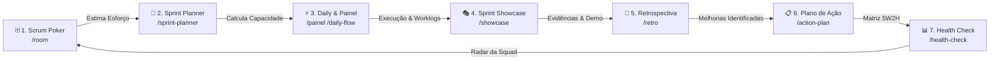

# 🚀 Portal Tech V&D — Frontend

> **Elimine a fricção da burocracia ágil. Foque em entregar software de valor.**

O **Portal Tech V&D** é o hub de colaboração definitivo de **Elite Engineering** para squads e lideranças ágeis. Ele centraliza cerimônias em tempo real (Scrum Poker, Retrospectivas, Sprint Reviews/Showcase, Sprint Planner), murais diários (Daily Flow), ferramentas especializadas de QA, base de conhecimento e utilitários técnicos para desenvolvedores em uma interface síncrona, moderna, auditável e de alta densidade de informação.

Este repositório contém a aplicação frontend construída com **Next.js 16 (App Router & Turbopack)**, **React 19**, **Tailwind CSS** e **Shadcn/UI**, integrando-se via REST e WebSockets ao [`agile-space-backend`](https://github.com/wanderalvess/agile-space-backend) (Spring Boot + PostgreSQL).

---

## 🌊 Pipeline Contínuo de Cerimônias

O Portal Tech V&D não é uma coleção de páginas isoladas, mas uma **esteira contínua de trabalho** que acompanha o ciclo de vida dos itens de desenvolvimento (`work_items`):



---

## ✨ Funcionalidades Principais

### 🃏 Scrum Poker (Elite Style)
*Disponível nos Modos Síncrono e Assíncrono (`/room`)*
- **UI Glassmorphism de Alta Densidade:** Estimativas em Fibonacci, T-Shirt ou Horas.
- **Modo Síncrono (Ao Vivo):** Votação guiada pelo facilitador em tempo real via WebSockets.
- **Modo Assíncrono (Remoto):** Feed de tarefas onde os membros votam em seu próprio tempo.
- **Consenso Inteligente por Papel (Role):** Avaliação de alinhamento com segregação por função (Dev, QA, PO, SM).
- **Varredura Visual de Divergência:** Alertas semafóricos instantâneos em caso de disparidade crítica de estimativas.
- **Ponte com o Planner:** Importação direta de escopo para a sessão de votação.

### 📅 Sprint Planner (Engenharia de Capacidade)
*Cerimônia Pre-Planning Síncrona/Assíncrona (`/sprint-planner`)*
- **Engine de Capacidade Flexível:** Alterne entre "Modo Simples" (cálculo em massa) e "Modo Detalhado" (dedicação individual, férias e ausências).
- **Importação em Lote Inteligente:** Cole listas brutas (`Título | Link | Descrição`) para gerar cards automaticamente.
- **Tracking de Sobrecarga:** Termômetros em tempo real de carga de desenvolvimento e qualidade.
- **Compartilhamento Seguro:** Geração de links somente-leitura para alinhamento com stakeholders.

### 🎭 Showcase Sessions (Sprint Review)
*Apresentação Executiva de Entregas e Resultados (`/showcase`)*
- **Modo Teatro Imersivo:** Experiência cinematográfica ao vivo, sem distrações visuais, para demonstração a clientes e lideranças.
- **Evidências do Jira Integradas:** Renderização e proxy autenticado de mídias anexadas (imagens e vídeos) direto das issues do Jira.
- **Gestão de Prontidão (Readiness):** Controle de histórias prontas para demo, ordenação por versão (Suporte, Master, Release, Develop) e toggle de destaque.
- **Exportação em PDF Executiva:** Geração de relatórios com capa executiva, resumo de entregas, cards de métricas e paginação inteligente via jsPDF.

### 🔄 Retrospectiva Inteligente (Retro Boards)
*Inspeção e Adaptação Colaborativa Síncrona (`/retro`)*
- **Dinâmicas Configuráveis:** Formatos clássicos e customizados (Start/Stop/Continue, Mad/Sad/Glad, 4Ls, etc.).
- **Votação com Limite por Participante:** Distribuição equilibrada de votos para priorização democrática.
- **Fusão de Cards com Histórico:** Agrupamento inteligente de tópicos similares preservando integralmente os textos originais (`originalTexts`).
- **Ponte com Plano de Ação:** Conversão direta de melhorias levantadas em tarefas com responsáveis e prazos.

### ⚡ Painel do Time & Daily Flow
*Mural Diário e Central Pós-Onboarding (`/painel`, `/daily-flow`, `/squad`)*
- **Visão Sintética de 3 Segundos:** Resumo da sprint ativa, capacidade realizada vs. planejada e próximas entregas.
- **Mural de Humor & Impedimentos:** Registro rápido de humor da squad e bloqueios com alertas sonoros e visuais.
- **Próxima Cerimônia Integrada:** Card inteligente com suporte a integração com Google Calendar (OAuth).

### 🧪 Central de Qualidade & Testes (QA Hub)
*Suíte Especializada para Engenharia de QA (`/qa`)*
- **Integração com Zephyr:** Visualização e sincronização de ciclos de testes e coberturas.
- **Gerador de Massa de Dados:** Criação de mocks com dados contextuais (Faker.js) e exportação em JSON/SQL.
- **Estúdio BDD & Bugs:** Estruturação guiada de cenários Gherkin (*Given-When-Then*) e templates padronizados de reporte de defeitos.
- **Gerador de Automação:** Snippets rápidos de teste para frameworks como Cypress e Playwright.
- **Fuzz Lab & API Diff:** Testes de limites de borda e comparador visual de respostas de API.

### 🧠 Prompt Hub & Skills de IA
*Repositório Colaborativo de Engenharia de Prompts (`/prompt-hub`)*
- **Filtro por Papel Ágil:** Prompts especializados para Scrum Masters, Product Owners, Desenvolvedores e Engenheiros de QA.
- **Importação/Exportação em Lote:** Sincronização em massa de bibliotecas de prompts e skills em JSON/Markdown.
- **Versionamento & Forks:** Histórico de adaptações, tags por tecnologias e sistema de favoritos.

### 📚 Knowledge Base & Chat com Documentação
*Base de Conhecimento e Busca Semântica (`/knowledge`)*
- **Design Bento Grid:** Documentos exibidos em cartões Bento responsivos de alta densidade visual.
- **Sincronização com TDN:** Modal para buscar e sincronizar manuais técnicos via URL, chave e query.
- **Download em Massa:** Exportação múltipla de documentações e manuais técnicos.
- **RAG Vetorial Autônomo:** Ingestão de documentações técnicas e consulta semântica via `pgvector` no backend, sem dependência de chaves de IA externas pagas.


### 🛡️ Secret Vault (Cofre de Segredos)
*Compartilhamento Seguro de Credenciais (`/vault`)*
- Criptografia zero-knowledge no lado do cliente com **AES-GCM**.
- Links com autodestruição baseada em tempo (1h, 24h) ou visualização única (`once`).

### 🛠️ DevTools Hub & Jolt Engine
*Suíte de Utilitários Técnicos para Desenvolvedores (`/devtools`, `/jolt`)*
- **Sandbox Jolt:** Transformador visual de payloads JSON utilizando a especificação Jolt.
- **Fábrica de Mocks:** Gerador de dados fictícios a partir de esquemas DDL e exportação SQL/JSON.
- **Segurança & Formatação:** Formatador SQL/JSON, inspetor JWT, decodificador Cron, conversor Base64 e Regex Lab.

### 📊 Radar de Saúde (Team Health Check)
*Diagnóstico Anônimo do Time (`/health-check`)*
- Mapeamento periódico e anônimo do clima, suporte técnico e cultura da squad em múltiplas dimensões.

### 📋 Plano de Ação (Action Plan)
*Gestão Tática de Melhorias (`/action-plan`)*
- Criação e monitoramento de planos de ação (metodologia 5W2H) com responsáveis, status e prazos integrados.

### 💡 Ideação & Brainstorming
*Facilitação de Dinâmicas Criativas (`/brainstorming`)*
- Espaço colaborativo síncrono para dinâmicas de ideação, arquitetura de soluções e design participativo.

### ⏱️ Modo Foco (Focus Area & Calmaria)
*Ambiente de Concentração Extrema (`/focus`)*
- Cronômetro Pomodoro integrado com alertas sonoros e seleção de trilhas ambientes/Lo-Fi relaxantes para foco profundo.

### 🏢 Workspace Dashboard
*Painel de Produtividade Pessoal (`/workspace`)*
- Kanban pessoal privado, notas adesivas (sticky notes), atalhos rápidos e gerenciamento de perfil.

### 🔐 Gestão de Acessos & Convites
*Segurança e Governança de Usuários (`/admin`, `/invite`)*
- Links de convite seguros com tokens de expiração para onboarding simplificado de novos membros.
- Níveis de permissão rígidos com segregação entre administradores de sistema (`ADMIN`) e lideranças ágeis (`Agile Master`, `Product Owner`).

---

## 🎨 Diretrizes de Estilo e Engenharia (Elite Engineering)

Seguimos um conjunto rigoroso de princípios de design e arquitetura:

- **Bento Design:** Interfaces compostas por grids modulares, densas e equilibradas (`rounded-[2rem]` / `rounded-[2.5rem]`).
- **Experiência Zero-Scroll:** A casca principal da tela utiliza o viewport completo (`h-[100dvh]` / `h-screen`, `overflow-hidden`), enquanto listas e tabelas usam barras de rolagem internas (`ScrollArea`).
- **Glassmorphism Premium:** Fundos translúcidos desfocados (`backdrop-blur-xl`), bordas finas e sombras calibradas.
- **Suporte Total Light/Dark Mode:** Contraste calibrado em ambos os temas sem o uso de cores puras, baseado nas variáveis semânticas do Tailwind.
- **Cliente HTTP Centralizado (`authFetch`):** Todas as chamadas autenticadas devem obrigatoriamente utilizar o helper `authFetch` (`src/lib/auth-client.ts`), que injeta o token JWT do `localStorage` e trata o logout automático em respostas `401`.
- **Componentização Estrita (Limite de 300 Linhas):** Arquivos que ultrapassarem 300 linhas de código devem ser decompostos em subcomponentes e hooks customizados.

---

## 📂 Documentação e Guias Técnicos

Consulte a documentação técnica complementar nos links abaixo:

* 📖 **Design System Oficial & Especificações de UI**: [`design.md`](./design.md)
* 🏛️ **Arquitetura & Mapeamento de Contexto**: [`ARCHITECTURE.md`](./ARCHITECTURE.md)
* 🤖 **Diretrizes para Assistentes de IA**: [`AI_INSTRUCTIONS.md`](./AI_INSTRUCTIONS.md)
* 🔌 **Guia de Integração com Backend**: [`.agent/skills/backend-integration/SKILL.md`](./.agent/skills/backend-integration/SKILL.md)

---

## 🛠️ Stack Tecnológica

| Camada | Tecnologias |
| :--- | :--- |
| **Framework Web** | [Next.js 16](https://nextjs.org/) (App Router, Turbopack, Build Standalone) |
| **Linguagem & Tipagem** | [TypeScript 5](https://www.typescriptlang.org/) |
| **Biblioteca de UI** | [React 19](https://react.dev/), [Tailwind CSS v3](https://tailwindcss.com/), [Shadcn/UI](https://ui.shadcn.com/), [Radix UI](https://www.radix-ui.com/) |
| **Gerenciamento de Estado** | [Zustand](https://zustand-demo.pmnd.rs/), React Context API, Custom Hooks |
| **Interatividade & Animações**| [Framer Motion](https://www.framer.com/motion/), `@dnd-kit/core`, `@dnd-kit/sortable`, `canvas-confetti` |
| **Gráficos & Visualização** | [Recharts](https://recharts.org/), [Lucide React](https://lucide.dev/), [React Nice Avatar](https://avatar.vuejs.org/) |
| **Editores & Ferramentas** | [Monaco Editor](https://microsoft.github.io/monaco-editor/), [Tiptap](https://tiptap.dev/), [Excalidraw](https://excalidraw.com/), [KaTeX](https://katex.org/) |
| **Exportação de Documentos** | [jsPDF](https://github.com/parallax/jsPDF), `html2canvas`, `html-to-image` |
| **IA & SDKs** | Vercel AI SDK (`@ai-sdk/react`), Google Generative AI / Gemini SDK |
| **Testes de Software** | [Vitest](https://vitest.dev/), React Testing Library, [Cypress](https://www.cypress.io/) |
| **Backend Integrado** | Spring Boot 3.x (Java 17+), PostgreSQL, WebSockets Stomp/SockJS, JWT |

---

## 🏁 Como Rodar Localmente

### Pré-requisitos
- **Node.js**: Versão 20.x ou superior instalada.
- **NPM**: Gerenciador de pacotes padrão (incluso com o Node).
- **Backend Operacional**: O serviço [`agile-space-backend`](https://github.com/wanderalvess/agile-space-backend) deve estar em execução na porta `8002` (`http://localhost:8002/api`).

### 1. Clonar e Instalar Dependências
```bash
git clone https://github.com/wanderalvess/agile-space-frontend.git
cd agile-space-frontend
npm install
```

### 2. Configurar Variáveis de Ambiente
Crie um arquivo `.env.local` na raiz do projeto copiando o modelo de exemplo:
```bash
cp .env.example .env.local
```

As principais variáveis necessárias para execução local:
```env
# URL base da API do backend Spring Boot
NEXT_PUBLIC_API_URL=http://localhost:8002/api
NEXT_PUBLIC_SPRING_API_URL=http://localhost:8002/api

# Opcionais (recursos adicionais)
# NEXT_PUBLIC_GOOGLE_CLIENT_ID=   # OAuth Google Calendar no painel
# GEMINI_API_KEY=                 # Integração de IA Gemini
# JIRA_BASE=                      # Proxy do Jira corporativo
```

### 3. Iniciar o Servidor de Desenvolvimento
Inicie a aplicação utilizando Turbopack na porta `9002`:
```bash
npm run dev
```

### 4. Acessar a Aplicação
Abra seu navegador em [http://localhost:9002](http://localhost:9002).

> 💡 **Credenciais de Teste Local**:
> - **Usuário**: `teste@teste.com`
> - **Senha**: `testeteste`  
> *(Perfil: Agile Master na squad "TESTE")*  
> Alternativamente, utilize a aba **Cadastrar** na tela de login para criar uma conta do zero.

---

## 📜 Scripts Disponíveis

| Script | Descrição |
| :--- | :--- |
| `npm run dev` | Inicia o servidor de desenvolvimento Next.js com Turbopack na porta 9002 |
| `npm run build` | Compila o projeto e gera o build standalone otimizado de produção |
| `npm run start` | Inicia a aplicação compilada em modo de produção |
| `npm run lint` | Executa a validação estática de código com o Next.js ESLint |
| `npm run typecheck` | Executa a validação estrita de tipos com o TypeScript (`tsc --noEmit`) |
| `npm run test` | Executa a suíte de testes unitários com Vitest |
| `npm run test:watch` | Executa os testes unitários em modo watch interativo |
| `npm run cypress:run` | Executa os testes end-to-end (E2E) em modo headless com Cypress |
| `npm run cypress:open` | Abre o test runner gráfico interativo do Cypress |

---

## 🐳 Rodando com Docker

Este repositório possui um `Dockerfile` multi-stage otimizado para build standalone do Next.js (Node 20 Alpine, porta `9002`).

A orquestração completa da stack (**Frontend + Backend + PostgreSQL dedicado**) é gerenciada pelo `docker-compose.yml` localizado no repositório [`agile-space-backend`](https://github.com/wanderalvess/agile-space-backend).

### Estrutura de Diretórios Recomendada:
```
meus-projetos/
├── agile-space-backend/   # Contém o docker-compose.yml e a API Spring Boot
└── agile-space-frontend/  # Este repositório (Next.js)
```

### Subir a Stack Completa:
A partir da pasta `agile-space-backend`:
```bash
docker compose up -d --build
```

### Recompilar apenas o Frontend após alterações:
```bash
docker compose up -d --build frontend
```

> ⚠️ **Atenção sobre variáveis `NEXT_PUBLIC_*` no Docker**: As variáveis prefixadas com `NEXT_PUBLIC_` são embutidas diretamente no bundle JavaScript durante o processo de build (`next build`). Elas são fornecidas como `ARG` no Dockerfile, e não apenas em tempo de execução via `environment:`.

---

## 🏗️ Estrutura de Diretórios

```
agile-space-frontend/
├── src/
│   ├── app/                # Rotas da aplicação (App Router do Next.js)
│   │   ├── (auth)/         # Rotas de login e cadastro
│   │   ├── admin/          # Painel administrativo e gestão de acessos
│   │   ├── daily-flow/     # Mural de sincronização diária e impedimentos
│   │   ├── devtools/       # Suíte técnica de utilitários para desenvolvedores
│   │   ├── jolt/           # Sandbox visual de transformações Jolt
│   │   ├── knowledge/      # Base de conhecimento e chat de documentação
│   │   ├── painel/         # Painel pós-onboarding e visão unificada da squad
│   │   ├── prompt-hub/     # Repositório de prompts e skills de IA
│   │   ├── qa/             # Central de Qualidade e Testes (Zephyr, BDD, Mocks)
│   │   ├── retro/          # Cerimônia de retrospectiva ágil em tempo real
│   │   ├── room/           # Salas síncronas e assíncronas de Scrum Poker
│   │   ├── showcase/       # Sessões de Sprint Review e Modo Teatro executivo
│   │   ├── sprint-planner/ # Planejamento de capacidade da sprint
│   │   ├── squad/          # Gestão avançada da squad e dashboards
│   │   ├── vault/          # Cofre de segredos com criptografia AES-GCM
│   │   └── workspace/      # Painel de produtividade pessoal e foco
│   ├── components/         # Componentes React modulares, UI (Shadcn) e compartilhados
│   │   ├── layout/         # Componentes estruturais (Header, Footer, RoomHeader)
│   │   ├── shared/         # Design system próprio (EliteCard, AgileBaseCard, EliteSidebar)
│   │   └── ui/             # Primitivos base da biblioteca Shadcn/UI
│   ├── context/            # Provedores de contexto React (Auth, User, Theme, SystemConfig)
│   ├── hooks/              # Custom hooks compartilhados (squad, sockets, debounce)
│   ├── lib/                # authFetch, utilitários, crypto (AES-GCM), tipagens TypeScript
│   ├── services/           # Camada de serviços e integração REST
│   └── store/              # Gerenciamento de estado global (Zustand)
├── public/                 # Ativos estáticos, fontes, imagens e ícones
├── .env.example            # Modelo de configuração de variáveis de ambiente
├── Dockerfile              # Imagem Docker multi-stage (Node 20 Alpine standalone)
└── package.json            # Dependências e scripts do projeto
```

---

## 🤝 Contribuição e Padrões de Commit

Para manter o histórico do repositório padronizado, siga a convenção de commits adotada no projeto:

Formato: `type(scope): summary`
- **Tipos aceitos:** `feat`, `fix`, `refactor`
- **Exemplos:**
  - `feat(qa): adiciona gerador de cenarios BDD no QA Hub`
  - `fix(poker,room): corrige sincronizacao de cartas em votacao assincrona`
  - `refactor(auth): unifica cliente HTTP com authFetch`

---

## 📄 Licença

Uso interno e restrito para gestão de squads e engenharia de software de alta performance.
