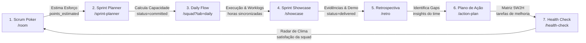

# 🎨 Espaço Ágil — Design System & Especificação de Engenharia (`design.md`)

> **Elimine a fricção da burocracia ágil. Foque em entregar software de valor.**  
> Este documento é a **Fonte Única da Verdade (Single Source of Truth)** do **Espaço Ágil**. Ele reúne a identidade visual, arquitetura de dados nativa, terminologias reais, mapa de arquivos críticos e padrões de interface para que humanos e IAs desenvolvam novas telas e módulos perfeitamente alinhados ao ecossistema.

---

## 🎯 1. Propósito do Sistema & Objetivos Centrais

O **Espaço Ágil** é o hub de colaboração de **Elite Engineering** projetado para times ágeis e squads de engenharia. A plataforma resolve o problema da fragmentação de cerimônias e sobrecarga burocrática integrando todo o ciclo ágil síncrono e assíncrono em um fluxo contínuo.

### Metas do Produto:
1. **Unificação do Ciclo de Cerimônias**: Do refinamento técnico à retrospectiva em uma esteira única de dados centralizada em `work_items`.
2. **Zero Fricção & Zero-Scroll**: Interfaces de alta densidade (`h-dvh` / `h-screen`) que eliminam rolagem desnecessária e concentram informação tática.
3. **Consenso Inteligente & Transparência**: Votações em tempo real com segregação e concordância por cargo (*Role-Based Consensus*).
4. **Privacidade & Engenharia Segura**: Criptografia zero-knowledge (*Secret Vault* com AES-GCM) e integração corporativa com Jira e TDN.

---

## 🌊 2. A Forma Nativa do Produto: O Pipeline Contínuo de Cerimônias

A estrutura do Espaço Ágil não é uma coleção de páginas avulsas, mas sim uma **esteira contínua de fluxo de trabalho (Pipeline)** guiada pelo ciclo de vida do item de trabalho (`work_items`):



### Domínios e seus Arquivos Críticos:

| Domínio / Módulo | Rota Frontend | Componentes Críticos (Frontend) | Entidade / Controller Backend |
| :--- | :--- | :--- | :--- |
| **Hub / Home Bento** | `/` | `src/components/home/HeroWidget.tsx`<br>`src/components/home/BentoGrid.tsx`<br>`src/components/home/ModuleGrid.tsx` | `PublicController.java`<br>`WorkspaceController.java` |
| **Scrum Poker** | `/room/[id]` | `src/components/poker/PokerRoom.tsx`<br>`src/components/poker/AsyncPokerRoom.tsx`<br>`src/components/poker/VotingArea.tsx` | `PokerRoom.java`<br>`PokerController.java` |
| **Sprint Planner** | `/sprint-planner` | `src/components/planner/SprintPlannerContent.tsx`<br>`src/components/planner/PlannerGuide.tsx` | `SprintPlanningController.java`<br>`WorkItem.java` |
| **Retrospectiva** | `/retro/[id]` | `src/components/retro/RetroBoard.tsx`<br>`src/components/retro/RetroCard.tsx`<br>`src/components/retro/RetroColumn.tsx` | `RetroBoard.java`<br>`RetroCard.java`<br>`RetroController.java` |
| **Sprint Showcase** | `/showcase/[id]` | `src/components/showcase/TeatroMode.tsx`<br>`src/components/showcase/TaskCard.tsx`<br>`src/components/showcase/ShowcaseCover.tsx` | `ShowcaseSession.java`<br>`ShowcaseSessionController.java` |
| **Daily Flow & Squad** | `/squad?tab=daily` | `src/components/daily-flow/DailyFlowGuide.tsx`<br>`src/app/daily-flow/SquadManagementSheet.tsx` | `SquadDaily.java`<br>`DailyFlowController.java` |
| **Base de Conhecimento** | `/knowledge/kb` | `src/components/knowledge/GlobalSearch.tsx`<br>`src/components/knowledge/TdnImportDialog.tsx` | `KnowledgeDocument.java`<br>`KnowledgeController.java` |
| **Biblioteca de IA** | `/prompt-hub` | `src/app/prompt-hub/components/PromptCard.tsx`<br>`src/components/prompt-hub/PromptGuide.tsx` | `PromptAsset.java`<br>`PromptController.java` |
| **Secret Vault** | `/vault/[id]` | `src/lib/vault-crypto.ts`<br>`src/app/vault/[id]/page.tsx` | `VaultSecret.java`<br>`VaultSecretController.java` |
| **DevTools Hub & Jolt** | `/devtools` / `/jolt` | `src/lib/jolt-lite.ts`<br>`src/components/devtools/*` | `com.agilespace.backend.domain.DevTool` |
| **Radar Health Check** | `/health-check` | `src/components/health-check/HealthCheckVotingBoard.tsx`<br>`src/components/health-check/HealthCheckResults.tsx` | `HealthCheckSession.java`<br>`HealthCheckController.java` |
| **Plano de Ação** | `/action-plan/[id]` | `src/components/action-plan/ActionPlanBoard.tsx`<br>`src/components/action-plan/ActionTaskDialog.tsx` | `ActionPlan.java`<br>`ActionPlanTask.java` |
| **Governança & Admin** | `/admin` / `/governance`| `src/components/admin/GovernanceHub.tsx`<br>`src/components/admin/GlobalProjectSelector.tsx` | `Project.java`<br>`AdminController.java` |

---

## 🏷️ 3. Conteúdo Real, Nomenclaturas & Vocabulário Oficial

> [!IMPORTANT]
> **Nada inventado, nada placeholder**. Use exclusivamente as terminologias oficiais extraídas da base de código real:

### Papéis Oficiais da Squad (`ROLES` / `GlobalRole` em `src/lib/types.ts`):
- `Agile Master` *(Liderança de processo)*
- `Product Owner` *(Liderança de negócio/escopo)*
- `Tech Lead` *(Liderança técnica e arquitetura)*
- `People Lead` *(Liderança de pessoas e alocação)*
- `Tribe Lead` *(Coordenação de tribo)*
- `Agile Coach` *(Facilitação organizacional)*
- `Developer` / `Desenvolvedor(a)` *(Engenharia e entrega)*
- `QA` / `Analista de QA` *(Qualidade e testes)*
- `Designer` / `UX` / `Designer / UI-UX` *(Experiência do usuário)*
- `SME` *(Especialista de domínio / Subject Matter Expert)*
- `Stakeholder / Observador` *(Acompanhamento)*

### Mapeamento de Termos de Cerimônias e Status:
- **Scrum Poker**:
  - Baralhos: `Fibonacci` (`?`, `0`, `1`, `2`, `3`, `5`, `8`, `13`, `21`, `34`, `55`, `89`, `☕`), `T-Shirt` (`PP`, `P`, `M`, `G`, `GG`, `?`), `Horas` (`1h`, `2h`, `4h`, `8h`, `16h`, `24h`, `32h`, `40h`).
  - Estados: `Votando...`, `Revelar Cartas`, `Reiniciar Votação`, `Consenso Atingido`, `Divergência Detectada`.
- **Sprint Planner**:
  - Modos: `Modo Simples` (Cálculo em massa) vs. `Modo Detalhado` (Individual com foco, férias e ausências).
  - Termômetros: `Horas Dev`, `Horas QA`, `Capacidade Total`, `Fator de Foco (%)`.
- **Retrospectiva**:
  - Colunas Padrão: `Correu Bem` (Verde/Emerald), `Melhorar` (Rosa/Rose), `Ideias` (Âmbar/Amber), `Ações` (Roxo/Violet).
- **Daily Flow**:
  - Categorias: `O que fiz ontem`, `O que farei hoje`, `Impedimentos / Bloqueios`.
  - Integração Timesheet: `Hoje: Xh Ym`, `Ontem: Xh Ym`, `Sincronizar Timesheet com Jira`.
- **DevTools Utilitários Reais**:
  - `Base64 / URL` (Codificar & Decodificar)
  - `Gerador UUID` (Criar chaves exclusivas)
  - `Secret Vault` (Criptografia AES-GCM local)
  - `Formatador SQL` (Sanitizar instruções)
  - `Decodificador JWT` (Análise local de tokens)
  - `Laboratório Regex` (Validar buscas complexas)
  - `Interpretador Cron` (Traduzir agendamentos)
  - `Validador JSON` (Sanitizar payloads)
  - `Sandbox Jolt` (Transformação de JSON visual)

---

## 🎨 4. Identidade Visual & Design Tokens Herdados

### Tipografia Oficial (`tailwind.config.ts` & `layout.tsx`):
- **Títulos & Hero**: `font-headline` (`var(--font-outfit)`, Outfit, Sans-Serif) — Usar `font-extrabold` ou `font-black`, `tracking-tight`.
- **Corpo & Formulários**: `font-body` (`var(--font-inter)`, Inter, Sans-Serif) — Usar `font-medium`, `font-semibold` ou `font-bold`.
- **Chaves de Projeto, Código & Horas**: `font-code` (`var(--font-jetbrains-mono)`, JetBrains Mono, Monospace).

### Paleta Semântica HSL (`src/app/globals.css`):

```css
/* LIGHT MODE (Padrão) */
--background: 210 40% 98%;          /* #F8FAFC - Superfície clean e suave */
--foreground: 222 47% 11%;          /* #0F172A - Texto escuro de alto contraste */
--card: 0 0% 100%;                  /* #FFFFFF - Cartões brancos nítidos */
--primary: 25 100% 50%;             /* #FF6600 - Agile Orange vibrante */
--primary-foreground: 0 0% 100%;    /* #FFFFFF - Texto sobre laranja */
--muted: 210 40% 96.1%;             /* Superfície neutra para fundos de abas */
--muted-foreground: 215.4 16.3% 46.9%; /* Textos de apoio e labels secundários */
--border: 214.3 31.8% 91.4%;        /* Bordas finas e discretas */

/* DARK MODE */
--background: 222.2 84% 4.9%;       /* Slate 950 (#020617) */
--foreground: 210 40% 98%;          /* Off-white de alta legibilidade */
--card: 222.2 47% 11.2%;            /* Slate 900 (#0F172A) */
--border: 217.2 32.6% 22%;          /* Slate 750 (Bordas nítidas) */
--muted: 217.2 32.6% 17.5%;         /* Slate 800 */
--muted-foreground: 215 20.2% 65.1%;/* Texto de apoio claro */
```

### Geometria de Bordas & Superfícies (Border Radius):
- **Cards Bento da Home e Módulos**: `rounded-[2.5rem]` ou `rounded-[2rem]` com `p-7`.
- **Modais e Diálogos (`DialogContent`)**: `rounded-2xl` ou `rounded-3xl` com `backdrop-blur-xl`.
- **Segmented Tabs (`TabsList`)**: `rounded-xl` com triggers `rounded-lg`.
- **Inputs & Selects**: `h-9 rounded-lg`.
- **Botões Principais (CTA)**: `h-9` ou `h-10` com `rounded-lg` ou `rounded-xl`, `font-bold`.
- **Pill Badges**: `rounded-full px-2.5 py-0.5 text-[11px] font-semibold`.

---

## 🧱 5. Anatomia de Componentes Padronizados

### 1. Card Bento com Efeito Glow e Micro-interações
Padrão exato utilizado na `BentoGrid.tsx` e `ModuleGrid.tsx`:
```tsx
<Card className="group relative border border-slate-200 dark:border-slate-800 bg-white/60 dark:bg-slate-900/60 backdrop-blur-xl rounded-[2.5rem] p-7 shadow-lg hover:shadow-2xl dark:shadow-none hover:border-primary/40 dark:hover:border-primary/40 transition-all duration-500 cursor-pointer flex flex-col justify-between h-full min-h-[260px] overflow-hidden">
  {/* Card Ambient Glow */}
  <div className="absolute top-0 right-0 w-32 h-32 bg-orange-500/5 dark:bg-orange-500/10 rounded-full blur-2xl group-hover:scale-125 transition-transform duration-700 pointer-events-none" />

  <div>
    <div className="flex items-center justify-between mb-4 relative z-10">
      <div className="w-10 h-10 bg-primary/10 rounded-xl flex items-center justify-center shrink-0 border border-primary/20 group-hover:scale-110 transition-transform duration-300">
        <Rocket className="h-5 w-5 text-primary" />
      </div>
      <span className="text-[9px] font-black text-slate-500 dark:text-slate-500 uppercase tracking-widest bg-slate-50 dark:bg-slate-950 px-2.5 py-1 rounded-full border border-slate-200 dark:border-slate-800/80">
        Tag de Categoria
      </span>
    </div>
    <h4 className="text-xl font-black uppercase tracking-tight text-slate-950 dark:text-slate-50 mb-2 group-hover:text-primary transition-colors flex items-center gap-1.5 relative z-10">
      Título do Módulo <ArrowUpRight className="h-4 w-4 opacity-0 group-hover:opacity-100 group-hover:translate-x-0.5 group-hover:-translate-y-0.5 transition-all duration-300 text-primary" />
    </h4>
    <p className="text-[13px] font-medium text-slate-500 dark:text-slate-400 leading-relaxed relative z-10">
      Descrição direta e objetiva da funcionalidade.
    </p>
  </div>

  <Button className="w-full h-10 bg-primary hover:bg-orange-600 text-white font-extrabold uppercase text-[10px] tracking-wider rounded-xl transition-all border-none mt-5 relative z-10">
    Acessar Módulo
  </Button>
</Card>
```

### 2. Header de Sala Unificado (`RoomHeader`)
Utilizado em todas as cerimônias (`/room`, `/retro`, `/showcase`, `/sprint-planner`, `/knowledge`, `/admin`):
```tsx
import { RoomHeader } from '@/components/layout/RoomHeader';
import { Flame } from 'lucide-react';

<RoomHeader 
  title="Retrospectiva — Squad Fênix"
  toolIcon={<Flame className="h-4 w-4 text-primary" />}
  actions={
    <div className="flex items-center gap-2">
      {/* Botões de Ação Específicos da Cerimônia */}
    </div>
  }
/>
```

### 3. Card de Ideia / Tarefa / Feedback (`AgileCard`)
Utilizado em Retrospectiva, Brainstorming, Planning e Murais colaborativos:
```tsx
import { AgileCard } from '@/components/shared/EliteCard';

<AgileCard
  id="card-ddw-101"
  content="Criar testes de regressão automatizados para a API de pagamentos"
  authorName="Wanderson"
  variant="retro" // 'retro' | 'brainstorm' | 'planner' | 'default'
  theme="emerald" // 'primary' | 'amber' | 'emerald' | 'rose' | 'indigo' | 'slate'
  votes={['uid-1', 'uid-2']}
  onVote={(id) => handleVote(id)}
  canVote={true}
  isRevealed={true}
/>
```

---

## 📐 6. Padrões de Layout por Tipo de Experiência

### A. Fluxo Centralizado (Onboarding, Configurações, Wizards)
- Viewport: `min-h-dvh flex items-center justify-center p-3 sm:p-4 md:p-6 py-4`
- Container: `w-full max-w-2xl space-y-3 sm:space-y-4`
- Header com Pill de Destaque: `bg-primary/10 border-primary/20 text-primary`
- Card de Ação: `bg-card border-border shadow-xl rounded-2xl`

### B. Sala Síncrona / Workspace de Cerimônia (Zero-Scroll)
- Casca: `h-dvh max-h-dvh overflow-hidden flex flex-col bg-background text-foreground`
- Topo: `RoomHeader` fixo (`h-12 sticky top-0 z-50 backdrop-blur-2xl`)
- Corpo: `flex-1 overflow-hidden p-3 md:p-4 grid grid-cols-1 md:grid-cols-3 gap-3 md:gap-4`
- Colunas internas com scroll próprio: `overflow-y-auto custom-scrollbar`

### C. Hubs Analíticos e Painéis Administrativos
- Layout: Bento Grid responsivo (`grid grid-cols-1 md:grid-cols-2 lg:grid-cols-12 gap-6`)
- KPIs em cards destacados: `rounded-2xl p-4 border-border bg-card`

---

## 🚫 7. Anti-Patterns & O que NUNCA fazer

1. **NUNCA crie telas vazias ou com placeholders genéricos**: Use nomes reais de projetos (`DDWMISSI`, `FENIX`, `DISTRIBUICAO`), cargos oficiais e tarefas reais.
2. **NUNCA use cores CSS hardcoded**: Proibido `bg-[#ffffff]`, `text-black`, `bg-blue-500` solto no JSX. Use sempre classes semânticas (`bg-card`, `text-foreground`, `text-muted-foreground`, `bg-primary`).
3. **NUNCA force scroll vertical na página inteira em cerimônias**: As salas de Poker, Retro e Planner devem caber em `100dvh` com rolagem isolada em colunas ou gavetas (`overflow-y-auto`).
4. **NUNCA crie arquivos com mais de 300 linhas de código**: Extraia diálogos, formulários e painéis para sub-componentes na mesma pasta do módulo.
5. **NUNCA misture bibliotecas de ícones**: Utilize exclusivamente `lucide-react`.
6. **NUNCA quebre o suporte a Dark Mode**: Todo componente novo deve ser testado e renderizar perfeitamente no tema escuro.

---

## 📋 8. Checklist de Entrega para Novas Telas

- [ ] **1. Propósito Alinhado**: A tela resolve uma etapa clara do fluxo contínuo de engenharia?
- [ ] **2. Tipografia Herdada**: Usa `font-headline` (Outfit) nos títulos, `font-body` (Inter) no corpo e `font-code` (JetBrains Mono) em chaves?
- [ ] **3. Cores Semânticas**: Usa `bg-card`, `bg-background`, `text-foreground` e `bg-primary`?
- [ ] **4. Paridade Dark Mode**: A interface tem contraste e legibilidade impecáveis no modo escuro?
- [ ] **5. Responsividade Completa**: Adaptação perfeita do mobile (`320px`) até telas ultrawide (`1920px`) sem transbordo horizontal (`overflow-x-hidden`)?
- [ ] **6. Ícones Lucide**: Todos os ícones importados de `lucide-react`?
- [ ] **7. Feedback de Ação**: Botões assíncronos mostram `<Loader2 className="w-4 h-4 animate-spin" />` e notificações com `toast`?
- [ ] **8. Localização PT-BR**: Vocabulário profissional em Português do Brasil sem termos inventados?
- [ ] **9. Componentização (<300 linhas)**: O código está modularizado e limpo?
- [ ] **10. Zero Erros de Hidratação**: Sem dependências diretas de `window`/`localStorage` fora de hooks ou `useEffect`?
