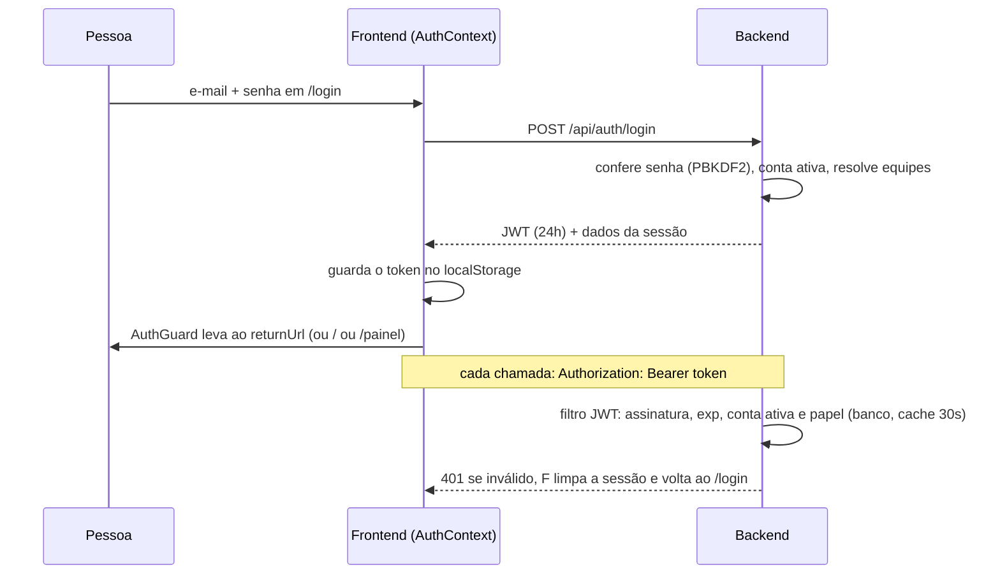

# Autenticação e sessão

Estado do `develop` em 2026-10-09. Onde algo é suposição ou não foi testado ao vivo, o texto diz.

## Objetivo e quem usa

Provar quem é a pessoa e mantê-la logada com segurança. Todo mundo passa por aqui: cadastro e login por **e-mail corporativo + senha** (conta local do Portal), sessão por **JWT** guardado no navegador, troca de equipe ativa e saída.

> O código **não usa Firebase nem Google** para entrar (a menção a Firebase vem de documentos antigos). A autenticação é 100% do backend Spring. O SSO corporativo (OIDC) está só **planejado** (`agile-space-backend/DOCUMENTACAO_SSO.md`); a coluna `users.sso_id` existe mas nenhum fluxo a preenche hoje.

## Telas e entradas

| Tela | Caminho | O que faz |
|---|---|---|
| Login / cadastro / esqueci a senha | `/login` | Única rota pública do frontend. Aceita `?returnUrl=` para voltar ao ponto de origem |
| Guarda de rota | `AuthGuard` (em todo o app) | Sem sessão manda para `/login?returnUrl=<destino>`; com sessão em `/login` manda para o destino |
| Menu da pessoa | cabeçalho (`Header`, `RoomHeader`, widgets da home) | "Sair", editar perfil, trocar de equipe |

Entradas do cadastro: nome, e-mail, senha (8 a 128 caracteres) e confirmação. O frontend envia também `jiraAccountId` = parte do e-mail antes do `@`.

## Fluxo principal

Passo a passo:

1. **Cadastro** (`POST /api/auth/register`, público): só e-mails do domínio `ALLOWED_EMAIL_DOMAIN` (produção: `totvs.com.br`; o servidor **não sobe** em produção com o domínio vazio). Se o e-mail já existe como conta "fantasma" criada pela sincronização do Jira (sem senha), o cadastro **reivindica** essa conta. A conta nasce `MEMBER`. O servidor liga a conta às linhas do roster (papéis do Jira) pelo e-mail.
2. **Login** (`POST /api/auth/login`, público): aceita e-mail completo ou só o usuário (antes do `@`; se bater com mais de uma conta, exige o e-mail completo). Senha errada e e-mail inexistente dão a **mesma** resposta 401 "E-mail ou senha incorretos" (e gastam o mesmo tempo). Conta inativa devolve 403 "Usuário inativo no sistema" **só depois** de a senha estar certa.
3. **Token**: JWT HS256 de 24 h (`app.security.jwt-expiration-seconds`), com `sub` (id), `email`, `name`, `role` (ADMIN/LEAD/MEMBER), projeto ativo, segmento e tribo. Segredo em `APP_JWT_SECRET` (mínimo 32 bytes; em produção os valores de dev conhecidos derrubam o boot).
4. **Hidratação** ao abrir o app: `GET /api/auth/me` com o token guardado. 401/403 apagam o token; erro de servidor ou rede **não** apagam (a pessoa só não entra naquela vez; recarregar depois restaura). Há limite de 15 s para não deixar o spinner eterno.
5. **Troca de equipe ativa** (`POST /api/auth/switch-project`): exige vínculo com o projeto; devolve a sessão com a equipe nova.
6. **Sair**: apaga o token e os dados do navegador que pertencem à pessoa (equipe ativa, perfil em cache, favoritos, atalhos de onboarding). Preferências do aparelho (tema, som) ficam. Não existe "logout" no servidor: o JWT em si continua válido até expirar, mas sem ele guardado ninguém o usa.
7. **Esqueci a senha** (`POST /api/auth/forgot-password`, público): sempre responde a mesma mensagem genérica. Grava um pedido para o **admin aprovar** (ver `usuarios-e-administracao.md`). Pedido repetido enquanto há um pendente não cria outra linha. Não envia e-mail.

## O que o filtro JWT faz em cada requisição `/api/**`

- Exige `Authorization: Bearer`, assinatura válida e `exp` presente e no futuro (token sem `exp` é recusado).
- **Estado vivo da conta:** consulta (cache de 30 s por conta) se a conta está ativa e qual o papel **atual** no banco. Conta desativada recebe 401; papel do banco vence o do token, então promoção ou rebaixamento feito no painel vale em até 30 s (na hora, no mesmo servidor, porque salvar o perfil invalida o cache). Se a conta não existir na tabela ou a consulta falhar, vale o papel do token.
- `/api/admin/**` exige papel `ADMIN`.
- Recusa (400) caminhos com `/..`, `/./`, `%2e` ou `\`. Contexto: o Tomcat normaliza o caminho antes de rotear, mas `getRequestURI()` devolve o texto cru; sem isso um prefixo "público" ou fora de `/api/` poderia mascarar uma rota protegida. (Defesa em profundidade: não foi possível provar exploração com o roteamento atual do Spring.)
- Prefixo público só vale como segmento inteiro (`/api/public` e `/api/public/...`, nunca `/api/publicidade`).

## Estados e transições da sessão

| Estado | Como entra | Como sai |
|---|---|---|
| Sem sessão | primeiro acesso, token apagado | login/cadastro |
| Carregando | app abriu com token guardado | `/auth/me` responde (ou 15 s) |
| Logada | login, cadastro ou `/auth/me` ok | sair, 401 em qualquer chamada, expiração (24 h), conta desativada |
| Equipe ativa trocada | switch-project, criar/entrar em equipe, "Sou eu" | trocar de novo |

## Permissões: servidor x cliente

| Regra | Servidor | Cliente |
|---|---|---|
| Rota exige login | filtro JWT (fonte da verdade) | `AuthGuard` (só conforto de navegação) |
| Papel ADMIN | filtro JWT + controllers | `userProfile.role === 'admin'` esconde telas |
| Equipe acessível | `UserProjectResolverService` | seletor de equipes |

Nada importante depende só do cliente.

## Várias abas e troca de usuário no mesmo navegador

- O token vive em `localStorage` (`agileSpace_auth_token`), compartilhado entre abas. Login, logout ou troca de conta em uma aba **recarrega as outras** (evento `storage`); se for a mesma pessoa entrando de novo, nada recarrega (não perde o que está sendo digitado).
- Ao entrar com outra conta no mesmo navegador, o que sobrou da anterior (equipe ativa, perfil em cache, favoritos) é descartado.
- Quando o servidor responde 401, o app dispara `UNAUTHORIZED_EVENT`, limpa a sessão e o `AuthGuard` leva ao login com `returnUrl`. **Formulários em edição são perdidos** (não há rascunho automático); a pessoa volta à mesma página depois de entrar.

## Dados guardados (negócio)

- Conta: e-mail, nome, hash PBKDF2-HMAC-SHA256 da senha (310 000 iterações, sal por senha), papel de sistema, cargo (`jobTitle`), equipe ativa, segmento/tribo, ativo/inativo, id do Jira.
- Pedidos de redefinição de senha (com senha temporária por até 1 h após a aprovação).
- Auditoria: pedidos de reset, aprovações, convites, acessos a `/api/admin/**`.
- No navegador: o token e caches de conveniência (ver acima).

## Pontos frágeis e erros de fluxo conhecidos

**Corrigido nesta rodada** (ver commits `fix(acesso)` e `fix(sessão)`): papel/conta ativa só mudavam ao expirar o token; token sem `exp` valia para sempre; e-mail inexistente era distinguível de senha errada por tempo e por conta inativa; app abrindo com backend fora (5xx) apagava o token; sobras da conta anterior no navegador; abas desencontradas após troca de conta.

**Não corrigido (decisão do produto):**

1. **Cadastro sem verificação de e-mail.** Qualquer pessoa que alcance o app pela internet e use um e-mail `@totvs.com.br` que ainda não tenha senha **cria a conta como aquela pessoa** (inclusive reivindicando conta-fantasma do Jira) e herda as equipes e os cargos de liderança ligados àquele e-mail no roster. Gravidade **alta**. Correções possíveis: (a) SSO corporativo (já planejado); (b) confirmação por e-mail (precisa de serviço de e-mail, hoje não há); (c) fechar o autocadastro depois que todos entraram. Para (c) existe agora a chave **opt-in** `APP_REGISTRATION_ENABLED=false` (padrão `true`, nada muda para quem usa hoje); com ela o cadastro devolve 403 "O cadastro está fechado".
2. **Sem bloqueio por conta** após senhas erradas: só há limite por IP (10 chamadas/min em `/api/auth/**`). Troca para limite por conta pode trancar a pessoa de fora por ataque de terceiros; fica como decisão.
3. **Sem logout no servidor / sem refresh**: o token vale 24 h e não há revogação individual; a mitigação é desativar a conta (efeito em até 30 s). Sem refresh, aos 24 h a pessoa é jogada ao login no meio do que fazia.
4. **Token no `localStorage`**: exposto a qualquer XSS. Aceito: não há `dangerouslySetInnerHTML` com conteúdo de usuário nas telas desta frente (a Base de Conhecimento sanitiza o HTML), mas é o risco residual.
5. **Token do WebSocket na query string** (`/ws/...?token=`): aparece em logs de proxy se houver log de acesso (o Caddy atual não registra acessos por padrão; suposição, conferir). O WebSocket só confere o token na abertura; uma conexão aberta sobrevive à expiração/desativação até cair.
6. **Senha temporária de reset** não obriga troca no primeiro login (decisão de produto).
7. **Mensagem de cadastro "Este e-mail já está cadastrado"** permite descobrir quem tem conta (409). Aceito: o domínio é fechado e o cadastro pedido já exige e-mail corporativo; a alternativa piora a experiência.
8. `switch-project`, criar/entrar em equipe e "Sou eu" devolvem a sessão nova mas o **token antigo continua** (as claims de projeto no token são informativas; o servidor sempre relê a equipe ativa do banco).

**Sem teste ao vivo:** todo o fluxo foi validado por testes unitários e leitura de código; login real e troca de abas não foram exercitados num navegador.

## Onde olhar no código

- Backend: `controller/AuthController`, `service/AuthService`, `service/PasswordResetService`, `security/JwtAuthenticationFilter`, `JwtTokenUtil`, `UserSessionGuard`, `PasswordUtil`, `config/ProductionSecretsValidator`.
- Frontend: `context/AuthContext.tsx`, `lib/auth-client.ts`, `components/auth/AuthGuard.tsx`, `app/login/page.tsx`, `context/UserContext.tsx`.
- Testes: `JwtAuthenticationFilterSessionTest`, `AccessControlsHardeningTest`, `lib/__tests__/auth-client.test.ts`.
