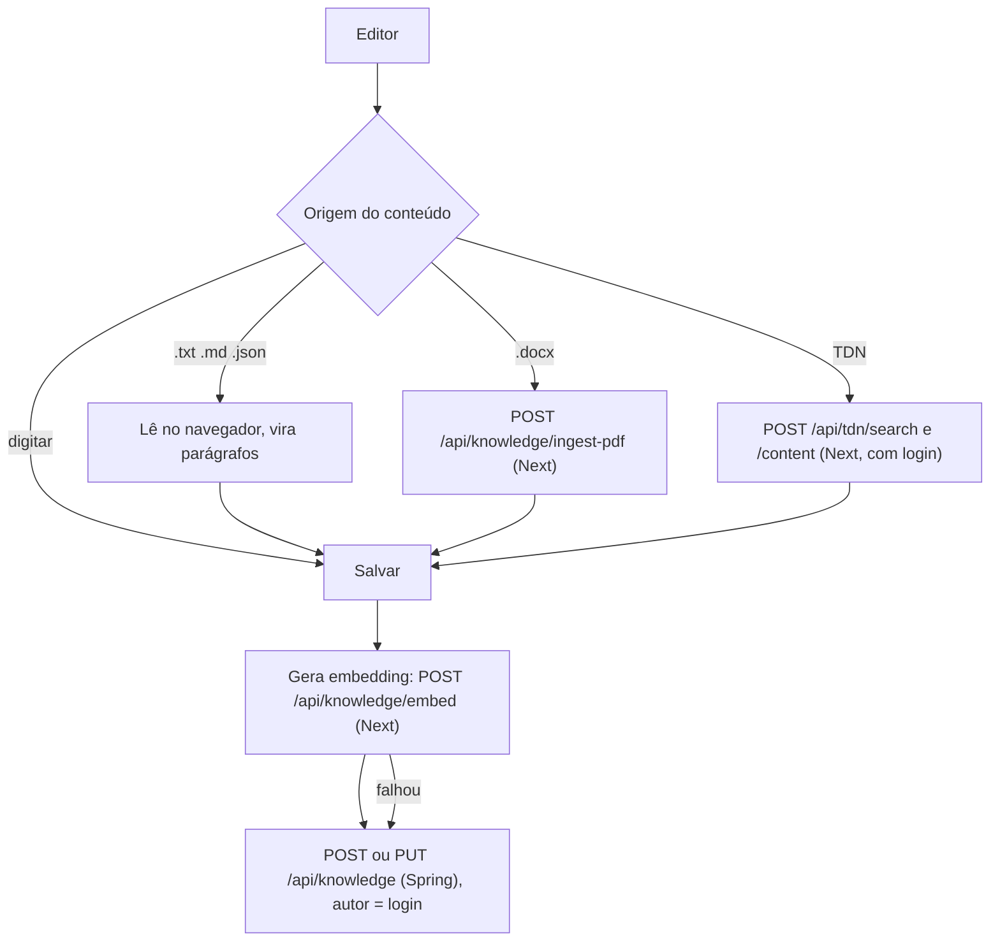

# Base de Conhecimento (wiki, busca, importação e Assistente de IA)

Descreve o que o código faz **hoje** (frontend e backend após as correções de 2026-10-09; migration V60 com índices). Suposições estão marcadas com **(suposição)**. Nada foi exercitado ao vivo (login Google/Firebase e chave de IA reais não estavam disponíveis): leitura de código e testes unitários.

## 1. Objetivo e quem usa

Wiki compartilhada da empresa para manuais técnicos e guias, com busca, importação do TDN/Confluence e de arquivos, e um **Assistente** que responde perguntas com base nos documentos.

| Quem | O que pode |
|---|---|
| Qualquer pessoa logada | Ler, criar, **editar qualquer documento**, restaurar da lixeira, conversar com o Assistente. A base é colaborativa e **não tem escopo por squad** |
| Autor do documento | Apagar o próprio |
| Administrador | Apagar qualquer documento |
| Chave de API (`X-Api-Key`) | Ler (`KNOWLEDGE_READ`) e criar (`KNOWLEDGE_WRITE`) pela API v1 e pelo MCP |

Sem login não há acesso a nada (nenhum conteúdo é público).

## 2. Telas e entradas

| Tela | Rota | Para quê |
|---|---|---|
| Base (leitura e gestão) | `/knowledge/kb` | Lista (até 200 documentos), filtros por módulo/categoria/tag, leitor com sumário, download, favoritos, sincronizar TDN |
| Novo / editar documento | `/knowledge/admin/new-asset` | Editor visual (Tiptap) + importar arquivo |
| Lixeira | `/knowledge/trash` | Documentos apagados (primeiros 100), restaurar |
| Assistente | `/knowledge/chat/[chatId]` | Conversas, lista lateral, resposta de IA |
| Configurações | `/knowledge/settings` | Chave Gemini (BYOK), modelo, total de tokens |
| Manual interno | `/knowledge/manual` | Texto de ajuda do módulo |

## 3. Fluxos principais

### 3.1 Criar, importar e salvar



- O **embedding** (vetor de 384 números, modelo multilíngue rodando no servidor Next, sem LLM) é gerado a partir de título + até 2.000 caracteres. Se falhar, o documento salva **sem** embedding e fica de fora da busca semântica.
- `/api/knowledge/ingest-pdf` (nome histórico) aceita PDF, DOCX e texto; **a tela só oferece `.docx`, `.txt`, `.md`, `.json`**. Regras: login, 10 chamadas/min por pessoa, arquivo até 20 MB, tipo conferido **pelo conteúdo** (PDF começa com `%PDF-`, DOCX é um zip, texto sem bytes nulos), tempo máximo de 60 s na leitura, texto extraído até 1,5 milhão de caracteres, mensagens de erro em português. PDF escaneado (sem texto) devolve 422.
- Servidor (`POST/PUT /api/knowledge`): título obrigatório (até 255), conteúdo até 2 milhões de caracteres, campos de caminho até 255, até 50 tags de 100 caracteres, status só `indexed`/`published`/`deleted`. **POST ignora o `id` do corpo** (antes um POST com id existente sobrescrevia o documento e a autoria de outra pessoa). `authorId`/`updatedBy` vêm sempre do login.
- Apagar: `DELETE` = só autor ou admin (marca `deleted`, `deletedAt`, `deletedBy`). O `PUT` com `status = deleted` agora segue a mesma regra (antes contornava). `PUT` sem status mantém o atual (antes zerava o status e o documento sumia das listas). Restaurar (`PUT` com status publicado) limpa as marcas de lixeira.

### 3.2 Busca

| Busca | Como funciona | Limites |
|---|---|---|
| Texto (`GET /api/knowledge?query=`) | `LIKE` em título, conteúdo, categoria e caminho. Se vierem menos de 3 resultados e a busca tiver várias palavras, refaz por palavras-chave **em memória** sobre **todos** os documentos ativos | Custo cresce com o tamanho da base |
| Semântica (`POST /api/knowledge/search/semantic`) | O navegador gera o embedding da pergunta; o servidor calcula o produto escalar contra o embedding **de todos** os documentos ativos e devolve os com similaridade ≥ 0,2 | Também em memória; ver pontos frágeis |
| Filtro por tags | Aplicado depois da paginação, no servidor | Total e páginas ficam errados com filtro; a tela filtra tags no navegador e não usa isso |
| Ordem padrão | Sem ordenação pedida, mais recentemente atualizado primeiro (novo) | — |

Não há filtro de permissão porque os documentos são de toda a empresa.

### 3.3 Assistente de IA

```mermaid
sequenceDiagram
    participant U as Pessoa
    participant UI as Tela do chat
    participant N as Next /api/ai/chat
    participant S as Spring /api/knowledge
    participant G as Google Gemini
    U->>UI: pergunta
    alt sem chave configurada
        UI->>S: busca semântica e por palavra-chave (+ TDN)
        S-->>UI: documentos
        UI-->>U: lista de resultados (sem gerar texto)
    else com chave BYOK
        UI->>N: mensagens (só papel+texto) + chave
        N->>N: valida login (GET /auth/me), limita 20 req/min
        N->>S: busca semântica pela pergunta (8 documentos), com o token da pessoa
        N->>G: instruções + documentos + mensagens
        G-->>N: texto + uso de tokens
        N-->>UI: resposta inteira (sem streaming)
        UI->>S: grava pergunta e resposta na conversa; soma tokens
    end
```

- **Contexto:** prioridade para (1) documentos enviados no pedido (máx. 20), (2) os 8 mais parecidos com a pergunta por busca semântica, (3) fallback: os 50 primeiros documentos (cache de 15 min por pessoa). Cada documento é cortado em 12 mil caracteres e o total em 120 mil.
- **Mensagens:** só as últimas 20, só texto, cada uma até 8 mil caracteres. O último papel precisa ser da pessoa (senão 400).
- **Instruções:** o texto dos documentos entra entre marcadores e o prompt diz que é **dado, não instrução**. Reduz, não elimina, o risco de *prompt injection* via documento editado por alguém.
- **Provedores:** só Google Gemini com chave da pessoa (ou chave do servidor por variável de ambiente) e "Lynn" (chave global, quando configurada, `provider: 'lynn'`, hoje sem chamada na tela). Chave começando com `sk-` (OpenAI/Anthropic) é recusada com mensagem clara; as opções OpenAI/Anthropic em Configurações aparecem como "Em breve".
- **Falha:** o motor tenta `gemini-2.5-flash` e, se falhar, `gemini-1.5-flash` (pode dobrar o custo em erro de cota). Em erro a tela mostra o motivo real e **devolve a pergunta à caixa de texto**; a pergunta só é gravada no histórico junto com a resposta.
- **Tokens:** o navegador informa o total; o servidor ignora negativos e limita 200 mil por chamada. É referência de custo, não medição confiável.

## 4. Estados e transições

- Documento: `published` / `indexed` → `deleted` (lixeira) → `published` (restaurar). Não existe exclusão definitiva e **não há purga automática** (a tela dizia "30 dias"; corrigido).
- Conversa: criada vazia (título derivado da primeira pergunta), mensagens acrescentadas uma a uma num campo JSON; até 100 mil caracteres por mensagem e 2 milhões por conversa (409 acima).

## 5. Permissões: servidor × cliente

| Ação | Servidor | Cliente |
|---|---|---|
| Qualquer rota `/api/knowledge/**` | Exige JWT (filtro) | `authFetch` |
| Apagar | Autor ou ADMIN (403 com mensagem) | Mostra a mensagem do servidor; apagar em lote conta sucessos e falhas |
| Conversas | Só a dona (404 para as dos outros) | — |
| Rotas Next (`ai/chat`, `embed`, `ingest-pdf`, `tdn/*`, `sync-manuals`) | Exigem login (validado em `/auth/me`) | `authFetch` |
| API v1 | `X-Api-Key` + escopo; **não devolve documento da lixeira** | — |

CORS: o `@CrossOrigin("*")` com credenciais do controlador foi removido; vale a configuração global de origens.

## 6. Dados guardados (negócio)

Documentos (título, conteúdo HTML, categoria, caminho, módulo/pasta, tags, tamanho, visualizações, autor, quem alterou/apagou e quando, id do TDN, embedding), conversas (título, mensagens), configurações de IA por pessoa (modelo e **chave cifrada em repouso**) e total de tokens por pessoa.

## 7. Rotas `/api` no Caddy (produção)

O Caddy manda `/api/*` ao Spring, exceto a lista `@nextApi`: `/api/ai/*`, `/api/llms`, `/api/mock-config`, `/api/mock/*`, `/api/tdn/*`, `/api/knowledge/embed`, `/api/knowledge/ingest-pdf`, `/api/knowledge/sync-manuals`, e agora `/api/v1/knowledge/docs/*/download`.

Conferência estática de **272 chamadas** do frontend contra os controladores Spring e a lista: **nenhuma chamada sem destino**. Observações:

- `GET /api/v1/knowledge/docs/{id}/download` só existia no Next e estava anunciado no catálogo de integrações → dava 404 para consumidores externos. Corrigido incluindo o caminho em `@nextApi`. **Exige reiniciar o contêiner do proxy** (bind mount do Caddyfile; ver `ambiente-e-deploy.md`).
- `src/app/api/jira/*` (7 rotas do Next) não estão em `@nextApi`; em produção quem atende é o Spring (que tem POST equivalente). Os handlers do Next são código morto em produção.
- Sem chamador no frontend: `/api/llms` (retorna 403 fixo), `/api/mock*` e `/api/knowledge/sync-manuals`.

## 8. Pontos frágeis e o que **não** foi corrigido

- **Chave BYOK sai do servidor para o navegador.** `GET /ai-settings` devolve a chave decifrada e o navegador a manda a cada pergunta. É a chave da própria pessoa, protegida por JWT e cifrada em repouso, mas qualquer XSS a leria. A correção real é o Spring chamar o provedor (mudança de arquitetura); mascarar só no GET não resolve porque a tela precisa da chave para usá-la. Decisão do dono do produto.
- **`NEXT_PUBLIC_GEMINI_API_KEY`** é variável de **build** (`Dockerfile` e `docker-compose.yml`): se tiver valor na VM, a chave fica embutida no JavaScript público. Conferir o `.env` de produção e deixar vazia; o servidor aceita também `GEMINI_API_KEY`/`GOOGLE_API_KEY` (não públicas). Não alterei o fallback para não derrubar quem depende dele.
- **Qualquer pessoa edita qualquer documento**, sem histórico de versões: um documento adulterado vira "verdade" para o Assistente. Mitigação parcial no prompt. Versionamento ou aprovação é decisão de produto.
- **Busca semântica e fallback por palavras-chave carregam todos os documentos (com conteúdo) na memória** a cada consulta. Aceitável para algumas centenas de documentos; para milhares precisa de busca vetorial no banco (pgvector) ou ao menos carregar só id+embedding.
- **Filtro por tags no servidor** fica após a paginação (total incorreto).
- **A lista da Base carrega só os 200 primeiros** e a lixeira os 100 primeiros; não há paginação na tela.
- **Gravação de mensagens de conversa** lê, altera e regrava o campo JSON inteiro; duas mensagens simultâneas na mesma conversa podem perder uma. A tela grava em sequência.
- **"Limpar Conversa"** (botão lateral) só limpa a tela; ao recarregar o histórico volta.
- **SSRF do TDN:** o domínio é validado (DNS e IPs privados) e redirecionamentos agora são bloqueados, mas continua existindo a janela entre a resolução do DNS e a conexão (DNS rebinding).
- **Limite de requisições é em memória** por processo (some ao reiniciar, não vale entre réplicas).
- **PDF não é oferecido na tela**, embora a rota o processe.
- **Fallback de modelo** pode duplicar o custo em erro de cota.
- **Importação TDN sobrescreve** o documento existente com o mesmo `tdnId`, de quem quer que seja.
- **Não testado ao vivo**: IA real, ingestão com arquivos reais, TDN, restauração da lixeira, V60.

## 9. Onde olhar no código

- Frontend: `src/app/knowledge/**` (kb, chat, settings, trash, admin/new-asset, `api.ts`), `src/components/knowledge/*`, `src/services/tdnService.ts`, `src/lib/ai-chat-context.ts`, `src/lib/file-sniff.ts`, `src/lib/text-to-html.ts`, `src/lib/embeddings.ts`, `src/lib/verify-auth.ts`, `src/lib/ssrf-guard.ts`.
- Rotas Next: `src/app/api/ai/chat`, `src/app/api/knowledge/{embed,ingest-pdf,sync-manuals}`, `src/app/api/tdn/{search,content}`, `src/app/api/v1/knowledge/docs/**`.
- Backend: `KnowledgeController`, `KnowledgeApiV1Controller`, `KnowledgeService`, `McpKnowledgeTools`, entidades `KnowledgeDocument`, `KnowledgeConversation`, `KnowledgeUserAiSettings`, `KnowledgeTokenUsage`, `Caddyfile` (lista `@nextApi`), migration V60.
