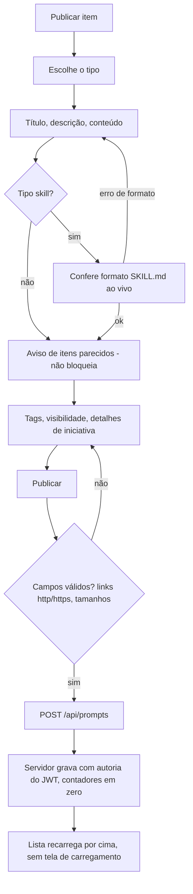
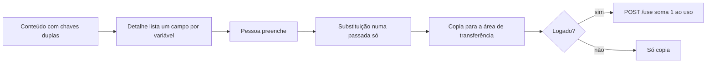
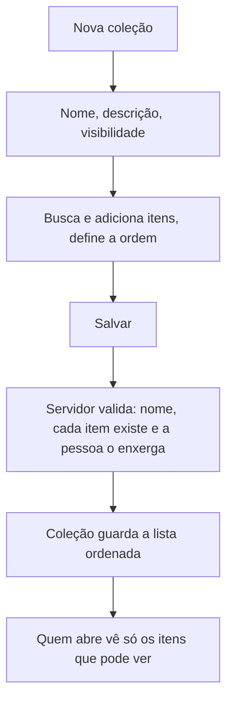
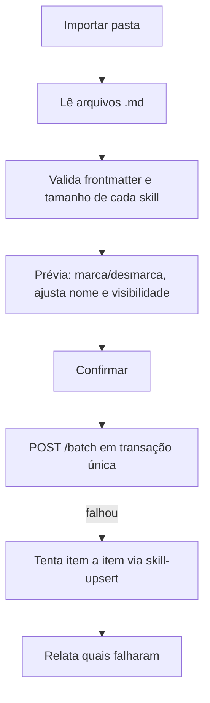

# Biblioteca de IA (`/prompt-hub`)

> Nome da tela: **Biblioteca de IA** (no código e na pasta: *Prompt Hub*; a aba do navegador ainda diz
> "Biblioteca de Modelos"). O usuário a chamou de **"Central de Iniciativas"**: é este o módulo auditado e
> corrigido (descrição na home: "prompts, skills, agentes, Gems e iniciativas de IA da empresa"). O item tem
> uma seção "Detalhes de iniciativa" (status, impacto, objetivo de negócio, público-alvo, documentação).
>
> Descreve o que o código faz **hoje** (frontend v4.21.0, backend com a migration V36). Itens marcados
> com **(suposição)** não foram confirmados no código ou ao vivo.

## 1. Objetivo e quem usa

Acervo da empresa para ativos de IA reaproveitáveis: prompts, skills, agentes, Gems, instruções, workflows,
configurações de MCP e recursos de referência. A ideia é **achar o que já existe antes de escrever de novo**.

| Papel | O que faz |
|---|---|
| Autor | Publica, edita, arquiva e exclui os próprios itens; comenta; monta coleções. |
| Dono de coleção | Cria e edita a trilha ordenada de itens; escolhe se é privada ou pública. |
| Leitor logado | Vê itens públicos e os próprios; copia, duplica para a biblioteca privada, favorita, comenta. |
| Visitante sem login | Só lê itens **públicos** (busca, filtros, detalhe e link compartilhado). Copiar funciona; não conta uso. |
| ADMIN | No servidor, pode editar/excluir item, coleção e comentário de qualquer pessoa e ver itens privados. Na tela não há botão para isso (a tela só mostra editar/excluir para o autor). |

## 2. Telas e entradas

| Tela | Rota | Para quê |
|---|---|---|
| Dashboard | `/prompt-hub` | Catálogo: busca, filtros (tipo, visibilidade, status, impacto, tags, favoritos), ordenação, destaques, cards. Abre editor, detalhe e importação. |
| Editor | diálogo no dashboard | Publicar/editar item. Seção recolhida "Detalhes de iniciativa". |
| Detalhe | diálogo no dashboard e página `/prompt-hub/[id]` (link compartilhável) | Ver conteúdo, preencher variáveis, copiar, duplicar, favoritar, discussão. |
| Coleções | `/prompt-hub/colecoes` e `/prompt-hub/colecoes/[id]` | Lista de trilhas e a trilha ordenada. Criação/edição em diálogo. |
| Página do autor | `/prompt-hub/autor/[authorId]` | Itens de uma pessoa (todos se for ela mesma; só públicos se for outra). Exige login. |
| Importação em lote | diálogo "Importar pasta" | Sobe pasta ou arquivos `.md` de skills (SKILL.md) de uma vez. |
| Tutorial | `/prompt-hub/tutorial` | Guia de criação de skills. |
| Seed | `/prompt-hub/seed` | Carga inicial de exemplos; restrita a admin só na tela. |
| Explorar sem login | botão na tela inicial do módulo | Abre o dashboard em modo somente leitura pública. |

Entrada do módulo: se a pessoa não tem login, vê a tela de apresentação com "Explorar Biblioteca Pública".
Se está logada mas sem cargo/squad no perfil, vê o convite para completar o perfil, com a opção "Apenas ver
modelos públicos" (nesse caso continua autenticada e lê pela rota normal).

## 3. Fluxo principal

### 3.1 Criar e publicar um item

- O botão trava enquanto salva (sem duplo clique). Fechar com alterações pede confirmação.
- Tag digitada sem Enter entra ao publicar. Limite de 30 tags de até 100 caracteres.
- Padrão do editor: visibilidade **privada**; status "Em produção" e impacto "Médio" (mesmo com a seção de iniciativa recolhida).
- Links (ferramenta e documentação) só são aceitos como `http(s)`.

### 3.2 Tipos de item

Oito tipos: Prompt, Skill, Agente, Gem, Instrução, Workflow, MCP e Recurso. O tipo muda rótulos, dica e formato
do conteúdo. Gem e afins têm "Link da ferramenta" (conteúdo opcional); os demais têm "Link de documentação" nos detalhes.
Skill exige frontmatter válido (nome, descrição) e erros de formato **bloqueiam** a publicação; avisos não.

### 3.3 Variáveis e copiar

No card, itens **com** variáveis abrem o detalhe para preencher; itens sem variáveis copiam direto.
Texto `${{ ... }}` e chaves em várias linhas não viram campos. Valores com `$` não são reinterpretados.

### 3.4 Duplicar (clonar)

Cria uma cópia **privada** do item para quem chama, "Cópia de <título>", e soma 1 ao contador de clones da origem,
tudo numa operação no servidor (`POST /{id}/clone`). Depois abre o editor na cópia. Só dá para duplicar o que a pessoa enxerga.

### 3.5 Comentar

Logado e com acesso ao item: escreve em "Discussão" (até 4.000 caracteres). Autor do comentário, dono do item
ou ADMIN podem remover. Autor do comentário vem do login, não do que a tela envia. Sem login, a seção pede para entrar.

### 3.6 Coleções

Coleção **não concede acesso**: item privado dentro de coleção pública continua invisível para outras pessoas.
Exige no mínimo 1 item na tela. A lista de coleções exige login.

### 3.7 Importar em lote

Visibilidade padrão da importação: **privada**. Skill do mesmo autor com o mesmo título é **atualizada**
(upsert) e mantém a visibilidade que já tinha. Lote: no máximo 200 itens.

### 3.8 Arquivar e excluir

- **Arquivar** = mudar o status do item para "Arquivado" no editor. Some do catálogo por padrão; o filtro de status mostra.
- **Excluir** (confirmação do navegador): o servidor tira o item de todas as coleções, apaga comentários e tags e remove o item.
  Não há lixeira nem desfazer. Favoritos guardados no navegador de outras pessoas ficam órfãos (a contagem ignora ids inexistentes).

## 4. Visibilidade: quem vê o quê

O tipo aceita `private`, `public`, `squad` e `role`, mas **squad e cargo não existem de fato**: o editor não oferece e nenhuma
consulta os usa. O servidor trata qualquer valor diferente de `public` como `private` ao gravar.

| Item | Autor | Outra pessoa logada | Visitante sem login | ADMIN |
|---|---|---|---|---|
| Privado | vê | **404** (some de lista, detalhe, comentários, coleções) | **404** | vê |
| Público | vê | vê | vê (rota aberta) | vê |
| Coleção privada | vê | 404 | não acessa (exige login) | vê |
| Coleção pública | vê tudo | vê, mas só os itens que pode ver | não acessa | idem autor |

**Leitura anônima nova**: `GET /api/public/prompt-hub/items` (lista paginada, máx. 50 por página) e
`GET /api/public/prompt-hub/items/{id}`. Só itens públicos. A resposta não traz o id interno do autor (só nome, cargo, squad e avatar de exibição),
nem comentários, nem coleções. Não existe escrita anônima.

**Por que 404 e não 403**: item privado e item que não existe respondem exatamente igual, então ninguém descobre
que um id privado existe. A página `/prompt-hub/[id]` mostra a mesma mensagem nos dois casos para quem não tem login.

## 5. Permissões

| Ação | Servidor (vale de verdade) | Cliente (só conveniência) |
|---|---|---|
| Criar item | Qualquer logado; autoria = JWT, id/contadores/datas ignorados do corpo | Exige sessão |
| Editar / excluir item | Autor ou ADMIN, senão 403 (404 se nem enxerga) | Botões só para o autor (`isOwner`); ADMIN não vê botão |
| Contar uso / clone | Qualquer logado que enxergue o item | Esconde para visitante |
| Comentar | Logado que enxerga o item; autoria = JWT | Exige sessão |
| Remover comentário | Autor do comentário, dono do item ou ADMIN | Lixeira para autor do comentário e dono do item |
| Criar coleção | Logado; dono = JWT; itens devem existir e ser visíveis a quem salva | Exige perfil |
| Editar / excluir coleção, adicionar/remover item | Dono ou ADMIN | Menu só para o dono |
| Seed (carga inicial) | **Sem restrição de admin no servidor**: usa o mesmo cadastro comum | Só a tela é restrita **(riscos: qualquer logado que chame a API faz o mesmo que o seed faz)** |

## 6. Dados persistidos (linguagem de negócio)

- **Item**: título, descrição, conteúdo, tipo, visibilidade, status, impacto, objetivo de negócio, público-alvo, links, autor (nome, cargo, squad, avatar copiados na criação), contadores de uso e de clone, datas de criação e atualização.
- **Tags**: lista do item, sempre em minúsculas, sem `#`.
- **Comentários**: texto, autor (copiado), data. Pertencem a um item.
- **Coleções**: nome, descrição, visibilidade, dono, lista **ordenada** de itens (guarda só referências).
- **Favoritos**: **não** ficam no servidor; ficam no navegador de cada pessoa (por usuário), não sincronizam entre dispositivos.

Regras:
- Contador de uso e de clone é somado **atomicamente** no banco (não perde contagens simultâneas) e **não altera a data de atualização**: usar um item não o faz parecer "recém-editado".
- Duplicar = cópia + contagem do clone numa transação só.
- Excluir item = tirar das coleções + apagar comentários + apagar item numa transação.
- Limites: título 255; descrição 10.000; conteúdo 200.000; campos curtos (objetivo, público-alvo, links) 255; comentário 4.000; coleção: nome 255, descrição 5.000.
- Índices por visibilidade/autor/dono e nas junções (migration **V36**).

## 7. Estados, filtros e busca

- **Status** (iniciativa): Ideação, Planejamento, Em desenvolvimento, Em produção (padrão), Arquivado. **Impacto**: baixo, médio, alto. O chip de status só aparece no card quando difere de "Em produção".
- **Filtros** do dashboard: tipo (com contagem), visibilidade (todos/públicos/meus privados), status (padrão **sem arquivados**), impacto, tags (todas as escolhidas), apenas favoritos. "Limpar filtros" volta ao padrão.
- **Busca** no navegador sobre título, descrição, conteúdo, autor, objetivo, público-alvo e tags; **ignora acento e maiúscula**.
- **Ordenação**: mais recentes, mais usados, mais clonados, A–Z.
- **Paginação**: o servidor limita página a 200 e ordena por atualização mais recente; o dashboard busca **todas** as páginas (até 10 de 200 por consulta, públicos e os próprios) e filtra no navegador. Acima de ~2.000 itens o resto não aparece **(limite de segurança do código)**. Visitante: páginas de 50, até 20.
- Tags populares: top 10, em minúsculas (sem duplicar por caixa).

## 8. Pontos frágeis e erros de fluxo conhecidos

- **Fuso das datas (corrigido em 09/10/2026)**: a VM, o contêiner do backend e o Postgres rodam em **UTC** e não há fuso configurado no Spring. As datas do servidor (`LocalDateTime`, gravadas com `now()` em UTC) saíam da API **sem fuso** e o navegador em Brasília as lia como horário local, adiantando 3 h. Agora o Jackson envia todo `LocalDateTime` como instante UTC com `Z` (`JacksonUtcConfig`); o banco e os valores gravados não mudam, e na entrada a API aceita com `Z`/offset (converte para UTC) ou sem fuso (como antes). **Exceção deliberada:** horários digitados por pessoa (prazo do cartão do Kanban em `UserKanbanCard.dueDate`, `WorkItem.targetStart/targetEnd`) continuam sem `Z`, porque são horário de parede e deslocariam. Dados antigos já estavam em UTC, então a correção vale retroativamente. Não verificado ao vivo.
- **Seed só no cliente**: a restrição a admin existe só na tela (ver seção 5).
- **API de coleções agora filtra itens**: `/api/prompts/collections` devolve só os itens que quem chama enxerga. Qualquer consumidor externo antigo que esperava a lista completa passa a ver menos itens. A API por chave (`/api/v1/prompt-hub`) já filtrava só públicos.
- **Busca no navegador**: todo o acervo é carregado; não escala bem para milhares de itens.
- **Squad/cargo como visibilidade** não existem apesar do tipo prever.
- **Favoritos locais**: somem ao trocar de navegador/limpar dados.
- **Sem limite de requisições específico** na leitura anônima (vale o geral de `/api/**`).
- **Nunca testado ao vivo** (login do Portal indisponível nas auditorias): nenhuma das telas foi exercitada em navegador; as correções foram validadas por testes automatizados (backend com mocks; frontend na camada de API) e por checagem de tipos. Não houve teste contra Postgres real: as consultas novas e a migration V36 ainda precisam ser vistas em ambiente real.
- **Migrations**: V36 (índices do prompt-hub; no repositório fica entre a V35 da Retro e a V37 do Review — se alguma delas já foi aplicada em produção antes, o Flyway reclama de ordem). **V40 não foi criada** por esta frente.
- **Doc antiga**: `src/app/prompt-hub/requisitos.md` ainda descreve partes do desenho em Firestore (favoritos, regras) **(suposição: desatualizado em parte)**.

## 9. Onde olhar no código

| Responsabilidade | Onde |
|---|---|
| Rotas e telas do módulo | `src/app/prompt-hub/` (`page.tsx`, `[id]`, `autor`, `colecoes`, `tutorial`, `seed`) |
| Catálogo, filtros, busca | `src/app/prompt-hub/components/Dashboard.tsx` |
| Cards, detalhe, editor | `components/PromptSpecimenCard.tsx`, `PromptView.tsx`, `PromptEditor.tsx` |
| Coleções e importação | `components/CollectionEditor.tsx`, `components/SkillImportDialog.tsx`, `skillFrontmatter.ts` |
| Chamadas à API (autenticada e pública) e erros | `src/app/prompt-hub/api.ts` |
| Tipos, status, visibilidade, rótulos | `types.ts`, `constants.tsx` |
| Itens parecidos e normalização de texto | `findSimilar.ts` |
| Testes do frontend | `src/app/prompt-hub/__tests__/` |
| Regras de acesso e dados (backend) | `agile-space-backend`: `service/PromptService` e `service/PromptCaller` |
| Rotas autenticadas | `controller/PromptController` (`/api/prompts`) |
| Leitura anônima | `controller/PublicPromptHubController` (`/api/public/prompt-hub`) e prefixo público em `security/JwtAuthenticationFilter` |
| API por chave / MCP | `controller/PromptHubApiV1Controller`, `mcp/McpPromptHubTools` |
| Entidades e consultas | `domain/Prompt`, `PromptComment`, `PromptCollection`; `repository/Prompt*Repository` |
| Banco | migrations `V1_1` (tabelas) e `V36` (índices) |
| Auditoria e achados | `side-session-notes/.../audit-iniciativas.md` |
