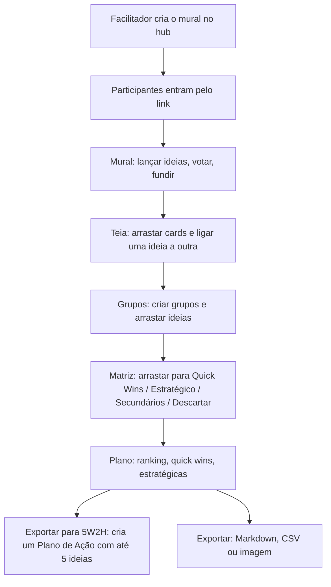

# Brainstorming

## Objetivo e quem usa

Mural colaborativo para gerar ideias em equipe e levá-las até um plano de ação, em cinco fases: **Mural** (ideação), **Teia** (ligações entre ideias), **Grupos** (agrupamento), **Matriz** (ROI x esforço) e **Plano** (resumo e exportação para o Plano de Ação 5W2H).

- **Facilitador:** quem criou o mural (`creatorId`) ou um ADMIN. É **um só** e **não há como transferir** o controle. Troca a fase, controla timer, anonimato, ocultação de ideias e modo apresentação, e pode apagar o mural.
- **Participante:** qualquer pessoa autenticada que abriu o link. Lança ideias, vota, edita o texto de qualquer ideia, funde, liga, agrupa e prioriza.
- **Decisão de produto aplicada:** o **link da sala dá acesso** (como a Review). Não há checagem de squad no mural porque ele só guarda o nome da squad em texto livre (`team`), não o identificador. *Decisão em aberto:* se o acesso deve ficar restrito à squad, o mural precisa passar a guardar o `squadId`.
- Entrar exige login (não é um item público).

## Telas

| Tela | Caminho | O que é |
|---|---|---|
| Hub | `/brainstorming` | Cria o mural (título + squad, preenchida com a do usuário). Guarda um atalho da sala criada no navegador (`localStorage`); não lista os murais da squad |
| Sala | `/brainstorming/[id]` | As cinco fases, barra com timer, participantes e exportação |
| Plano de Ação | `/action-plan/[id]` | Destino do botão "Exportar para 5W2H" da fase Plano (ver `plano-de-acao.md`) |

Barra do topo: fases (só o facilitador clica; abaixo de telas largas aparece um seletor de fase só para o facilitador), timer (1 a 5 min, som opcional), anonimato, ocultar/revelar ideias, modo apresentação, copiar link, participantes e exportar.

## Fluxo principal

1. **Criar.** O hub cria o mural na fase Mural, com timer parado de 10 min, anonimato desligado e ideias reveladas. O criador é gravado pelo servidor a partir do login.
2. **Entrar.** Ao abrir a sala a pessoa vira participante automaticamente (uma vez por sala; o apelido vem do perfil).
3. **Mural.** Cada ideia é um card. Quem escreveu pode apagar; qualquer participante pode editar o texto, votar e iniciar uma fusão. Busca por texto e ordenação (recentes/populares) são locais.
   - *Ocultar ideias* (facilitador): enquanto está oculto, cada pessoa só lê as **próprias** ideias; as demais aparecem borradas. *Anonimato* troca o autor por "Anônimo". Os dois são **só visuais** (ver pontos frágeis).
   - *Modo apresentação*: esconde o campo de nova ideia.
4. **Voto.** Alterna: um voto por pessoa e ideia, sem limite de ideias votadas e em qualquer fase em que o card tem botão de voto (Mural, Teia, Grupos). A operação é atômica no servidor.
5. **Fusão.** Botão de fusão no card de origem, depois clique no card de destino. O servidor junta o texto (destino + linha "- origem"), une os votos sem repetir quem votou nas duas, passa as ideias ligadas à origem para o destino e apaga a origem. Texto fundido acima de 5000 caracteres é recusado.
6. **Teia.** Arrastar grava a posição; ligar (de baixo de um card para o topo de outro) grava a ligação; clicar na linha pergunta se quer remover. O servidor recusa ligar uma ideia a ela mesma ou fechar ciclo.
7. **Grupos.** Criar grupo, arrastar ideias entre "Sem Grupo" e os grupos. Apagar um grupo pede confirmação e devolve as ideias a "Sem Grupo".
8. **Matriz.** Arrastar (ou os botões Quick Win/Descartar) grava ROI e esforço fixos: Quick Win 80/20, Estratégico 80/80, Secundário 20/20, Descartar 20/80, A Classificar 50/50. A regra de quadrante é a mesma na Matriz e no Plano.
9. **Plano.** Mostra Quick Wins, Iniciativas Estratégicas e o ranking por votos (10 primeiras). Clicar no texto de um card edita a ideia. "Exportar para 5W2H" cria **um novo** Plano de Ação com as **5 ideias mais votadas que não foram descartadas** (cada uma vira uma ação "A Fazer", com o grupo em "Onde" e o esforço em "Quanto") e leva a pessoa até ele. Se alguma ação falhar, o plano criado abre mesmo assim e um aviso diz quantas faltaram.
10. **Exportar.** Markdown e CSV (grupo, votos, texto, ROI, esforço, data) e imagem PNG da fase atual (Mural/Teia). Com as ideias **ocultas**, só o facilitador exporta.

## Estados e transições

| Item | Valores | Quem muda |
|---|---|---|
| Fase | `ideation` → `diagram` → `grouping` → `prioritization` → `actions` (qualquer ordem, nos dois sentidos) | Facilitador |
| Configurações | `isAnonymous`, `isRevealed` (ausente = revelado), `isPresentationMode`; mescladas **chave a chave** (alternar uma não desfaz a outra) | Facilitador |
| Timer | `stopped` / `running` / `paused`, com `endTime` (ms), duração e restante na pausa | Facilitador |

O servidor **guarda** o timer e **não conta tempo**: cada navegador calcula o que falta com o relógio local, e o `endTime` é calculado pelo navegador do facilitador. Ao zerar só toca o alarme (se o som da pessoa estiver ligado); nada muda sozinho.

## Tempo real (WebSocket `/ws/brainstorming/{id}?token=`)

O servidor exige login e que o mural exista. Depois de **cada gravação confirmada** (commit) ele envia:

| Evento | Quando | O cliente faz |
|---|---|---|
| `BOARD_UPDATED` | Mural criado/alterado (fase, timer, configurações) | Substitui os dados do mural |
| `BOARD_DELETED` | Facilitador apagou | Avisa e volta ao hub |
| `PARTICIPANT_JOINED` / `PARTICIPANT_LEFT` | Entrada/remoção | Atualiza a lista |
| `IDEA_SAVED` | Ideia criada/alterada (inclui voto, fusão, ligação, grupo) | Insere/substitui |
| `IDEA_DELETED` | Ideia apagada | Remove e solta a ligação das filhas |
| `GROUP_SAVED` / `GROUP_DELETED` | Grupo criado/alterado/apagado | Atualiza; no apagar, as ideias do grupo voltam a "Sem Grupo" (o servidor também publica cada ideia solta) |
| `REFRESH_BOARD` e desconhecidos | — | Recarrega tudo |

A resposta de cada gravação também é aplicada na hora, então a tela não depende do eco do WebSocket. Ao **reconectar** (com espera crescente de 1,5 s até 15 s e token relido) o cliente recarrega mural, ideias, grupos e participantes; respostas de recargas antigas são descartadas (vale só a mais recente). Ao trocar de sala o estado da anterior é limpo.

## Permissões (servidor x cliente)

| Ação | Servidor | Cliente |
|---|---|---|
| Ler mural, ideias, grupos, participantes e abrir o WebSocket | Qualquer autenticado (o mural precisa existir) | — |
| Criar mural | Autenticado; criador = quem chama | — |
| Mudar fase/timer/configurações/título (`PATCH /api/brainstormings/{id}`) | Só facilitador ou ADMIN (403 para os demais) | Botões só aparecem para o facilitador |
| Apagar mural | Facilitador ou ADMIN | — |
| Entrar na sala | Autenticado; o id do participante é sempre o do login | Automático |
| Sair / remover participante | A própria pessoa, facilitador ou ADMIN | Facilitador vê o botão de remover |
| Criar ideia | Autenticado; **autor = quem chama**, votos começam vazios | — |
| Editar texto, posição, grupo, ligação, qualificadores | Qualquer autenticado, só os campos enviados (`PATCH …/ideas/{id}`) | Qualquer participante |
| Votar | Autenticado; voto é de quem chama, com lock na ideia | Todos |
| Fundir | Autenticado, duas ideias do **mesmo** mural | Todos |
| Apagar ideia | Autor, facilitador ou ADMIN | Só o autor vê o botão |
| Criar/apagar grupo | Qualquer autenticado | Todos |

Ideia ou grupo de **outro mural** nunca é alterado pela rota de um mural (404/409). Gravar a ideia inteira (`POST …/ideas`, usado por abas antigas) não altera votos nem autor de uma ideia que já existe.

## Endpoints principais

`POST /api/brainstormings` (criar), `GET/PATCH/DELETE /api/brainstormings/{id}`, `GET /api/brainstormings?squadId=` (exige acesso à squad), `GET/POST …/participants`, `DELETE …/participants/{userId}`, `GET/POST …/ideas`, `PATCH …/ideas/{id}`, `POST …/ideas/{id}/vote`, `POST …/ideas/{alvo}/merge/{origem}`, `DELETE …/ideas/{id}`, `GET/POST …/groups`, `DELETE …/groups/{id}`.

Erros relevantes (com mensagem em português no corpo): `403` (não é facilitador/autor), `404` (mural, ideia ou grupo inexistente ou de outro mural), `409` (id de ideia/grupo pertence a outro mural), `400` (texto vazio ou longo demais, fase/timer/posição/ROI inválidos, ligação em ciclo).

## Dados guardados (negócio)

Mural (título, squad em texto, criador, fase, configurações, timer, data), ideias (texto até 5000 caracteres, autor, quem votou, posição, ligação a outra ideia, grupo, ROI e esforço, cor), grupos (nome, ordem, cor) e participantes (apelido, papel, se é criador, última atividade). Participante é único por (mural, pessoa). Há índices por mural em ideias e grupos e por squad no mural (migration V40). Não há versão (trava otimista); a consistência vem de lock na linha nas operações de voto, fusão, edição e mudança do mural.

## Pontos frágeis e erros de fluxo conhecidos

Corrigidos em 2026-10-09 (para quem comparar com o comportamento anterior): voto gravava o objeto inteiro e perdia voto simultâneo; fusão era duas chamadas (ideia ganhava o texto e a origem podia não ser apagada); qualquer autenticado alterava/apagava ideia, grupo e mural de qualquer outro mural e trocava `authorId` pelo corpo; qualquer participante mudava fase/timer/configurações pela API; gravar o mural inteiro desfazia a mudança de outra pessoa; teia só atualizava quando mudava a **quantidade** de ideias (ligações, votos e textos dos outros não apareciam); ideias de um grupo apagado sumiam da tela; texto digitado era perdido quando a gravação falhava; cards da teia/grupos nunca mostravam "você votou"; erros só iam para o console.

Ainda abertos:

- **Ocultar ideias e anonimato são só visuais.** O servidor continua enviando texto e autor de todas as ideias a todos os participantes (REST e WebSocket). Quem abrir as ferramentas do navegador lê tudo. Corrigir exige o servidor mascarar até a revelação (mudança de comportamento do mural, não feita).
- **Votação sem limite e sem fase.** A tela de apresentação do módulo e o manual falavam em "5 votos"; o código nunca limitou (textos corrigidos). Se o produto quiser limite, deve ser opção do facilitador (opt-in).
- **Facilitador único e intransferível.** Se o criador sair, ninguém troca a fase; ADMIN consegue.
- **Facilitador não apaga ideia de outra pessoa pela tela**, embora o servidor permita (a tela mostra o botão só ao autor). Decisão em aberto.
- **Qualquer participante edita o texto de qualquer ideia** (`allowAnyEdit` é intencional na tela). Sem histórico de quem editou.
- **Relógio do timer é o de cada navegador**, e o `endTime` vem do navegador do facilitador; diferença de relógio mostra segundos diferentes. Falta um relógio do servidor.
- **Alarme do timer baixa um áudio de um site externo** (mixkit); sem internet ou com bloqueio ele não toca.
- **Lista de participantes só encolhe por remoção explícita.** Sair da página não remove; quem foi removido volta ao recarregar (sem lista de banidos).
- **Duas pessoas arrastando o mesmo card na teia:** vale a última posição gravada.
- **Matriz usa arrastar do navegador (HTML5)**, que não funciona em toque; no celular só há os botões Quick Win e Descartar, sem como mandar para Estratégico/Secundário.
- **Indicador de "pilha" de ideias fundidas nunca aparece** (o card espera um campo `children` que o servidor não envia). Código morto.
- **"Exportar para 5W2H" não é idempotente:** cada clique cria outro plano.
- **Exportar imagem** da Teia/Mural falha em silêncio para o usuário se o navegador bloquear a captura (só registra no console).
- **Mural não lista os da squad**: quem perde o link só acha pelo histórico local do navegador ou pelo painel.
- **Não testado ao vivo:** nada desta rodada foi exercitado no app (exige uma conta logada, e não havia conta de teste nem banco local). Validado por testes unitários (backend: autorização, voto, fusão, patch, eventos pós-commit; frontend: cliente de API, reconexão do WebSocket e regras de lista/quadrante). A migration V40 só cria índices e nunca rodou contra um Postgres real antes do deploy.

## Onde olhar no código

- Frontend: `src/app/brainstorming/[id]/page.tsx` (estado, WebSocket, handlers), `src/app/brainstorming/api.ts`, `src/components/brainstorming/*` (uma pasta por fase: Mural, Diagram, Grouping, Prioritization, Actions, Toolbar, IdeaCard, Export), `src/components/shared/EliteCard.tsx` e `EliteTimer.tsx`, utilitários em `src/lib/brainstorming-utils.ts`, `src/lib/room-socket.ts` e `src/lib/ceremony-api.ts`.
- Backend: `BrainstormingController`, `BrainstormingService` (regras), `BoardWebSocketHandler` / `BrainstormingWebSocketHandler`, `BoardExistsHandshakeInterceptor`, entidades `BrainstormingBoard/Idea/Group/Participant`, migration V40.
