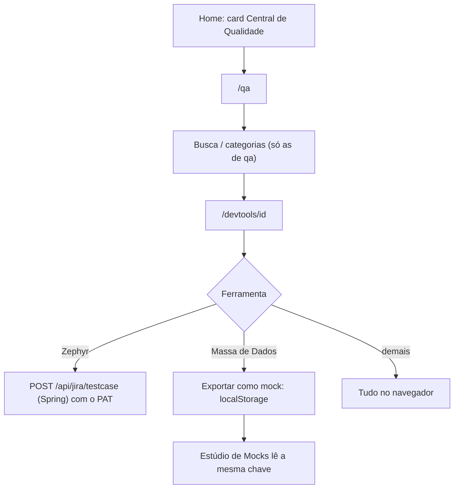

# Central de Qualidade

## Objetivo e quem usa

Atalho para as ferramentas de **teste e qualidade** do DevTools, num lugar só: massa de dados, Zephyr, BDD, automação, mocks e utilitários de API. Quem usa: QA e quem escreve testes. Não há papel exigido: qualquer pessoa logada.

A Central **não é um módulo separado**: `/qa` é o hub do DevTools filtrado. Não tem dados próprios, backend próprio nem estado próprio.

## Telas

| Tela | Caminho | O que é |
|---|---|---|
| Central de Qualidade | `/qa` | Mesmo componente do hub (`DevToolsHubPage`) com `collection="qa"`: mostra só as ferramentas marcadas `qa: true` no registro |
| Ferramenta | `/devtools/{id}` | Abre na mesma casca do DevTools (a trilha mostra "DevTools › Categoria", não "Central de Qualidade") |

Entrada na home: card **Central de Qualidade** (grupo "Ferramentas de Engenharia") aponta para `/qa`. O cabeçalho destaca a seção para `/qa`, `/devtools` e `/jolt`.

## O que aparece (15 ferramentas, `qa: true`)

JSON Schema, JWT Inspector, Regex Lab, Diff, UUID & IDs, Cliente HTTP, Massa de Dados, Zephyr Explorer, BDD & Bugs, Gerador de Automação, Fuzz de Limites, Diff de API, Estúdio de Mocks, Gerador JUnit, CPF & CNPJ. Como cada uma funciona e o que sai do navegador: `devtools.md`.

## Fluxo principal

Integração entre ferramentas: a **Massa de Dados** exporta o lote gerado como mock pela chave `agile-space_custom_mocks` do `localStorage`, e o **Estúdio de Mocks** lê a mesma chave.

## Estados e transições

Igual ao DevTools: sem estado compartilhado. O filtro de categorias do hub só lista categorias que têm ao menos uma ferramenta da Central (`dados`, `codificacao`, `texto`, `api`, `qualidade`).

## Permissões (servidor x cliente)

Só o login geral. A única chamada ao servidor é a do Zephyr (JWT + Jira do próprio usuário); ver `devtools.md`.

## Dados guardados (negócio)

Nenhum no servidor. No navegador: mocks e massa exportada (`agile-space_custom_mocks`), PAT/domínio do Jira (configurações de integração do usuário).

## Pontos frágeis e erros de fluxo conhecidos

- **Não é um módulo à parte:** pedidos de "recurso só da Central" caem no DevTools. A ferramenta aberta pela Central **perde o contexto** (botão e trilha levam a `/devtools`, não a `/qa`). Não corrigido: não há erro funcional, só navegação.
- **Cliente HTTP** (está na Central) tem destinos limitados pela política de segurança do navegador; ver `devtools.md`.
- **Zephyr** exige o domínio do Jira nas configurações de integração; sem ele agora há aviso antes de chamar o servidor.
- **Card morto na home:** nenhum. Os 15 links desta seção existem. (Ver `ferramentas-ageis.md` para o conjunto da home.)
- **Não testado ao vivo.**

## Onde olhar no código

`src/app/qa/page.tsx`, `src/components/devtools/DevToolsHubPage.tsx` e `DevToolsHub.tsx`, `src/lib/devtools/registry.ts` (campo `qa`), `src/components/home/ModuleGrid.tsx` (card), `src/components/layout/Header.tsx` (destaque do menu).
