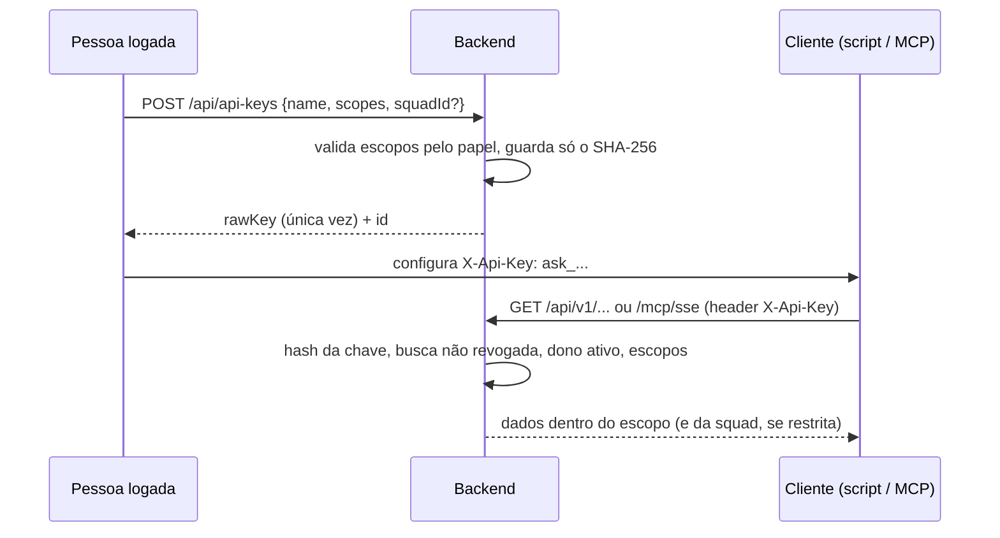

# Chaves de API (REST v1) e servidor MCP

Estado do `develop` em 2026-10-09.

## Objetivo e quem usa

Dar acesso **de máquina** (scripts, agentes de IA, clientes MCP como Claude/IDEs) a partes do Portal sem sessão de usuário: Base de Conhecimento, Prompt Hub (Biblioteca de IA), dados de squad e Scrum Poker.

- **Qualquer pessoa logada** gera e revoga as **próprias** chaves (`/api/api-keys`).
- **Admin/LEAD** têm também a visão global (`/api/admin/api-keys`): listam e revogam a chave de qualquer pessoa e criam chaves com todos os escopos.

## Telas

| Tela | Onde |
|---|---|
| Minhas chaves | configurações do espaço de trabalho (cliente `lib/my-api-keys-client.ts`) |
| Todas as chaves | `/admin` → API Keys (`components/admin/ApiKeysManager.tsx`) |

A chave **crua aparece uma única vez**, na resposta da criação (`rawKey`); depois só existe o hash.

## Fluxo principal

## Regras

- **Formato e armazenamento:** `ask_` + 64 hex (256 bits de entropia). No banco fica só o **SHA-256** (índice único), nunca a chave. Hash rápido é adequado porque a chave já é aleatória e longa.
- **Escopos** (`ApiKeyScope`): `KNOWLEDGE_READ`, `KNOWLEDGE_WRITE`, `SQUAD_READ`, `PROMPTHUB_READ`, `PROMPTHUB_WRITE`, `POKER_READ`, `POKER_WRITE`.
  - **MEMBER** só pode gerar `KNOWLEDGE_READ` e `SQUAD_READ`; `SQUAD_READ` fica **travado na squad ativa da pessoa** (e exige ter uma).
  - **ADMIN/LEAD** geram qualquer escopo e podem restringir a uma squad (ou deixar sem restrição).
  - A chave criada no painel admin (`/api/admin/api-keys`) recebe **todos os escopos e nenhuma restrição de squad**, em nome do admin.
- **Papel congelado:** o papel do dono é gravado na criação e não é reavaliado; rebaixar a pessoa **não** reduz os escopos de chaves já emitidas (revogar e recriar).
- **Chaves antigas (anteriores ao campo `ownerRole`)** são tratadas como acesso total ("grandfathered"), para não quebrar integrações em produção.
- **Revogação:** `POST /{id}/revoke`; efeito imediato (a consulta da chave filtra revogadas). O dono só revoga as próprias; admin revoga qualquer uma.
- **Dono desativado:** a chave deixa de valer (401) enquanto a conta estiver inativa.
- **`lastUsedAt`** é atualizado a cada uso.
- **Nome da chave:** obrigatório, até 100 caracteres.
- **Limite de taxa:** `/api/**` tem o limite geral por IP (300/min). `/mcp/**` **não** passa por esse limite.

## Rotas e autenticação

| Prefixo | Autenticação | Observação |
|---|---|---|
| `/api/v1/**` | `X-Api-Key` (sem JWT) | `KnowledgeApiV1Controller`, `PromptHubApiV1Controller` etc. conferem o escopo (`ApiKeyAccess.requireScope`) |
| `/mcp/sse`, `/mcp/message` | `X-Api-Key` no handshake e em cada mensagem | Tools MCP chamam `ApiKeyContext.from(...)` e conferem escopo e squad (`requireScope`, `requireSquad`) |
| `/api/api-keys`, `/api/admin/api-keys` | JWT de sessão | gestão das chaves |

O atributo de escopo é lido uma vez no filtro e repassado ao controller/tool; não há segunda consulta ao banco.

## Dados guardados

Chave (nome, hash, dono, papel do dono na criação, escopos, squad opcional, criada/último uso/revogada em). Nada da chave crua.

## Pontos frágeis e erros de fluxo conhecidos

**Corrigido nesta rodada:** chave de conta desativada continuava valendo; `/api/v1` sem barra final não era exigido pelo filtro de chave; nome de chave sem limite virava erro 500.

**Não corrigido / decisão:**

1. **Chaves não expiram.** Sem validade, sem rotação automática. Opção: validade padrão (ex.: 1 ano) **opt-in** na criação.
2. **Chave do painel admin tem todos os escopos sem restrição de squad**, e chaves legadas (sem `ownerRole`) também. São as mais perigosas se vazarem; recomenda-se revogá-las e recriar com escopos mínimos (mudança que **quebra integrações em uso**, por isso não foi feita sem aviso).
3. **Papel congelado na criação** (acima): rebaixar não revoga.
4. **Sem limite de chaves por pessoa.**
5. **`/mcp/**` sem limite de taxa** e a chave vai em cabeçalho (não em URL), o que é bom para logs. Como a chave tem 256 bits, força bruta não é viável; o risco é abuso por chave legítima.
6. **O Caddy de produção não roteia `/mcp/*` para o backend** (só `/api`, `/ws`, `/actuator`, `/v3/api-docs`, `/swagger-ui`); a requisição cai no frontend. Ou o MCP está inacessível em produção, ou o roteamento é feito de outro jeito que não está no repositório. **Confirmar com quem operou o deploy** antes de documentar o MCP como disponível.
7. **`lastUsedAt` grava no banco a cada requisição** (uma escrita por chamada); com tráfego alto isso pesa.
8. A tela de chaves pessoais espelha `scopesAllowedForRole` no cliente; a regra real é do servidor.

## Onde olhar no código

- Backend: `security/ApiKeyAuthenticationFilter`, `ApiKeyHashing`, `ApiKeyAccess`; `controller/ApiKeyController`, `ApiKeyAdminController`; `domain/ApiKey`, `ApiKeyScope`; pasta `mcp/` (`ApiKeyContext`, `ApiKeyTransportContextExtractor`, `McpServerConfig`, `Mcp*Tools`); migration `V1__create_api_keys_tables.sql`.
- Frontend: `lib/my-api-keys-client.ts`, `components/admin/ApiKeysManager.tsx`, `app/admin/api.ts`.
- Testes: `ApiKeyAuthenticationFilterTest`, `ApiKeyAccessTest`, `ApiKeyIntegrationTest`, `mcp/ApiKeyContextTest`, `AccessControlsHardeningTest`.
