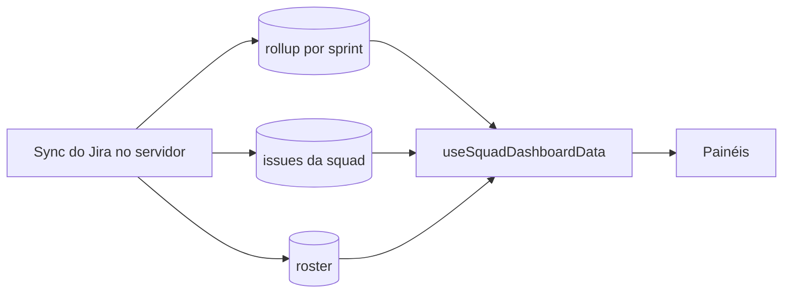

# Dashboards por papel

Estado do `develop` em 2026-10-09. Sem teste ao vivo.

## Objetivo e quem usa

Mostrar a cada papel os números da sprint que importam para ele, sempre a partir do que foi sincronizado do Jira. Sem dado, o painel diz **"sem dados desta squad ainda"** e o próximo passo (sincronizar no Squad Hub); sem squad, manda para os Primeiros passos.

## Telas e quem acessa

| Painel | Caminho | Papéis que abrem (cliente) |
|---|---|---|
| Execução (Dev, QA, UX…) | `/squad/dashboards/member` | Dev, QA, Designer, UX, SME, Stakeholder |
| Product Owner | `/squad/dashboards/product-owner` | Product Owner |
| Agile Master | `/squad/dashboards/agile-master` | Agile/Scrum Master, Agile Coach |
| People Lead | `/squad/dashboards/people-lead` | People Lead |
| Tech Lead | `/squad/dashboards/tech-lead` | Tech Lead, Arquiteto |
| Tribo | `/squad/dashboards/tribe-level` | Tribe Lead, admin |
| Consultas JQL | `/squad/dashboards/custom` | Todos |
| Meu painel (aba do hub) | `/squad?tab=dashboards` | Mesmas regras, tudo numa tela |

`/dashboards/product-owner` e `/squad/panels` apenas redirecionam. `/squad/dashboards` leva ao painel do papel (`getDashboardRouteForRole`).

Regra de cliente (`lib/dashboard-roles.ts`): Agile Master, Agile Coach, Tribe Lead e admin veem **todas** as abas; os demais veem JQL + o painel do próprio papel e, abrindo a URL de outro, recebem "Este painel é de outro papel". **Isto é só tela**: o servidor não distingue painel, ele decide por squad (ler = membro da squad). Dado por pessoa (horas, carga) é protegido no servidor só nas horas (`member-metrics`, `worklog-cache`, liderança); a lista de issues com responsável é legível por qualquer membro (é o próprio quadro da squad).

## De onde vem cada número

`useSquadDashboardData`: busca rollup da sprint ativa, issues e roster **separadamente** (se as issues falham, o painel mostra o erro em vez de uma squad "vazia"). Sem roster sincronizado, usa o cadastro do projeto.

- **Sprint em foco:** "atual" = sprint do rollup; as issues são filtradas por ela (antes entravam as de todas as sprints). Outra sprint escolhida busca o rollup gravado dela; sem rollup, calcula das issues pela **categoria do Jira** (nunca copia o da atual).
- **Minhas tarefas:** issue com o mesmo id do Jira ou **nome completo igual** (sem acento/caixa). Sem tarefa própria, a tela diz isso; não mostra as do time.

| Painel | Números |
|---|---|
| Execução | Meu progresso (concluídas ÷ minhas), minhas por status, meus bugs **em aberto**, minhas tarefas, rituais da squad |
| PO | Say/Do = concluídas ÷ itens da sprint (**inclui o que entrou depois do planejamento**, não é "escopo combinado" estrito), escopo por tipo, em andamento, pendentes |
| Agile Master | % entregue, status, bugs (impedimentos **não** são lidos do Jira), atalho do Plano de ação |
| Tech Lead | Esforço (funcionalidade/bug/débito por palavra no título), itens em review/QA (por palavra no status), carga por pessoa |
| People Lead | Horas **estimadas** das tarefas × capacidade da semana (horas/dia × 5); quem não tem horas/dia fica sem barra |
| Tribo | Por squad do cadastro: concluídos ÷ total do rollup (previsibilidade), atrasados; squad fora da tribo mostra "sem acesso" |

Divisão por zero: `percentOf` devolve vazio quando não há total. Contagens usam `??` (rollup com 0 é 0 de verdade).

## Permissões: servidor x cliente

Servidor: ler rollup/issues/roster = membro da squad (liderança transversal só da própria tribo). Cliente: abas por papel. Tribo: cada squad é uma chamada de rollup; as negadas aparecem como "sem acesso".

## Dados persistidos

Nada próprio: tudo vem do rollup, issues e roster. Painéis JQL ficam no navegador.

## Pontos frágeis e erros conhecidos

- **Corrigidos:** zeros e 0% falsos, issues de outras sprints nas listas, sprint escolhida copiando os números da atual, tarefas do time exibidas como "minhas", `includes` por nome, 8 h inventadas de capacidade, barra fictícia "Story: 0".
- **Não corrigido:** "previsibilidade" é só concluídos ÷ total (não compara com o planejado no início); Tech Lead depende de palavras no título/status em português ou inglês; painel por papel não é proteção (qualquer membro lê as mesmas issues); `Meu painel` repete a lógica das páginas (código duplicado); o hook roda 2 vezes por página (duplica requisições); a página Tribo faz uma chamada por projeto (N+1, sem paginação).
- **Decisão do usuário:** impedimentos e prioridade não existem no que se sincroniza; mostrar exige ampliar o sync.

## Onde olhar no código

`src/app/squad/dashboards/*`, `src/components/squad/dashboards/*` (DashboardDataNotice, SquadDashboardView, CustomJqlPanelsSection), `src/hooks/useSquadDashboardData.ts`, `src/lib/dashboard-roles.ts`, `src/lib/squad-metrics.ts`.
