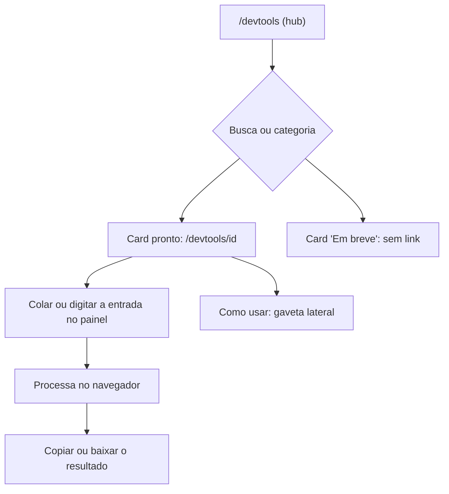

# DevTools

## Objetivo e quem usa

Caixa de ferramentas do dia a dia de desenvolvimento e qualidade (formatar JSON, decodificar JWT, testar regex, gerar massa de dados...). A promessa do produto é **rodar no navegador, sem enviar o conteúdo a servidor**; algumas ferramentas fogem disso de propósito e dizem na própria tela (tabela abaixo).

- Qualquer pessoa **logada** usa. Não há papel nem guarda de rota além do login geral (`AuthGuard`; só `/login` é público). Nenhuma ferramenta expõe dados internos do Portal: as que falam com o servidor do Portal são só o **Zephyr** (via Jira) e, sem uso pela interface, o motor de mocks em memória.
- A Central de Qualidade (`/qa`) é o mesmo hub filtrado; ver `central-de-qualidade.md`.

## Telas

| Tela | Caminho | O que é |
|---|---|---|
| Hub | `/devtools` | Cards de todas as ferramentas, busca (tecla `/` foca) e filtro por categoria |
| Ferramenta | `/devtools/{id}` | Casca única (`DevToolPage`): cabeçalho, trilha "DevTools › Categoria", gaveta "Como usar", corpo em tela cheia |

O catálogo vive em um registro só (`src/lib/devtools/registry.ts`): id, título, descrição, categoria, ícone, se aparece na Central de Qualidade (`qa`), status (`ready`/`soon`), palavras de busca e passos do "Como usar". Hoje as 33 ferramentas estão `ready`; um card `soon` apareceria desativado ("Em breve"). Cada id do registro tem sua pasta em `src/app/devtools/` e vice-versa (conferido em 2026-10-09, sem card morto).

## Fluxo principal

## Catálogo, o que cada uma faz e o que sai do navegador

**Dados & Formatos:** JSON Studio, XML Studio, YAML ⇄ JSON, SQL Formatter, JSON Schema (valida e gera), Planilha → CSV (lê `.xlsx` no navegador, sem biblioteca externa; sem limite de tamanho do arquivo).
**Codificação & Segurança:** Base64, URL Encoder, JWT Inspector (só decodifica, não valida assinatura), Deep Decoder, Certificados, Cofre de Segredos.
**Texto & Código:** Regex Lab, Diff, String Master, Gerador de Tipos, Cron, Data & Hora, UUID & IDs, Calculadoras.
**Rede & Brasil:** IP Analyzer, Consulta de CEP.
**API & Integração:** Cliente HTTP, Snippets de API.
**Qualidade & Testes:** Massa de Dados, Zephyr Explorer, BDD & Bugs, Gerador de Automação, Fuzz de Limites, Diff de API, Estúdio de Mocks, Gerador JUnit, CPF & CNPJ.
**Documentação:** Markdown Viewer.

Ferramentas que **falam com a rede** (tudo mais é local):

| Ferramenta | Para onde vai | O que é enviado | Risco |
|---|---|---|---|
| **Consulta de CEP** | `viacep.com.br` (direto do navegador) | O CEP digitado | Baixo. Estava **bloqueado pela política de segurança (CSP)** em produção; liberado em 2026-10-09 |
| **IP Analyzer** ("Localizar") | `ipapi.co` | O IP consultado (ou o do próprio usuário) | Baixo; a tela avisa |
| **Cliente HTTP** | A URL digitada, direto do navegador | Método, URL, cabeçalhos e corpo informados | Ver "Pontos frágeis": a CSP só libera alguns destinos |
| **Zephyr Explorer** | Backend Spring `POST /api/jira/testcase`, que chama o Jira do usuário | Código do caso, domínio do Jira e o **PAT** do usuário | PAT passa pelo servidor do Portal; o servidor só lê, valida o domínio e o código (`[A-Za-z0-9_-]{1,60}`) |
| **Gerador JUnit** (motor avançado, opcional) | Google Gemini, direto do navegador | A **classe Java colada** e a chave do próprio usuário | A chave fica em `localStorage` em texto puro; o código da classe sai da máquina. O motor local (esqueleto) não envia nada |

Guardam dados no navegador (`localStorage`): Estúdio de Mocks (`agile-space_custom_mocks`), Cofre de Segredos (`devtools.secret-vault.v1`, cifrado com AES-GCM; a senha mestra nunca é guardada), Gerador JUnit (chave do Gemini e modelo), Massa de Dados (mocks), Zephyr (o PAT é salvo nas configurações do Jira do usuário).

## Estados e transições

Cada ferramenta é local e sem estado compartilhado: entrada → resultado. Estados que variam: `carregando` (Zephyr, CEP, IP, Cliente HTTP, Gemini), `erro` (mensagem na própria tela ou toast) e `resultado`. O Cliente HTTP cancela a requisição anterior ao disparar outra.

## Permissões (servidor x cliente)

- **Cliente:** login geral; nada mais. Não existem ferramentas restritas a admin ou liderança.
- **Servidor:**
  - `POST /api/jira/testcase` (Spring) exige JWT como toda rota `/api/**` fora da lista pública. A rota equivalente em `src/app/api/jira/testcase/route.ts` (Next) **não é usada em produção**, porque o Caddy manda `/api/jira/*` ao Spring.
  - `GET/POST/DELETE /api/mock-config` exige login; `ANY /api/mock/*` é **público** (feito para ser consumido por outros sistemas). Ambos estão na lista `@nextApi` do Caddyfile (vão ao Next). O estado desses mocks fica **na memória do servidor, compartilhado entre todos e perdido a cada deploy**. A interface "Estúdio de Mocks" **não usa** essas rotas (guarda no navegador); só quem as chama direto as usa. Em 2026-10-09 ganharam limites (200 mocks, 20 contratos Swagger, 200 mil caracteres por resposta, atraso máximo de 10 s, status entre 100 e 599).

## Dados guardados (negócio)

Nada no banco. Tudo é navegador (ver acima) ou memória do servidor (mocks via API). O Zephyr, ao buscar, grava o PAT e o domínio nas configurações de integração do Jira do usuário (as mesmas do Painel do Time).

## Pontos frágeis e erros de fluxo conhecidos

Corrigidos em 2026-10-09: CEP e o exemplo inicial do Cliente HTTP (`viacep`) bloqueados pela CSP; Zephyr sem domínio do Jira falhava com mensagem do servidor sem dizer onde configurar (agora avisa antes); contadores do relatório do Zephyr aceitavam negativos; mensagem de falha do Cliente HTTP só falava de CORS; motor de mocks sem limites.

**Não corrigido:**

- **Cliente HTTP quase só funciona para destinos da lista da CSP** (`connect-src` em `next.config.ts`: o próprio Portal, GitHub, Google APIs, ipapi.co, viacep, alguns hosts de imagem). Qualquer outra API é bloqueada pelo navegador antes de sair. Abrir `https:` inteiro enfraquece a proteção contra exfiltração em caso de XSS. *Decisão do usuário:* manter assim (e dizer isso na tela), liberar mais hosts específicos, ou aceitar o risco de liberar tudo? Além disso `upgrade-insecure-requests` faz `http://localhost` virar `https`.
- **"O conteúdo não sai da sua máquina"** (subtítulo do hub) não vale para CEP, IP, Zephyr e Gerador JUnit avançado; cada uma diz isso na própria tela, mas o hub promete o contrário.
- **PAT do Jira e chave do Gemini em `localStorage` em texto puro.** Qualquer script na página (XSS) leria. Comportamento herdado.
- **Mocks em memória do servidor** (`/api/mock-config`): compartilhados, sem dono, perdidos no deploy, listados a qualquer logado; sem uso pela interface. Se for aposentar, remover as rotas; se for usar, precisa de dono e persistência.
- **Planilha → CSV** lê o arquivo inteiro na memória, sem limite: um arquivo enorme trava só a aba de quem o abriu.
- **Auditoria parcial:** as 33 páginas foram verificadas por busca de chamadas de rede, uso de armazenamento e lógica em Zephyr, Cliente HTTP, Gerador JUnit, Cofre, Mocks e CEP/IP; **as demais não foram lidas linha a linha** (parsers, geradores e conversores locais, sem efeito colateral). Nada foi exercitado ao vivo.

## Onde olhar no código

- Frontend: `src/lib/devtools/registry.ts` (catálogo), `src/components/devtools/` (`DevToolsHub`, `DevToolsHubPage`, `DevToolPage`, `ToolPane`, editor HTTP), `src/app/devtools/*/page.tsx` (uma pasta por ferramenta), `src/lib/devtools/*` (HTTP, IP, JUnit, documentos BR), `next.config.ts` (CSP).
- Servidor: `JiraController`/`JiraService` (`/api/jira/testcase`), `src/app/api/mock/[...slug]` e `src/app/api/mock-config` (Next), `Caddyfile` (`@nextApi`).
