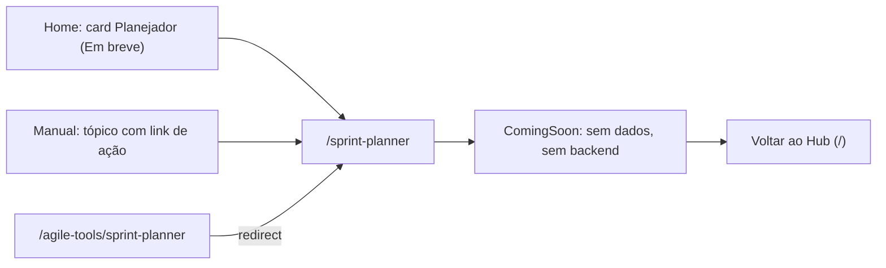

# Ferramentas ágeis avulsas e Arquitetura

## Objetivo e quem usa

Este documento cobre o que sobrou fora dos módulos principais: a pasta `/agile-tools`, o **Planejador de Entregas** (`/sprint-planner`) e o componente de **Arquitetura** (quadro Excalidraw). Hoje **nenhum deles entrega funcionalidade**: o Planejador é uma página "Em breve" e a Arquitetura não tem rota. Serve para o próximo agente não procurar fluxo que não existe. Também traz a **conferência dos cards da home**.

## Telas

| Tela | Caminho | Situação |
|---|---|---|
| Planejador de Entregas | `/sprint-planner` | Página "Em breve" (`ComingSoon`): "Capacidade do time e planejamento de sprint, depois do Scrum Poker. Estamos redesenhando este módulo". Rota viva, sem 404; botão "Voltar ao Hub" |
| Alias antigo | `/agile-tools/sprint-planner` | `redirect('/sprint-planner')`. É a **única** página sob `/agile-tools` |
| Arquitetura (quadro Excalidraw) | **nenhuma** | `src/components/architecture/ExcalidrawRoom.tsx` existe, mas nenhuma página o importa (órfão) |

## Fluxo principal

## O componente de Arquitetura (órfão)

`ExcalidrawRoom` renderiza um Excalidraw em tela cheia. Pelo código:

- Carrega o quadro do `localStorage` (`agileSpace_excalidraw_board` + `_{userId}` quando há perfil) e salva 1,5 s depois de cada mudança (`serializeAsJSON`).
- Exporta SVG (`architecture_visual.svg`) por uma função entregue ao pai (`onExportReady`).
- Desativa abrir/salvar arquivo e exportação nativa do Excalidraw.

Se alguém criar uma rota para ele, há dois problemas já visíveis no código (por isso não foi religado): a chave usa `userProfile.id` na primeira leitura, que pode chegar **depois** do carregamento (abre o quadro "genérico" e não o do usuário), e o salvamento adiado **não é descarregado ao sair da página** (perde até 1,5 s de desenho). Nada disso está acessível hoje.

## Cards da home (`ModuleGrid.tsx`) conferidos

Todos apontam para rota que existe (conferido por `page.tsx` em 2026-10-09):

| Card | Rota | Situação |
|---|---|---|
| Jolt | `/jolt` | Funciona (ver `jolt.md`) |
| DevTools | `/devtools` | Funciona (ver `devtools.md`) |
| Central de Qualidade | `/qa` | Funciona (ver `central-de-qualidade.md`) |
| Painel do Time | `/painel` | Existe |
| Meu Quadro | `/workspace` | Existe |
| Planejador | `/sprint-planner` | **Placeholder "Em breve"** (marcado `soon` no card; não é card morto, mas também não há funcionalidade) |
| Radar de Clima | `/health-check` | Existe |
| Painel de Ideias | `/brainstorming` | Existe |
| Plano de Ação | `/action-plan` | Existe |
| Conhecimento | `/knowledge/kb` | Existe |
| Biblioteca de IA | `/prompt-hub` | Existe (ver `biblioteca-ia.md`) |
| Políticas & Ajuda | `/governance`, `/changelog`, `/manual`, `/support` | Existem |

**Cards mortos: nenhum.** Os cards de Retro, Poker e Review não estão nesta grade (têm entrada própria); a existência das rotas deles não foi conferida aqui. "Existe" significa que há `page.tsx`; o conteúdo dessas rotas foi auditado por outras frentes ou não foi auditado.

## Permissões (servidor x cliente)

Nenhuma: não há chamadas ao servidor nestas telas.

## Dados guardados (negócio)

Nenhum. O histórico de uso (`useToolHistory`) conhece o tipo `sprint-planner`, mas a página "Em breve" não grava nada.

## Pontos frágeis e erros de fluxo conhecidos

- **Planejador sem funcionalidade.** O tópico do Manual (`topics.ts`) e o card da home levam a uma página vazia; o card avisa "Em breve", o Manual não necessariamente. *Decisão de produto:* quando (e se) o módulo volta, e como (o legado tinha uma versão, que não foi portada).
- **Pasta `/agile-tools` quase vazia:** só o redirect. Pode ser removida junto com o alias, se nenhum link externo usar `/agile-tools/sprint-planner` (não verificado).
- **Componente de Arquitetura órfão:** peso morto no repositório e dependência `@excalidraw/excalidraw` (pesada) sem uso aparente. Decidir: criar a rota ou remover.
- **Não testado ao vivo.**

## Onde olhar no código

`src/app/sprint-planner/page.tsx`, `src/app/agile-tools/sprint-planner/page.tsx`, `src/components/shared/ComingSoon.tsx`, `src/components/architecture/ExcalidrawRoom.tsx`, `src/components/home/ModuleGrid.tsx`, `src/app/manual/data/topics.ts`.
