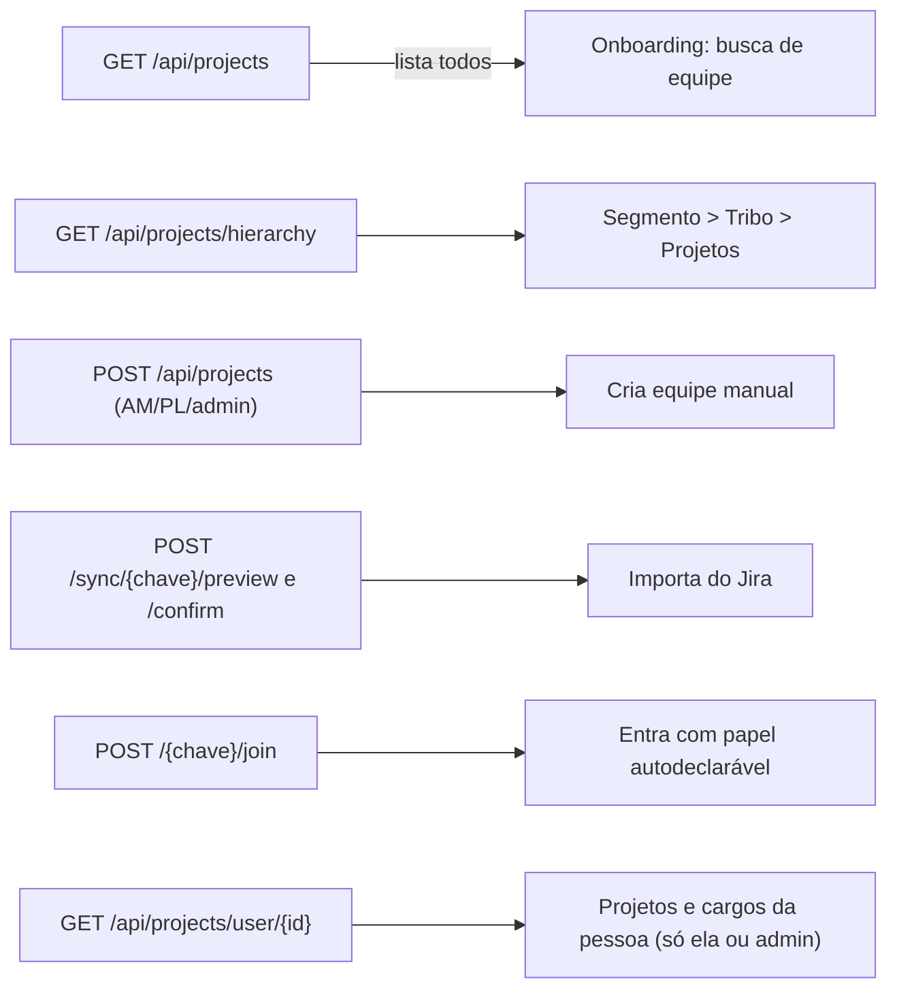

# Governança, Product Owner e Projetos

Descreve o que o código faz **hoje** (`develop`, 2026-10-09). Sem teste ao vivo.

## Objetivo e quem usa

Três entradas que parecem módulos mas são, na maior parte, **atalhos**:

| Entrada | O que é de verdade |
|---|---|
| `/governance` | Página **estática** de transparência: pilares de segurança, limitações conhecidas, inventário de dados, avisos legais, links para `/support` e `/manual`. Sem dado do servidor, sem controle de acesso |
| `/governance/product-owner` | **Redireciona** para `/squad/dashboards/product-owner` |
| `/projects` | **Redireciona** para `/admin?tab=governance` (aba de sincronização do Jira, área de admin) |

O cadastro e a hierarquia de projetos de verdade moram no backend (`/api/projects`) e são usados pelo onboarding, pelo seletor de equipes e pela importação do Jira.

## Telas e entradas

- **`/governance`**: leitura. Texto fixo no código (sem fonte de dados).
- **Dashboard do PO** (`/squad/dashboards/product-owner`): abas por papel (Tribe, PL, PO...) filtradas por `lib/dashboard-roles` conforme o cargo da sessão; dados do mesmo hook do painel.
- **`/admin`** (aba Governança → "Sincronização Jira"): só admin no cliente; abre sempre nessa aba (o `?tab=` é ignorado, funciona por coincidência com o padrão).

## Fluxo de projetos (backend)

- **Lista:** devolve **todos** os projetos com a equipe completa (nome, e-mail, cargo) a **qualquer pessoa logada**. É o que permite à pessoa encontrar a própria equipe; também significa que qualquer usuário vê o roster de qualquer equipe. Decisão de produto atual (documentada em `onboarding-e-papeis.md`).
- **Hierarquia:** agrupa por segmento e tribo; projeto sem segmento vai para "Segmento Geral" e sem tribo para "Geral". Conta líderes por projeto.
- **Acesso por liderança transversal:** Tribe Lead, Agile Coach e People Lead enxergam **todos os projetos da mesma tribo ou do mesmo segmento** (comparação por nome, sem acento nem caixa). Por segmento é um alcance largo; ver pontos frágeis.
- **`/user/{identificador}`:** agora só responde para o **próprio usuário** (id, e-mail ou conta do Jira) ou admin; antes qualquer pessoa logada listava as equipes e cargos de qualquer outra pelo e-mail.

## Estados e transições

Projeto: criado manualmente (`status = EM ANDAMENTO`, 1 pessoa) ou importado do Jira (campos do Profields, `status` do Jira). Reimportar substitui o time (com a mescla descrita em `integracao-jira.md`). Não há exclusão de projeto nem "arquivar".

## Permissões: servidor x cliente

| Ação | Servidor | Cliente |
|---|---|---|
| Ver `/governance` | nada exigido | nada |
| Abrir dashboard do PO | só login + ser membro da squad para ler os dados | filtra abas pelo cargo guardado na sessão/`localStorage` (**editável pelo usuário**); o servidor não distingue cargo |
| Criar/importar equipe | AM/PL/admin (ou listado como tal no Jira) | esconde botões |
| `/admin` | `ADMIN` obrigatório em `/api/admin/**` | também checa no cliente |
| Ver roster de qualquer projeto | qualquer logado | — |

Ou seja: **o gate do dashboard do PO é só de interface**. Um Developer que alterar o cache local vê as mesmas abas, e mesmo sem alterar o servidor devolve os mesmos números a qualquer membro da squad.

## Dados persistidos

`project_configs` (segmento, tribo, localidade, VP, status, tamanho do time, flags de fluxo do Profields, JSON bruto do Profields) e `project_member_roles` (papel, chave, conta Jira, nome, e-mail, avatar embutido, `user_id`, liderança). Índices por projeto, e-mail e conta Jira.

## Pontos frágeis e erros de fluxo conhecidos

**Corrigidos agora:** `/api/projects/user/{id}` aberto (ver acima); N+1 na lista e na hierarquia de projetos (uma consulta de membros por projeto; agora uma só).

**Não corrigidos (e por quê):**

- **`/governance` afirma coisas que o código contradiz**: "sem migrations manuais: o schema é derivado das entidades" (há Flyway e `ddl-auto: validate`); "Integração Jira/TDN: somente o usuário dono" (admin também lê o token); "Política v3.0" é texto fixo; as limitações conhecidas não citam os riscos de segurança listados em `integracao-jira.md`. Reescrever é decisão de conteúdo/jurídico do dono do produto.
- **Gate do PO só no cliente** (acima). Aplicar no servidor exige definir quem pode ler o quê por cargo; hoje a regra é "membro da squad".
- **Config da squad editável por qualquer membro** (cerimônias, `jiraDomain`, `syncOwnerUserId`): ver `integracao-jira.md` (vazamento de token via domínio da squad). Frente de Squad.
- **Liderança transversal por segmento** dá acesso a todas as equipes do segmento, e por nome de tribo/segmento (sem id); equipes cuja tribo vem como "Geral" ou nome repetido em segmentos diferentes podem se misturar. O resolvedor (`UserProjectResolverService`) está em edição por outra frente neste momento e não foi tocado.
- **Nomes iguais** (`SquadAccessService`, passo por nome) dão a um homônimo acesso à squad.
- **`/admin` ignora `?tab=`** e `/projects` depende da coincidência de a aba padrão ser a de governança.
- **Sem exclusão/arquivamento de projeto** e sem tela de projetos para o usuário comum (a lista só existe no onboarding e no seletor).
- **Banco de produção tem dados de teste** (ver `onboarding-e-papeis.md`).

## Onde olhar no código

- Frontend: `src/app/governance/` (`page.tsx`, `product-owner/page.tsx`), `src/app/projects/page.tsx`, `src/app/admin/`, `src/lib/dashboard-roles`, `src/services/projectService.ts`, `onboardingService.ts`, `src/lib/integration-catalog.ts` (catálogo de integrações; o exemplo de host e o texto "app novo ainda não tem deploy público" estão desatualizados).
- Backend: `controller/ProjectController`, `service/JiraProfieldsService` (lista, hierarquia, criação, join), `service/UserProjectResolverService`, `service/OnboardingService`, `domain/ProjectConfig`, `domain/ProjectMemberRole`.
- Testes: `ProjectControllerTest`, `ProjectAndDashAccessTest`, `JiraProfieldsServiceTest`, `JiraProfieldsImportSafetyTest`.
