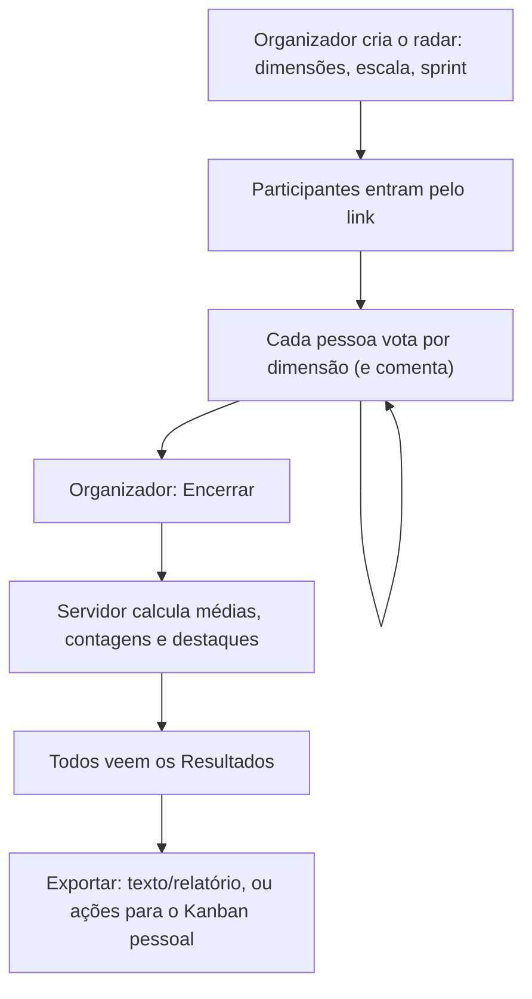

# Health Check (Radar de Saúde)

## Objetivo e quem usa

Pesquisa de saúde da squad, respondida de forma **anônima**: cada pessoa dá uma nota (sinal de trânsito, 1 a 5 ou carinhas) em várias dimensões (Apoio e Suporte, Trabalho em Equipe, Qualidade do Código...) e pode comentar. O criador encerra a coleta e todos veem o resultado consolidado (radar, barras, pontos fortes e fracos, comentários sem autor).

- **Organizador:** quem criou o radar (`creatorId`) ou um ADMIN. Só ele encerra a votação e apaga o radar. Não é transferível.
- **Participante:** qualquer pessoa autenticada que abriu o link. Vota e comenta; vê só as **próprias** respostas até o encerramento.
- **Decisão de produto aplicada:** o **link da sala dá acesso** (como a Review): qualquer autenticado entra e vota. Não há checagem de squad porque o radar guarda só o nome da squad em texto livre (`team`). *Decisão em aberto:* restringir à squad exigiria guardar o `squadId`.
- Não confundir com o **check-in de humor da Retro** (`RetroHealthCheckGate`): é outro recurso, dentro da Retro (ver `retro.md`).

## Telas

| Tela | Caminho | O que é |
|---|---|---|
| Hub | `/health-check` | Abre o diálogo de criação: modelo de dimensões (Spotify, Maturidade Scrum, etc.), dimensões editáveis/importáveis por texto, escala, nome da sprint, squad. Guarda atalho da sala no navegador (`localStorage`) |
| Votação | `/health-check/[id]` (radar aberto) | Cartões por dimensão com botões da escala e caixa "Por que essa nota?" |
| Resultados | `/health-check/[id]` (radar encerrado) | Radar, barras, fortalezas/fraquezas, distribuição de votos e comentários anônimos |
| Histórico | Meu Espaço (`/workspace`, aba Histórico) | Resumo dos radares **em que a pessoa é criadora** (ver pontos frágeis) |

## Fluxo principal

1. **Criar.** Obrigatório ao menos uma dimensão e o título da cerimônia. O servidor grava criador (do login), status `collecting` e as dimensões já limpas (chave única, título até 255 caracteres, máximo de 30 dimensões). Escalas: `traffic_light` (verde/amarelo/vermelho), `numbers_5` (1 a 5), `emojis` (feliz/neutro/triste).
2. **Entrar.** Quem abre o link vira participante (uma vez por sala) com o papel mapeado do perfil (AM, PO, PL, DEV, QA, UX, SME, OUTRO). Enquanto isso a tela mostra "Juntando-se à sala...".
3. **Votar.** Um voto por pessoa e dimensão; clicar de novo em outra opção **substitui**. O comentário só é gravado depois que a pessoa já votou na dimensão e é enviado ~0,7 s depois da última tecla, ao sair do campo, ao encerrar e ao sair da tela (antes era uma gravação por tecla). Se a gravação falhar, o comentário digitado continua na tela e um aviso aparece.
4. **Encerrar.** Só o organizador, com confirmação. Exige pelo menos **um voto**. O servidor trava o radar, calcula o resumo com todos os votos já gravados e muda para `finished`; um voto que chegar depois recebe `409 A votação deste radar já foi encerrada.`. Encerrar de novo é inofensivo (devolve o mesmo resultado).
5. **Resultados.** A tela recarrega os votos (agora de todos, sem identificação) e mostra a distribuição, médias e comentários. "Gerar ações" cria um cartão por dimensão em atenção no **Kanban pessoal** de quem clicou (não no Plano de Ação).

## Como o resumo é calculado

Nota por voto: verde/feliz = 3, amarelo/neutro = 2, vermelho/triste = 1, número = o próprio número. Média por dimensão ignora votos sem nota. Destaques (até 3 de cada):

| Escala | Ponto forte | Ponto fraco |
|---|---|---|
| 1 a 5 | média ≥ 4 | média < 2,5 |
| Sinal de trânsito / carinhas | média ≥ 2,5 | média < 1,8 |

Antes, quem encerrava calculava no navegador com uma regra única (≥ 2 forte, < 2 fraco), errada para a escala 1 a 5. Radares **já encerrados** mantêm o resumo antigo.

## Estados e transições

`collecting` → `finished` (único caminho, sem reabrir). Dimensões e escala não mudam depois de criado.

## Tempo real (WebSocket `/ws/health-check/{id}?token=`)

O servidor exige login e que o radar exista. Eventos, sempre **depois do commit**:

| Evento | Quem recebe | O cliente faz |
|---|---|---|
| `BOARD_UPDATED` | Todos | Substitui o radar (encerrado muda para a tela de resultados e recarrega os votos) |
| `BOARD_DELETED` | Todos | Avisa e volta ao hub |
| `PARTICIPANT_JOINED` / `PARTICIPANT_LEFT` | Todos | Atualiza a lista |
| `VOTE_SAVED` | **Só as sessões de quem votou** | Atualiza o voto próprio. Os votos dos outros **não trafegam** |
| `REFRESH_BOARD` e desconhecidos | Todos | Recarrega tudo |

Ao reconectar (espera crescente de 1,5 s a 15 s, token relido) o cliente recarrega radar, participantes e votos; recargas antigas são descartadas.

## Permissões (servidor x cliente)

| Ação | Servidor | Cliente |
|---|---|---|
| Ler radar e participantes, abrir WebSocket | Qualquer autenticado | — |
| Criar radar | Autenticado; criador = quem chama; status sempre `collecting`; resumo do corpo descartado | — |
| Entrar | Autenticado; id = do login; papel fora da lista vira OUTRO; quem já entrou mantém o papel | Automático |
| Votar | Autenticado **e já na sala**; voto é de quem chama (`participantId` do corpo é ignorado); papel vem do cadastro na sala; valor tem de existir na escala; dimensão tem de existir; comentário até 2000 caracteres; só com o radar aberto | Botões da escala |
| Ler votos | Aberto: **só os próprios**. Encerrado: todos, **sem id nem papel do votante** (o parâmetro `participantId` não amplia o resultado) | — |
| Encerrar (`POST …/finish`) | Criador ou ADMIN | Botão só para o criador |
| Apagar radar | Criador ou ADMIN | — |
| Sair / remover participante | A própria pessoa, criador ou ADMIN | — |

## Endpoints principais

`POST /api/health-checks` (criar), `GET /api/health-checks/{id}`, `POST …/{id}/finish`, `DELETE …/{id}`, `GET /api/health-checks?squadId=` (exige acesso à squad), `GET/POST …/participants`, `DELETE …/participants/{userId}`, `GET/POST …/votes`.

Erros relevantes (mensagem em português no corpo): `403` (não é criador / não entrou na sala), `409` (votação encerrada; encerrar sem voto), `400` (escala, dimensão ou valor inválido, comentário longo), `404`.

## Dados guardados (negócio)

Radar (squad em texto, nome da sprint, escala, dimensões, status, resumo consolidado, criador, data), participantes (apelido, papel, papel global) e votos (dimensão, valor, comentário, hora, papel e **identificador do votante**). Voto é único por (radar, pessoa, dimensão). Índice de votos por radar e de radares por squad (migration V40).

## Pontos frágeis e erros de fluxo conhecidos

Corrigidos em 2026-10-09: qualquer autenticado votava em nome de outra pessoa e depois do encerramento; a API devolvia **todos os votos com o id do votante** durante a coleta e o `VOTE_SAVED` ia para toda a sala (a tela dizia "100% secretos"); qualquer autenticado apagava ou regravava o radar (inclusive o resumo); o resumo vinha do navegador do organizador (podia sair com votos faltando); comentário gravava a cada tecla; falha de voto ou de encerramento só ia para o console; deleção e saída ignoravam a resposta.

Ainda abertos:

- **Anonimato é da API e da tela, não do banco.** A tabela de votos guarda o identificador do votante (e o id do voto o contém); quem tem acesso ao banco identifica. Em equipes muito pequenas a média e os comentários podem revelar autoria (ex.: dois votantes, ou comentário com estilo reconhecível).
- **Não há contagem de quem já votou**; o organizador não sabe quando encerrar. A tela mostra só o total de pessoas na sala e o progresso individual.
- **Encerrar com um único voto é permitido**, sem aviso de baixa participação.
- **Sem reabrir, sem editar dimensões** e sem excluir pela tela (a API existe para o criador).
- **Histórico (Meu Espaço) só mostra radares criados pela pessoa:** o histórico filtra por `participantIds`, que guarda apenas o criador (quem entra pelo link não é acrescentado). Decisão em aberto: acrescentar participantes ao entrar.
- **Resumos antigos** seguem a regra de destaque anterior; o gráfico de resultados usa a regra nova (Results) e o histórico usa o resumo gravado, então radares antigos podem mostrar destaques diferentes nas duas telas.
- **"Gerar ações" vai para o Kanban pessoal** e cria um cartão por vez; falha no meio deixa parte criada.
- **Componentes sem uso:** `HealthCheckTrendChart`, `HealthCheckNicknameDialog` e `FinishHealthCheckDialog` não são usados em nenhuma tela (a tendência entre radares não existe hoje, apesar do texto do hub).
- **Pessoa removida** volta ao recarregar (entrada automática, sem lista de banidos).
- **Não testado ao vivo** (exige login Google). Validado por testes unitários: backend (anonimato na leitura, voto de quem chama, escala, encerramento e cálculo do resumo, autorização, evento só ao votante) e frontend (cliente de API e reconexão). A migration V40 só cria índices e nunca rodou contra um Postgres real antes do deploy.

## Onde olhar no código

- Frontend: `src/app/health-check/[id]/page.tsx` (estado, WebSocket, encerramento), `src/app/health-check/api.ts`, `src/components/health-check/*` (`HealthCheckVotingBoard`, `HealthCheckResults`, `CreateHealthCheckDialog`, gráficos), modelos em `src/lib/health-check-templates.ts` e `health-check-defaults.ts`, utilitários `src/lib/room-socket.ts` e `ceremony-api.ts`.
- Backend: `HealthCheckController`, `HealthCheckService` (regras e resumo), `BoardWebSocketHandler` / `HealthCheckWebSocketHandler`, `BoardExistsHandshakeInterceptor`, entidades `HealthCheckBoard/Participant/Vote`, migration V40.
