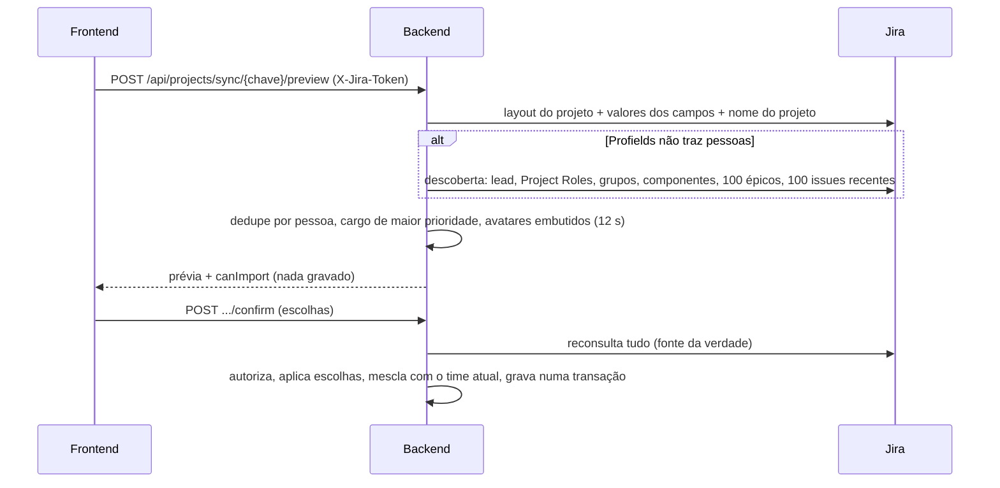

# Integração com o Jira

Descreve o que o código faz **hoje** (`develop`, 2026-10-09). Sem teste ao vivo: nada abaixo foi exercitado contra um Jira real nem com login do Portal; vale como leitura de código + testes unitários.

## Objetivo e quem usa

Trazer dados do Jira corporativo para o Portal sem que o servidor guarde credenciais em claro por conta própria. Quatro usos:

| Uso | Quem | O que faz |
|---|---|---|
| Importação de equipes (Profields) | Agile Master, People Lead, admin | Lê projeto + pessoas e cria a equipe (regras em `onboarding-e-papeis.md`) |
| Proxy de leitura do backend (`/api/jira/*`) | qualquer pessoa logada | Busca issues, sprint, campos, boards, anexos, caso de teste (Poker, Review, Squad, Zephyr) |
| Proxy do JiraDash (`/jira/*`, Next.js) | iframe do JiraDash | Leitura de issues/worklogs/sprint (ver `jira-dash.md`) |
| Administração (`/api/admin/jira/*`) | só admin | Prévia/confirmação de squad e membros a partir do Jira |

## Token e domínio do Jira (PAT)

- Cada pessoa usa o **próprio** PAT. O Portal nunca usa um token compartilhado.
- **Onde fica:** (1) navegador, `localStorage` chave `agile_jira_config_<id>` com `{domínio, token}` **em texto claro**; (2) conta no servidor (`user_jira_configs`), token **cifrado em repouso** (AES-256-GCM, chave `APP_ENCRYPTION_SECRET`; em produção a variável é obrigatória, em dev há chave padrão pública).
- **Leitura:** `GET /api/users/{id}/jira-config` devolve o token **decifrado**, só para o próprio dono ou admin (qualquer admin lê o token de qualquer pessoa). Outro usuário comum recebe 403. O token não aparece em perfil nem em listagens.
- O navegador prefere a cópia local à do servidor: se o token for trocado/removido no servidor, aquele navegador continua usando o antigo.
- **Saída do token:** vai no corpo do POST para `/api/jira/*`, no header `X-Jira-Token` nos endpoints de importação, e no header `x-jira-token` para o proxy `/jira`. Nunca em URL. Nos logs do backend não aparece.
- Salvar o token na conta agora **avisa** quando falha (antes dizia "guardado na sua conta" mesmo com o servidor fora do ar).

## Proxy do backend (`JiraController` / `JiraService`)

Fluxo de uma chamada:

```mermaid
flowchart TD
    A[Frontend: POST /api/jira/... com domínio + token] --> B[JWT do Portal válido?]
    B -- não --> X[401]
    B -- sim --> C[cleanDomain: só host[:porta]]
    C -- "caminho, usuário@, ?, #" --> X2[400 Domínio inválido]
    C --> D[assertNotBlockedHost]
    D -- "loopback, link-local, 0.0.0.0, multicast, redes privadas" --> X3[Erro: domínio não permitido]
    D --> E[GET https://domínio/rest/... com Bearer]
    E -- "handshake TLS falha por confiança" --> F[repete com trust-all + aviso no log]
    E -- "3xx" --> G{mesmo host, https?}
    G -- não --> X4[Recusado]
    G -- sim --> E
    E -- 429 --> H["até 3 tentativas (Retry-After)"]
    E --> I[Resposta devolvida como veio]
```

Regras e limites **de hoje**:

- **Domínio:** só `host` ou `host:porta` (esquema e barra final são tirados). Caminho, credencial, consulta ou fragmento dão 400.
- **Alvos bloqueados:** loopback, link-local (inclui `169.254.169.254`, metadata de nuvem), `0.0.0.0`, multicast **e, por padrão, redes privadas** (10/8, 172.16/12, 192.168/16, 100.64/10, fc00::/7). Confere **todos** os IPs que o nome resolve. Quem tiver Jira em rede interna liga `app.jira.allow-private-hosts=true` (variável do backend). Lista opcional de domínios aceitos: `app.jira.allowed-domains`.
- **TLS:** validação padrão da JVM primeiro; só se o handshake falhar por confiança (certificado próprio/CA corporativa) tenta de novo **sem validar certificado**. Risco: nesse segundo caminho há exposição a MITM para aquele host. Alternativa recomendada: importar a CA corporativa no truststore da JVM do container e desligar o fallback (não feito: exige o certificado e pode quebrar um Jira que hoje funciona).
- **Redirecionamento:** o cliente HTTP **não segue** redirecionamento sozinho. O backend segue até 3 saltos, só `https` no **mesmo host e porta**, revalidando cada salto. Qualquer outro destino é recusado (o Bearer não sai do host configurado).
- **Timeouts:** conexão 15 s, leitura 45 s. Worklog truncado é completado com até 8 chamadas em paralelo.
- **Tamanho:** a página de busca é limitada a 100 itens; **não há limite de bytes** na resposta (a busca devolve o JSON inteiro; o anexo é lido todo em memória). Ponto frágil conhecido.
- **Erros:** corpo JSON válido com motivo curto ("tempo esgotado", "domínio não encontrado", "falha no certificado TLS"...), sem URL nem detalhe de rede. Antes a mensagem bruta da exceção ia para o cliente (revelava endereço interno ao sondar portas) e quebrava o JSON quando tinha aspas.
- **Anexo/avatar:** a URL precisa ser `https` do **mesmo host** do domínio informado e a resposta tem de ser imagem.
- **Logs:** a JQL e as URLs completas saem do nível `info`; só o host aparece.
- **CORS:** a configuração global lista as origens permitidas (`ALLOWED_ORIGINS`). O `@CrossOrigin("*")` dos controllers fica sem efeito prático porque o filtro global roda antes (não removido).

## Importação Profields (equipes)

Detalhes de permissão e telas: `onboarding-e-papeis.md`. Aqui, o que acontece por baixo:



Regras de **hoje**:

- **Chave do projeto:** `A-Z`, `0-9`, `_`, até 50 caracteres; senão 400 (a chave vai para o caminho da URL do Jira).
- **Fonte das pessoas:** primeiro os campos de liderança do Profields (Agile Master, Agile Coach, Product Owner, Product Manager, People Lead, Tribe Lead, Team Lead, Arquiteto Digital). Se o Profields não devolver pessoas, cai na descoberta pela API padrão (item abaixo).
- **Descoberta pela API padrão:** líder do projeto, atores dos Project Roles (pessoas **e grupos**, com o nome do grupo codificado na URL), líderes de componentes, e quem aparece nos campos de usuário das 100 épicos/iniciativas e das 100 issues mais recentes. **Não há paginação**: quem trabalhou só antes das últimas 100 issues não aparece, e grupos com mais de 50 pessoas vêm cortados (limite padrão do Jira).
- **Links de Project Role** vêm do JSON do próprio Jira. Só são seguidos se forem `https` do **mesmo domínio**; outro host é ignorado (antes seria chamado com o token).
- **Cargo sugerido** (`evaluateRole`): heurística por texto do nome do cargo/campo. Siglas e termos ambíguos (`rte`, `ui`, `ux`, `qa`, `sme`, `dev`, `head`, `gpm`) agora só valem como **palavra inteira**: "Suporte", "Parte", "Equipe" e "Overhead" deixaram de virar Agile Master, UX ou People Lead. Cargo desconhecido cai em Developer (pontuação baixa), nunca em liderança.
- **Contas de robô:** nome/e-mail/conta contendo `integrador`, `zendesk`, `plataformas`, `robo`, `bot@`, `service_account`, `no-reply`, `daemon@`, `jira_admin` ou `automation` são descartadas na descoberta (mas **não** no Profields). A lista é por texto e pode errar em sobrenomes.
- **Duplicados:** a mesma pessoa vira uma linha só, juntando por e-mail (sem caixa), conta do Jira ou nome normalizado. Fica o cargo de maior prioridade: **Agile Master/People Lead > outra liderança > cargo específico > Developer**. Homônimos (mesmo nome, e-mails diferentes e sem conta em comum) **ainda são juntados** por causa do nome.
- **Vínculo com contas:** o e-mail da linha casa com `users.email` (igualdade exata). Se o e-mail do Jira difere do login, a pessoa precisa do "Sou eu".
- **Reimportar (novo):** o time é trocado pelo que o Jira devolveu, **mas** (1) o vínculo conta→linha de quem já estava no time é copiado para a linha nova (por conta do Jira ou e-mail), e (2) quem entrou por "Sou eu"/"join" e **não aparece no Jira** (sem liderança, com conta) continua no time. Antes essas pessoas eram apagadas e perdiam acesso à equipe. Quem o Jira devolveu e a pessoa **desmarcou** na prévia continua fora.
- **Falha do Jira:** o 502 diz o motivo ("o Jira recusou o token (HTTP 401)", "projeto não encontrado", "limitou as requisições"); sem endereço interno.
- **Se a descoberta falhar em silêncio** (rede, 403), a lista de pessoas vem vazia e a prévia diz `canImport = false` para quem não é AM/PL/admin — com a mesma mensagem de "só AM/PL cadastram". A causa real só aparece no log do servidor.

## Administração (`/api/admin/jira/*`)

Só `role = ADMIN` (filtro JWT + auditoria). `preview-project` usa a mesma descoberta acima; `confirm-sync` grava `squads`, `squad_members` e, com `syncUsers`, cria/atualiza `users` (cargo em `jobTitle`, **nunca** em `role`). Pessoas sem e-mail ganham `<conta>@empresa.com`. Não foi alterado além do que vem de `JiraService`/descoberta compartilhados.

## Pontos frágeis e erros de fluxo conhecidos

Corrigidos nesta rodada: TLS trust-all **sempre** na importação e na administração (agora via `JiraService`, estrito primeiro); redirecionamento seguido com o Bearer; links de Project Role de outro host chamados com o token; domínio/chave sem validação nos métodos do proxy; mensagem de erro bruta; "Suporte"/"Parte"/"Equipe" promovendo cargo; grupos com espaço descartados em silêncio (e grupos virando "pessoa"); reimportação apagando quem entrou por "Sou eu"; People Lead sumindo quando a pessoa também é PO; N+1 em `/api/projects` e na hierarquia; `/api/projects/user/{id}` aberto a qualquer logado (agora só o próprio ou admin).

**Não corrigido (e por quê):**

- **DNS rebinding** no bloqueio de IPs: a checagem é antes da conexão. Fechar exige fixar o IP resolvido no cliente HTTP; fora do escopo.
- **TLS tolerante como segundo caminho:** depende do certificado corporativo (ver acima). Decisão do usuário.
- **Sem limite de bytes** na resposta do Jira.
- **Proxy `/jira` (Next.js) sem login do Portal** — ver `jira-dash.md`; precisa de decisão de produto.
- **Token em claro no `localStorage`** e **não apagado no logout** (`UserContext` é compartilhado com outras frentes). Qualquer script na página lê o token.
- **Admin lê o token de qualquer pessoa** (`isOwnerOrAdmin`).
- **Vazamento de token via squad:** `jiraDomain` da squad é editável por qualquer membro e o sync usa esse domínio com o token de quem sincroniza (`SquadService`/`SquadSyncService`, frente de Squad). Avisado à sessão responsável. Mitigação nova: o domínio passa por `cleanDomain`/`assertNotBlockedHost` quando chega ao proxy, mas **um domínio público do atacante continua permitido**.
- **Paginação de pessoas** na descoberta (100 issues, 50 por grupo).
- **Homônimos** juntados no dedupe; robô detectado por texto.
- `User.role` x papel de negócio, catálogo de papéis em código: ver `onboarding-e-papeis.md`.

## Onde olhar no código

- Backend: `service/JiraService` (proxy, domínio, bloqueio, redirect, TLS), `service/JiraProfieldsService` (importação, permissão, mescla), `service/JiraAdminService` (descoberta, cargos), `controller/JiraController`, `ProjectController`, `JiraAdminController`, `domain/UserJiraConfig`, `security/CryptoConverter`.
- Frontend: `components/jira/JiraProfieldsImport` e `JiraImportPreview`, `services/projectService`, `hooks/useJiraSettings`, `app/users/api`, `app/jira/[...path]` (proxy do JiraDash), `lib/jira-proxy`.
- Testes: `JiraServiceHardeningTest`, `JiraServiceTest`, `JiraAdminServiceTest`, `JiraProfieldsServiceTest`, `JiraProfieldsImportSafetyTest`, `ProjectAndDashAccessTest`; `lib/__tests__/jira-proxy.test.ts`.
