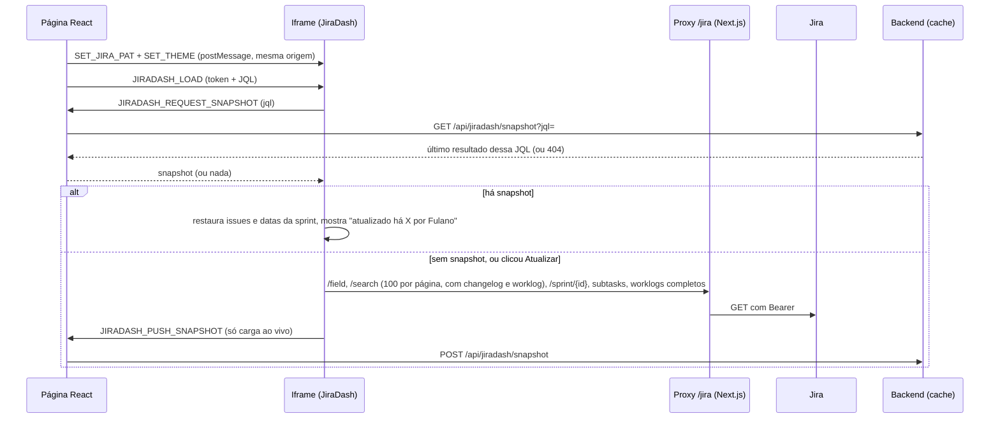

# JiraDash (`/jiradash`)

Descreve o que o código faz **hoje** (`develop`, 2026-10-09). Sem teste ao vivo (precisa de PAT e Jira reais). Os cálculos foram auditados por leitura de código e dois testes pontuais em Node; os módulos de identidade de pessoa (`reconciliation`, `analysis-scope`, `person-presentation`, `person-picker`) foram só percorridos.

## Objetivo e quem usa

Painel de sprint feito em cima do Jira: composição da sprint, capacidade x alocação, horas, fluxo (aging e cycle time) e qualidade. Usado por Agile Master, líderes e quem acompanha a sprint. Qualquer pessoa logada abre; os dados vêm do **token Jira da própria pessoa**, então ela só vê o que o Jira dela permite.

## Telas e entradas

- **Página React** (`/jiradash`): cabeçalho com "PAT ativo", botão Configurar e Atualizar; modal com **token (PAT)** e **JQL** (JQLs salvas, públicas ou privadas, mais três atalhos). O corpo é um **iframe** com um app estático (`public/jiradash/`, JavaScript puro) — a página só fala com ele por `postMessage`.
- **App do iframe — abas:** Visão Geral, Planejamento, Issues, Pessoas, Horas, Fluxo, Qualidade, Configuração (papel, dias e horas produtivas por pessoa e sprint).
- **Exportações:** CSV de alocação, PNG dos gráficos e a ponte para a Retro (`localStorage`, nomes de squad).

## Fluxo principal

Passos de uma carga ao vivo: descobre os ids dos campos (Flagged, Sprint, Identificador, Tipo do Defeito, Rotina, Cliente) por **nome**; busca as issues da JQL; busca os metadados da sprint **somente se a JQL tiver `Sprint = <número>`**; busca subtasks que não vieram na JQL (lotes de 50); busca "removidas da sprint" por uma JQL paralela (até 500 candidatas) confirmadas pelo changelog; completa worklogs truncados (8 em paralelo). Cada carga tem uma "geração": carga velha que termina depois de uma troca de dataset **não publica** nada.

## Como os números são calculados

- **Unidade:** tudo em **segundos** (estimativa, restante, apontado); divide por 3600 para horas. Story points (`customfield_10016`/`10028`/`10002`) só somam nos pais; o card some se a soma é 0.
- **Escopo:** o pai é a unidade; canceladas e tipo Gestão ficam fora das métricas do topo. Subtasks agregam estimado e apontado ao pai. Estimado efetivo do pai = o próprio, se maior que 0, senão a soma dos filhos.
- **Apontado na sprint:** soma dos worklogs com `started` entre início e fim da sprint, atribuído ao **autor do worklog** (não ao responsável da issue). Sem datas da sprint, cai no `timespent` histórico inteiro.
- **Estimativa ajustada:** `min(restante + apontado na sprint, original − apontado antes da sprint)`; sem original, sem teto.
- **Capacidade por pessoa:** `(dias de codificação/teste + dias de regressivo) × horas produtivas`; **horas em branco valem 8** (padrão). Soma por papel (DEV ou QA). Herança campo a campo: sprint atual, sprint anterior do mesmo board, padrão global.
- **Saldo livre:** `max(0, capacidade − apontado) − restante`. Fora dos gráficos de capacidade: Gestão, tipo não mapeado e Defeito.
- **Visão Geral:** conclusão por quantidade e por horas; aderência = apontado ÷ ajustada das concluídas; consumo de capacidade = apontado produtivo ÷ capacidade DEV+QA; burndown/burnup em dias úteis (segunda a sexta, **sem feriados**), linha ideal linear.
- **Planejamento:** planejadas, adicionadas após o início (*scope creep*, por changelog), *carry-over*, removidas; capacidade x comprometimento por pessoa; planejado x apontado com jornada fixa de 8 h.
- **Fluxo:** *aging WIP* (tempo produtivo no status atual contra a estimativa) e *cycle time* por status das concluídas, em horas produtivas (8 h–18 h, segunda a sexta) normalizadas em dias pelas horas produtivas da pessoa.
- **Qualidade:** bugs criados/resolvidos/abertos na janela, horas de defeito, tempo excedido (apontado contra a original) e impedidas.

## Estados e transições

Sem token → pede configurar. Com token e JQL → carrega (snapshot ou Jira). Erro de rede com dados antigos na tela → aviso "dados em cache" (sem data). Troca de squad (aba do app) → usa o cache em memória daquela squad, depois o snapshot, depois o Jira. `Atualizar` sempre vai ao Jira e republica o snapshot.

## Permissões: servidor x cliente

- **Servidor (backend):** `GET/POST /api/jiradash/snapshot` exigem só login. **Qualquer pessoa logada grava** o snapshot de qualquer JQL e **qualquer pessoa logada lê** o de qualquer JQL. Novo: o `POST` valida formato (precisa de `allIssues`), JQL ≤ 4000 caracteres e payload ≤ 12 MB (400 caso contrário); o `GET` recusa JQL vazia/enorme.
- **Proxy `/jira/*` (Next.js):** **não exige login do Portal** (o iframe só conhece o PAT do Jira). Destino fixo (`JIRA_BASE`), só `GET` e só 5 caminhos de leitura. Agora tem limite por IP (600/min) e certificado validado primeiro.
- **Cliente:** o token vive em `sessionStorage` do iframe (some ao fechar a aba) e em `localStorage` da página (ver `integracao-jira.md`).

## Dados persistidos

- **Cache compartilhado** (`jiradash_snapshots`): último resultado de cada JQL (normalizada por espaços), quem buscou e quando. Sem prazo de validade.
- **Configuração de pessoas** (papel, dias, horas): serviço `/config` do Next com código de edição; sem rede, `localStorage`.
- **Preferências:** JQLs salvas (por usuário, com opção pública), aba ativa, squads do dashboard.

## Pontos frágeis e erros de fluxo conhecidos

**Corrigidos agora:**

- Snapshot compartilhado voltava com as datas da sprint como **texto**: toda comparação de janela dava falso e as abas mostravam **0 h apontadas, 0 scope creep, 0 bugs e carry-over vazio** ao recarregar a página com snapshot existente. Agora as datas são reconstruídas (e datas ausentes viram "sem janela", não valor inventado).
- `fetchSprintInfo` devolvia a promessa sem `await`: um 403/404 no endpoint da sprint **derrubava a carga inteira**; agora segue sem dados da sprint como a intenção documentada.
- Fluxo com horas produtivas = 0 mostrava `Infinityd`/`NaNd`; agora mostra "—".
- `postMessage` aceitava qualquer janela (trocar o PAT, injetar snapshot falso) e enviava o PAT para `*`. Agora origem e janela são conferidas nos dois lados e o alvo é a própria origem.
- Cache aceitava qualquer JSON e tamanho (ver permissões).

**Não corrigidos (decisão ou risco de mudar número):**

- **JQL sem `Sprint = <id>`** (atalhos "Sprint Aberta" e "Próxima Sprint" usam `openSprints()`/`futureSprints()`): sem janela de sprint as abas Horas, Pessoas e capacidade somam o **apontado acumulado de todas as sprints** das issues. **Rotulado agora:** a faixa de informações da sprint mostra o aviso "Consulta sem Sprint = número: não há janela de sprint…" (`sprintWindowNotice`) em toda carga ou restauração sem janela. O número em si não muda; resolver o id da sprint automaticamente a partir do campo Sprint das issues ficou de fora (mudaria os valores mostrados para quem já usa esses atalhos).
- **Snapshot sem idade máxima**: com `openSprints()` o cache continua mostrando a sprint antiga depois da virada. O indicador "há X por Fulano" some ao trocar de squad e voltar; no erro de rede o aviso não diz a data.
- **Snapshot é publicado antes de completar os worklogs** e mistura dados novos e velhos; sem versão de schema (payload antigo sem `sprintDates` agora é tolerado, outros campos não).
- **Proxy sem login**, snapshot gravável por qualquer pessoa (um usuário pode **envenenar o cache** de uma JQL e outros verão números falsos; ou ler dados de issues que o próprio Jira dele não mostraria, se souber a JQL exata). Não há como verificar o conteúdo sem o token; opções: restringir a gravação à liderança da squad, ou assinar o snapshot com o usuário e mostrar autoria em destaque.
- **Cards com denominadores diferentes**: "Issues (pai)" exclui canceladas e Gestão; "Composição da sprint" inclui. Burndown de issues conta canceladas como entregues e Gestão como nunca fechada.
- **"Tempo excedido"** compara o apontado **só da janela** com a estimativa original total (pode subestimar quando houve apontamento antes da sprint) e inclui pais cancelados.
- **Aba Pessoas** pode usar worklogs truncados (20 por issue) quando é a aba ativa na carga: os cálculos de h DEV/QA/Defeito ficam subestimados e o aviso de "apontamento incompleto" não é exibido nela.
- **Capacidade com 8 h/dia inventado** quando as horas estão em branco (só tooltip e ⚠ no Fluxo avisam); capacidade herdada de sprint anterior conta como da atual (itálico).
- **Horas de defeito** diferem entre Qualidade (só subtasks de tipo bug/defeito) e Pessoas (qualquer "defeito"); subtasks buscadas separado não têm `created`, então nunca entram em "criados na sprint".
- **Bugs "abertos"**: bug criado na sprint e resolvido depois do fim conta como aberto; bug cancelado conta como resolvido.
- **Subtasks e "removidas" podem faltar em silêncio** (falha por lote engolida; teto de 500 candidatas).
- **Janela por instante** (início/fim com hora exata) e **sem feriados** no burndown e no cycle time.
- **Exportação para a Retro** grava 0 quando falta janela ou etapa, assume papel DEV quando vazio e classifica por texto do tipo; a unidade do *cycle* (horas produtivas por etapa) não foi conferida com o consumidor.
- **Soma de story points** em ponto flutuante pode exibir `0.30000000000000004`.
- **Texto:** "Estado: active/closed/future" vem cru do Jira; "Scope creep", "Carryover", "Cycle Time" ficam em inglês.
- **XSS:** não foi achado ponto concreto (campos do Jira passam por escape); `renderMetric` insere `value`/`sub` sem escape, hoje só com dado local. O risco real era o `postMessage` (corrigido).

## Onde olhar no código

- Página e relé: `src/app/jiradash/` (`page.tsx`, `snapshotApi.ts`).
- Proxy: `src/app/jira/[...path]/route.ts`, regras em `src/lib/jira-proxy.ts`.
- App estático: `public/jiradash/index.html`; `assets/js/app.js` (carga, cache, geração), `platform/jira-api.js`, `services/issue-service.js` (métricas), `ui/renderers.js` (abas e fórmulas de tela), `domain/person-config.js` (capacidade), `services/retro-export.js`, `core/config.js` (mapa tipo→papel).
- Backend: `controller/JiraDashController`, `service/JiraDashSnapshotService`, `domain/JiraDashSnapshot`.
- Testes: `public/jiradash/assets/js/**/__tests__`, `JiraDash` em `ProjectAndDashAccessTest`.
