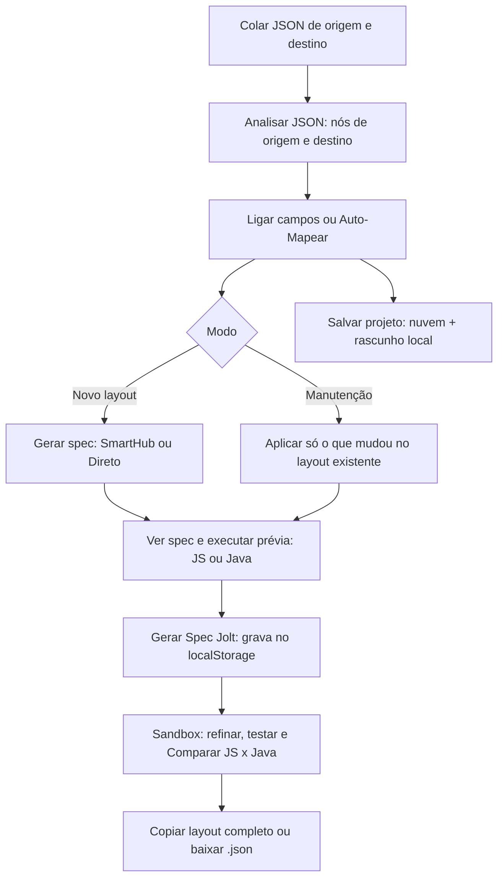
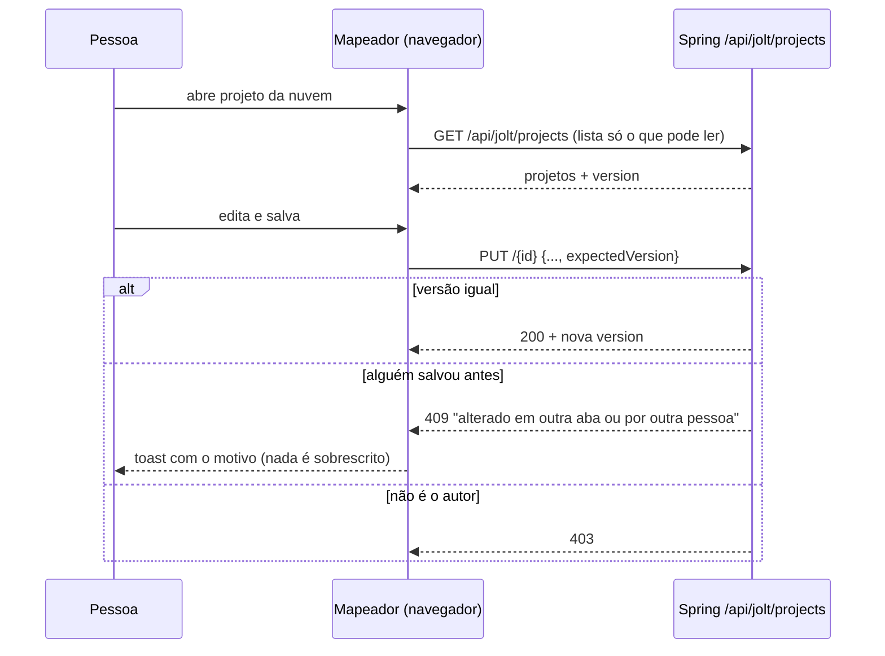

# Jolt (Sandbox e Mapeador Visual)

## Objetivo e quem usa

Ferramenta para **transformar um JSON em outro** usando uma especificação Jolt (a "spec"). Serve a quem monta e mantém os layouts de integração (TOTVS SmartHub / PDVSync): ou escreve a spec à mão (Sandbox), ou desenha o de-para campo a campo e a spec é gerada (Mapeador Visual).

- Qualquer pessoa **logada** usa. Não há papel específico. O app inteiro exige login (`AuthGuard`; só `/login` é público); o endpoint de execução no servidor é a exceção (ver "Permissões").
- Os projetos salvos na nuvem têm dono (quem criou). Ver "Permissões".

## Telas

| Tela | Caminho | O que é |
|---|---|---|
| Hub | `/jolt` | Explica os dois modos e o fluxo recomendado (desenhar, gerar a spec, refinar, confirmar no Java) |
| Sandbox | `/jolt/sandbox` | Dois editores (JSON de entrada e spec), saída ao lado, três motores, layouts salvos, GitHub, manutenção de layout existente |
| Mapeador Visual | `/jolt/visual` | Quadro com campos de origem (esquerda) e destino (direita); a pessoa liga os campos e o sistema gera a spec |

### Sandbox

- **Motores** (seletor): **JavaScript** (roda no navegador, `jolt-lite`), **Java** (motor oficial Bazaarvoice, no backend) e **Comparar** (roda os dois e lista as diferenças de conteúdo; só a ordem das chaves diferente não conta como divergência).
- **Modelos** de operação (shift, modify, cardinality, default, remove) que substituem o conteúdo do editor de spec.
- **Layouts salvos**: ficam no `localStorage` do navegador, por usuário (`agileSpace_jolt_layouts_{id}`). Não vão ao servidor.
- **Barra do GitHub**: escolhe Integração → Rota → Versão no repositório de layouts (padrão `totvs/winthor-smart-hub-layouts`) e carrega o arquivo na hora. Usa a API pública do GitHub sem token (limite de ~60 consultas por hora por IP; a tela avisa).
- **Manutenção de layout existente** (v4.15.0): com um layout completo (`tabela.campos`) carregado, o painel de manutenção acrescenta/troca/remove só ligações do `shift`; o resto da spec (modify, default...) volta exatamente como entrou. "Copiar/baixar layout completo" devolve o arquivo inteiro com a spec editada.
- **Abrir no Mapeador Visual**: leva o JSON de entrada (e, se há `shift`, o layout para o modo manutenção) pelo `localStorage`.

### Mapeador Visual

1. Cola o **JSON de origem** e um **JSON de destino de exemplo**; "Analisar JSON" transforma cada caminho folha em um nó (listas de objetos contam só o **primeiro item**, como `itens[*].id`).
2. Liga origem→destino arrastando, ou usa **Auto-Mapear** (nome igual ou sinônimo conhecido).
3. **Ver spec** gera a spec; a prévia pode ser executada no motor JavaScript ou Java.
4. **Gerar Spec Jolt** grava a spec no `localStorage` e abre a Sandbox.
5. Opções: modo **SmartHub** (envelope com `idExterno`, `idInterno`, `tipoIdInterno`, `_attr_access`...) ou **Direto** (array puro); nome da entidade; **template de envelope** (`PCINTEGRACAOROTASERVICO` com o marcador `_JOLT_SPEC_`).
6. **Modo manutenção** ("Layout existente"): parte de um layout pronto; as ligações dele aparecem tracejadas, só o que é novo entra.

## Projetos salvos

Dois lugares, escolhidos no diálogo "Salvar projeto":

| Onde | O que guarda | Escopo |
|---|---|---|
| **Nuvem** (padrão ligado) | JSONs, spec gerada, nós e ligações, modo, entidade, histórico de versões | Servidor (Postgres). Dono = quem criou |
| **Rascunho local** | O mesmo, sem versões | `localStorage` do navegador, **chave única do navegador** (`agileSpace_jolt_visual_projects`), não separada por usuário |

Salvar com a nuvem ligada grava na nuvem **e** no rascunho local. Se a nuvem falhar, o toast mostra o motivo e o trabalho continua na tela e no rascunho local. Cada gravação com "mensagem da versão" preenchida cria uma versão nova (v2, v3...); a primeira gravação cria a v1. **Restaurar** uma versão grava o conteúdo dela e cria uma versão nova ("Rollback para a versão vN"); nada é apagado do histórico.

## Execução no servidor (motor Java)

`POST /api/jolt/transform` (e `GET /api/jolt/engine-info`) estão na lista **pública** do `JwtAuthenticationFilter`: respondem sem token (o frontend manda o token de qualquer forma). É computação sem dados do sistema.

Limites (corrigidos em 2026-10-09, antes não havia nenhum):

| Limite | Valor |
|---|---|
| Corpo da requisição | 5 MB (filtro `JoltRequestSizeFilter`, vale também para corpo "chunked"); acima disso `413` |
| Texto de entrada / de spec | 2 milhões de caracteres cada |
| Elementos | entrada 200 mil; spec 20 mil |
| Profundidade de aninhamento | 64 níveis |
| Operações na spec | 50 |
| Tempo | 10 s por transformação, em pool de 2 a 4 threads com fila de 8 (excesso responde "motor ocupado") |
| Taxa | 300 requisições/min por IP (filtro geral `/api/**`) |

Erros devolvidos ao cliente: erro de spec do Jolt e entrada inválida voltam como mensagem de uma linha (até 400 caracteres, sem trecho de código nem stack); qualquer falha inesperada volta como mensagem genérica e o detalhe vai só para o log. A resposta sempre tem `success`, `output`, `error`, `executionTimeMs`, `engine`.

Operações aceitas pelo Chainr: `shift`, `default`, `remove`, `sort`, `cardinality`, `modify-overwrite-beta`, `modify-default-beta`. `custom-decode` e `custom-totvs` não existem no Jolt: o servidor decodifica Base64 nos campos listados e **descarta** a operação. Não há execução de código arbitrário (o `modify` do Jolt só chama funções embutidas).

## Permissões (servidor x cliente)

Projetos salvos (`/api/jolt/projects`), sempre pela identidade do JWT (nunca por `userId` do corpo):

| Ação | Quem |
|---|---|
| Listar / buscar | Só o que a pessoa **pode ler**: criou, é público, ou é da mesma squad dela (ADMIN lê tudo). A busca também respeita isso (antes varria projetos privados de todos) |
| Ler projeto e versões | Quem pode ler; quem não pode recebe `404` |
| Criar | Qualquer logado. O autor é sempre quem chama. Compartilhar com squad só com a **própria** squad (ADMIN: qualquer) |
| Alterar, excluir, restaurar versão | Só o autor ou ADMIN; leitor sem permissão recebe `403` |
| Salvar com `expectedVersion` diferente da atual | `409` (opt-in: sem o campo, vale a última gravação) |

No cliente: a lixeira só aparece para o autor/ADMIN; abrir projeto de outra pessoa o abre **como cópia** (ao salvar, cria um projeto seu). Excluir, restaurar versão, apagar conexões e resetar pedem confirmação.

A tela de salvar **não oferece** marcar como público nem escolher squad: hoje todo projeto salvo pela interface é privado do autor. O compartilhamento existe só no servidor (campos `isPublic` e `squadId`). *Suposição:* ninguém usa o compartilhamento hoje.

## Dados guardados (negócio)

- **Projeto na nuvem:** nome, descrição, categoria, entidade, modo (SmartHub/direto), público?, autor (id, nome, e-mail), squad, JSON de origem, JSON de destino, spec gerada, desenho (nós e ligações), datas e uma **versão de edição** para detectar edição concorrente (V65).
- **Versão:** número, mensagem, e uma cópia de spec, desenho e JSONs, mais quem gravou.
- **No navegador:** layouts da Sandbox (por usuário), rascunhos do Mapeador, sessão de trabalho (JSONs, nós, ligações, template), cache de consultas ao GitHub (sessionStorage).

## Pontos frágeis e erros de fluxo conhecidos

Corrigidos em 2026-10-09 (para referência): execução sem limites nem tempo máximo; qualquer logado lia, alterava e **excluía** projeto de qualquer outro (e o servidor tratava a falta de usuário como "local-user"/"anonymous"); busca vazava projetos privados; edição concorrente sobrescrevia em silêncio; excluir projeto da nuvem sem confirmar; "Conexões" (limpar) não persistia e a tecla Delete apagava nós do quadro; um campo ligado a **dois destinos** perdia o primeiro; `$` na spec (ex.: `concat('$', ...)`) corrompia o envelope ao injetar; erro do servidor aparecia como JSON cru; lista da nuvem com falha mostrava "nenhum projeto"; armazenamento cheio do navegador derrubava a tela.

**Não corrigido (e por quê):**

- **`POST /api/jolt/transform` continua sem login.** Há comentário explícito de que é "execução pública"; tornar autenticado muda o contrato para quem o chama de fora. Mitigado com limites, tempo máximo e taxa por IP. *Decisão do usuário:* exigir login?
- **As opções `smartHubEnvelope` e `sortKeys` são enviadas mas o servidor as ignora.** Não alteram o resultado.
- **Operações desconhecidas são descartadas em silêncio no Java** (ex.: `modify-define-beta`, `remove` com outro nome, qualquer `operation` fora da lista). O modo Comparar mostra a divergência, mas nada avisa na execução simples.
- **JS x Java divergem.** O motor local é uma reimplementação (`jolt-lite`); diferenças existem e são a razão do modo Comparar. A produção usa o Java.
- **Motor local sem limite nem tempo máximo:** um JSON enorme ou spec patológica trava a aba (só afeta quem executou).
- **Gerador de spec usa só o nome da folha** do campo de origem (`cliente.nome` vira `nome` sob `items.*`). Campos aninhados ou duas origens com o mesmo nome de folha colidem (a última vence). O gerador também deduz entidade e faz conversões por nome do campo (`situacao`, `prioritaria`, datas, ids), regras específicas do PDVSync.
- **Listas de objetos: só o primeiro item** vira nó; campos que só existem em outros itens não aparecem.
- **Sem desfazer/refazer** no mapeador. Remover ligação é por duplo clique/Delete; a confirmação só existe para ações em massa.
- **O mapa pode divergir do JSON digitado.** Os nós vêm da última análise; agora um aviso aparece quando os JSONs mudaram depois, mas a atualização continua manual ("Analisar JSON").
- **Rascunhos locais do Mapeador não são separados por usuário** (chave única no navegador): em máquina compartilhada, quem abre vê os rascunhos do anterior. Os layouts da Sandbox são por usuário.
- **Sem limite de versões por projeto** e a listagem da nuvem devolve o conteúdo completo de todos os projetos acessíveis (pesado com muitos). Cada versão guarda cópia integral (até ~10 MB por gravação, no limite do DTO).
- **`localStorage` de ~5 MB:** a sessão do Mapeador grava a cada mudança; JSONs muito grandes estouram (agora com aviso nos pontos principais, não em todos).
- **GitHub sem token:** limite baixo; sem cache entre sessões do navegador além do `sessionStorage`.
- **CORS dos controllers é `*` com credenciais.** A autenticação é por `Authorization: Bearer` (não cookie), então o risco prático é baixo; vale revisar junto com a política geral.
- **Não testado ao vivo.** Nada disto foi exercitado no app (exige login Google). Validado por testes unitários (backend: Mockito/JUnit; frontend: vitest). A migration V65 e o mapeamento `@Version` do Hibernate nunca rodaram contra um Postgres real antes do deploy.
- **Não lido linha a linha:** o motor `jolt-lite` (1,1 mil linhas), o `JoltMaintenancePanel` e o miolo de JSX da Sandbox.

## Onde olhar no código

- Frontend: `src/app/jolt/` (`page.tsx` hub, `sandbox/`, `visual/`), `src/components/jolt/` (barra do GitHub, painel de manutenção, guias, diálogo de layout existente), `src/lib/jolt-lite.ts` (motor JS), `src/lib/jolt-engine.ts` (escolhe motor), `src/lib/jolt-visual.ts` (geração da spec e envelope), `src/lib/jolt-maintenance.ts` e `jolt-compare.ts`, `src/services/joltService.ts` (chamadas ao backend).
- Backend: `JoltExecutionController`, `JoltJavaEngineService` (limites e execução), `JoltRequestSizeFilter`, `JoltProjectController`, `JoltProjectService` (autorização, versões), entidades `JoltProject` e `JoltProjectVersion`, migration V65. O caminho `/api/jolt/**` vai ao Spring no Caddy (não está na lista `@nextApi`).
