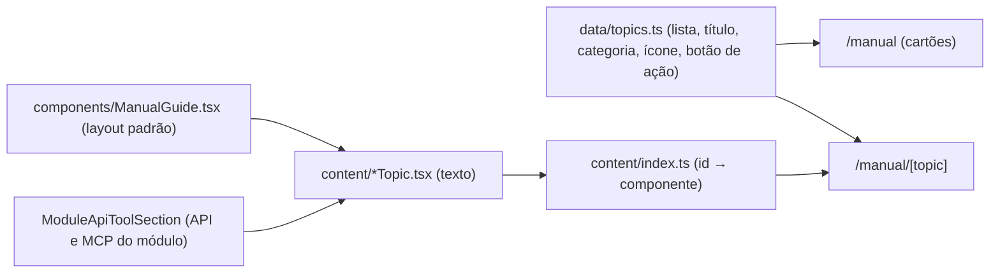

# Manual e ajuda

Descreve o que o código faz **hoje** (frontend após 2026-10-09). O manual é **conteúdo para usuários**: texto claro em português do Brasil, descrevendo o comportamento atual das telas.

## 1. Objetivo e quem usa

Guia de uso por módulo do Portal Tech V&D. **(suposição)** as páginas do manual não exigem login (não confirmado no layout); por isso não devem ter dados pessoais. Quem mantém: quem muda o comportamento de uma tela deve atualizar o tópico correspondente na mesma entrega.

## 2. Telas e entradas

| Rota | O que é |
|---|---|
| `/manual` | Visão geral: busca por nome/descrição e cartões agrupados em 4 categorias |
| `/manual/[topic]` | Página de um tópico (gerada estaticamente para cada id) |
| `/manual#poker` (e outros ids) | Compatibilidade: redireciona para `/manual/poker` |
| `/knowledge/manual` | Ajuda curta **dentro** do módulo Conhecimento (texto separado, em `src/app/knowledge/manual/page.tsx`) |

Também existem componentes de ajuda dentro de telas (`src/components/knowledge/KnowledgeGuide`, `KnowledgeHowToUse`, `GovernanceGuide`) e uma seção de integrações (`src/components/manual/IntegrationsSection.tsx`, catálogo em `src/lib/integration-catalog.ts`).

## 3. Como o manual é montado

Para **adicionar um tópico**: (1) novo item em `MANUAL_TOPICS` (`data/topics.ts`) com `id`, categoria, ícone e, se houver, `actionUrl` (precisa ser uma rota existente); (2) novo arquivo em `content/` usando `ManualGuide` (cartão lateral com a ideia central, seções numeradas, avisos); (3) registrar em `content/index.ts`. O teste `src/app/manual/__tests__/topics.test.ts` falha se faltar componente, se a categoria for inválida, se o botão de ação apontar para rota inexistente ou se o texto voltar a conter afirmações já desmentidas (armazenamento da chave "só no navegador", "purga em 30 dias").

Tópicos atuais: Scrum Poker, Brainstorming, Retrospectiva, Sprint Planner, Radar de Saúde, Meu Espaço, Hub Jolt, Integrações & API, Base de Conhecimento, Biblioteca de IA, Review de Sprint, Primeiros Passos & Papéis, Manifesto e Governança.

## 4. O que foi atualizado em 2026-10-09

Reescritos a partir do comportamento real (ver os documentos de fluxo correspondentes):

- **Retrospectiva:** modelos de colunas, chaves do facilitador (desligadas por padrão), votação por coluna, fusão, plano de ação, importar ações pendentes, exportação; aviso de que o anonimato é visual.
- **Scrum Poker:** modos síncrono e assíncrono, três baralhos, quem vota, regras opt-in, revotação parcial, estimativa por papel, devolução ao Jira.
- **Review de Sprint (antes "Showcase"):** criação, importação do Jira, anexos, Modo Teatro, decisão do PO/SME, finalização e exportações; regra de acesso por link.
- **Biblioteca de IA (antes "Hub de Prompts"):** oito tipos, skills (SKILL.md), iniciativas, coleções, variáveis, duplicar, leitura sem login só de itens públicos.
- **Meu Espaço:** as nove abas reais. Removida a menção a "Apoio à Daily", que não existe.
- **Base de Conhecimento:** a chave de IA **não** fica só no navegador (fica cifrada no servidor); respostas **não** são em streaming; a lixeira **não** tem purga em 30 dias; o editor é visual, não Markdown.
- **Novo:** Primeiros Passos & Papéis (onboarding, quem cadastra equipes, regra "ninguém se declara líder").

## 5. Pontos frágeis e o que **não** foi feito

- **Os outros tópicos** (Brainstorming, Planner, Radar de Saúde, Jolt, Integrações, Manifesto, Governança) **não foram revisados** contra o código nesta rodada. Sprint Planner continua com o botão "Ver status (em breve)".
- **O manual não é testado contra as telas.** Só há verificação estrutural (teste acima). Texto desatualizado só aparece quando alguém lê. Regra prática: mudou uma tela, mude o tópico.
- **Duas ajudas para a Base de Conhecimento** (`/manual/knowledge` e `/knowledge/manual`) mantidas à mão; podem divergir.
- `/api/knowledge/sync-manuals` (lê `manual/*.md` do diretório do servidor) não tem chamador e o diretório `manual/` não existe na imagem de produção. Hoje é rota morta; agora exige login.
- Se `/manual` for pública **(suposição)**: não colocar dados de pessoas ou da empresa nos textos.
- Os títulos de algumas ações apontam para telas que exigem login (o botão leva à tela de entrada).
- Não verificado ao vivo: aparência dos tópicos reescritos (testes e `tsc` apenas).

## 6. Onde olhar no código

- `src/app/manual/page.tsx`, `src/app/manual/[topic]/page.tsx`, `src/app/manual/layout.tsx`.
- `src/app/manual/data/topics.ts` (lista e metadados), `src/app/manual/content/*.tsx` (textos), `src/app/manual/components/*` (`ManualGuide`, `ManualHero`, `ManualSidebar`, `ModuleApiToolSection`).
- `src/app/manual/__tests__/topics.test.ts`.
