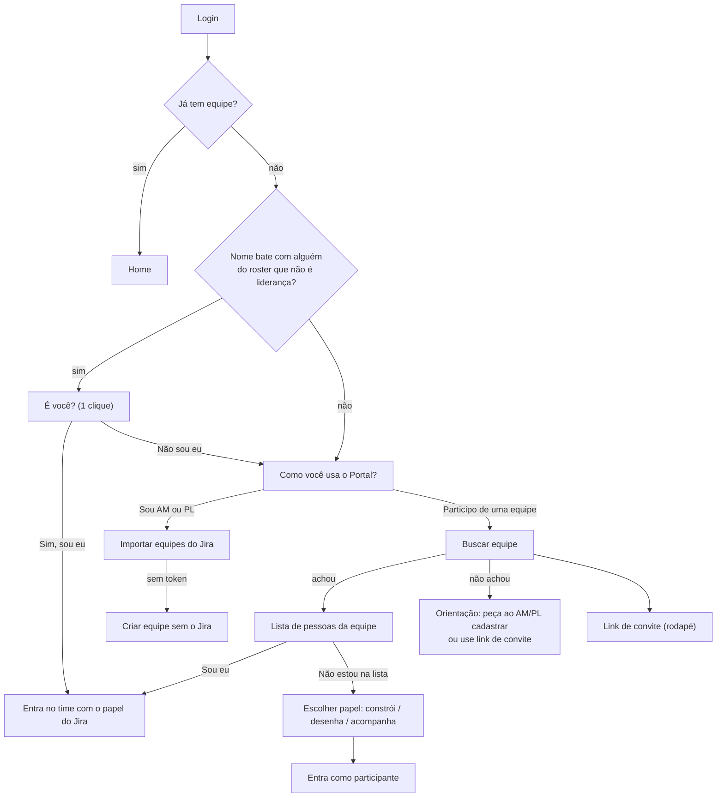
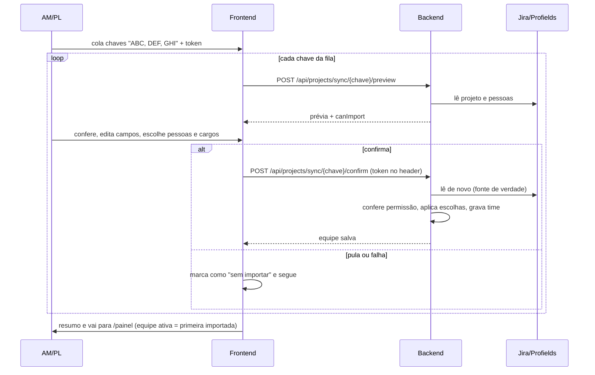

# Onboarding, equipes e papéis

## Objetivo

Levar quem acessa pela primeira vez até a própria equipe. Há dois tipos de pessoa com necessidades opostas:

- **Quem cadastra equipes:** Agile Master (AM) e People Lead (PL). Importam as equipes que cuidam do Jira (várias de uma vez) ou criam uma equipe nova.
- **Quem participa:** dev, QA, design, PO, stakeholder. Procuram a equipe que **já foi cadastrada** e entram nela. Não cadastram equipes.

Regra do produto: **ninguém se torna AM ou PL por conta própria.** O papel vem do Jira (Profields) ou de convite/ajuste de um admin.

## Quem é quem (papéis)

| Papel | Origem | Pode cadastrar equipe? | Observação |
|---|---|---|---|
| Admin (`User.role = ADMIN`) | Definido no sistema | Sim | Também ajusta `jobTitle` de outras pessoas |
| Agile Master (inclui Scrum Master) | Jira/Profields | **Sim** | Gerencia equipes, documentos, reuniões, cerimônias |
| People Lead | Jira/Profields | **Sim** | Lidera equipes; vê todas as equipes da mesma tribo/segmento |
| Agile Coach, Tribe Lead | Jira/Profields | Não | Lideranças transversais (veem a tribo), mas não cadastram |
| Product Owner, Product Manager, Team Lead, Tech Lead, Arquiteto Digital | Jira/Profields | Não | Lideranças da equipe (governança), sem cadastrar equipes |
| Developer, QA, Designer, UX, SME, Stakeholder/Observador | Jira ou escolha na entrada | Não | Os únicos papéis que a pessoa pode **escolher sozinha** ao entrar |

Pontos importantes:

- Liderança = linha do roster com `is_leadership = true`. Papéis de liderança **não podem ser autodeclarados** (nem pela tela "Não estou na lista", nem pelo "Sou eu").
- `User.role` (ADMIN/LEAD/MEMBER) é o nível de autorização do sistema e **não é** o cargo de negócio. O cargo de negócio é `jobTitle` (só admin grava) e as linhas do roster (`project_member_roles`).
- **Dev e QA** são reconhecidos por vários nomes ao importar do Jira: "dev", "developer", "desenvolvedor", "programador" viram Developer; "qa", "teste", "tester", "testador", "qualidade" viram QA.
- **Agile Coach / Agile Coaching** é papel próprio e **não vira Agile Master** (corrigido; antes o sistema juntava os dois).

### Como o sistema decide que alguém pode cadastrar equipe

Qualquer um destes basta:

1. É admin.
2. Um admin marcou o `jobTitle` como "agile master", "scrum master" ou "people lead".
3. Consta no roster de **alguma** equipe como AM/SM/PL (casamento por id da conta, e-mail ou conta do Jira).
4. Na importação de uma equipe específica: o **próprio Jira lista a pessoa como AM/PL naquela equipe**, casando por e-mail, conta do Jira ou nome completo (sem acento nem caixa). É assim que o primeiro AM entra com o banco vazio.

Se nenhuma vale, a gravação é recusada com 403 e a mensagem "Só Agile Master ou People Lead cadastram equipes…".

## Fluxo do primeiro acesso (`/onboarding`)

Telas, na ordem:

1. **É você?** Só aparece se o nome da conta bate (primeiro + último nome) com uma linha do roster que **não é de liderança**. Um clique vincula a conta à linha e entra com o papel do Jira. "Nada foi alterado ainda" até confirmar.
2. **Como você usa o Portal?** Duas escolhas: "Sou Agile Master ou People Lead" ou "Participo de uma equipe". Também aparece direto quando não há sugestão.
3. **Participante: buscar equipe.** Busca por chave, nome do projeto ou nome de uma pessoa. Se não achar, **não há botão de criar equipe** aqui: o texto manda pedir o cadastro ao AM/PL ou usar link de convite.
4. **Roster da equipe.** A pessoa se marca ("Sou eu") na própria linha. Linhas de liderança mostram "entra por convite". "Não estou na lista" leva a escolher o papel entre três opções de linguagem comum (Developer, Designer, Stakeholder/Observador).
5. **AM/PL: importar do Jira** (ver abaixo) ou **criar equipe sem Jira** (um campo: nome; a chave é gerada).
6. **Rodapé sempre disponível:** "Tenho um link de convite" (abre `/invite/<token>`) e "Só quero dar uma olhada" (exploração pública).

## Importação do Jira em lote

Para quem cuida de várias equipes. Domínio e token são digitados **uma vez**; o token fica salvo na conta do usuário.

Regras da prévia/confirmação:

- A prévia **não grava nada**. Mostra `canImport = false` e bloqueia o botão se a pessoa não pode importar aquela equipe.
- O servidor **reconsulta o Jira** na confirmação. Só entram pessoas que o Jira devolveu; a pessoa escolhe **quais** entram e pode trocar cargo apenas para cargos sem governança. Cargo de liderança só se mantém se veio do Jira. **Ninguém se promove pela prévia.**
- "Sou eu" numa linha de liderança só vale se e-mail, conta do Jira ou nome batem com a pessoa.
- Quem importa e não se marcou entra como Developer, nunca como liderança.
- Reimportar equipe que já tem time exige ser liderança dela ou admin (evita sobrescrever equipe alheia).
- Falha numa chave não derruba as outras; elas aparecem em "sem importar".
- A equipe ativa do usuário fica na **primeira** importada; as demais aparecem no seletor de equipes.

## Criar equipe sem Jira

`POST /api/projects` (só AM/PL/admin). **Criar não dá papel a ninguém:** o fundador entra com o papel que já tem (AM ou PL). Quem é admin sem papel de AM/PL entra como Developer, sem liderança. O usuário é movido para a equipe criada.

## Entrar em equipe existente (participante)

- **"Sou eu"** (`claim`): liga a conta à linha do roster. Recusa liderança (403) e linha de outra conta (409).
- **Escolher papel** (`join`): só os papéis da lista autodeclarável (Developer, QA, Designer, UX, SME, Stakeholder/Observador).
- **Convite:** link `/invite/<token>`; é o caminho de quem tem papel de liderança e não foi reconhecido.

## Endpoints principais (backend)

| Caminho | Quem | O que faz |
|---|---|---|
| `GET /api/projects`, `/hierarchy`, `/{chave}` | autenticado | Lista/detalha equipes |
| `POST /api/projects` | AM/PL/admin | Cria equipe manual |
| `POST /api/projects/sync/{chave}/preview` | autenticado | Prévia da importação (retorna `canImport`) |
| `POST /api/projects/sync/{chave}/confirm` | AM/PL/admin ou listado como tal no Jira | Grava a equipe |
| `POST /api/projects/{chave}/join?roleName=` | autenticado | Entra com papel autodeclarável |
| onboarding: sugestões, busca, roster, claim | autenticado | Reconhecimento e "Sou eu" |

## Pontos frágeis e erros de fluxo conhecidos

- **Expulsão não é permanente:** quem foi removido de uma sala/equipe pode voltar ao recarregar; não existe lista de banidos.
- **Catálogo de papéis ainda é código:** a lista de papéis e apelidos do Jira está espalhada no backend (`JiraAdminService`, `JiraProfieldsService`) e no frontend (`lib/types.ts`). Plano: tabela única de papéis quando a lista completa do Jira estiver em mãos. Papel desconhecido do Jira hoje cai em Developer (nunca em liderança).
- **Heurística de texto na importação de board** (`JiraAdminService.evaluateRole`): ainda adivinha o papel pelo texto. Siglas curtas (rte, am, sm, pm, em) agora só valem como palavra inteira, então "Suporte" deixou de virar Agile Master, "Equipe" de virar UX e "Overhead" de virar People Lead. Cargos novos ainda podem cair no papel errado; o Profields (`parseProfieldsMembers`) é mais fiel.
- **Casamento por nome** (sugestão "É você?" e liberação de importação) pode confundir homônimos. Por isso o "É você?" ignora linhas de liderança, e a importação exige AM/PL no Jira.
- **Banco de produção tem dados de teste** (importados antes da regra de papéis). Serão zerados; até lá, AM/PL antigos podem estar errados.
- **Não testado ao vivo** (login do Portal): tudo acima foi validado por testes unitários e leitura de código, não clicando no app.
- **Onboarding não foi portado para o legado** (o legado não tem essa tela).

- **O 403 "só AM/PL cadastram" também aparece quando a descoberta de pessoas do Jira falha em silêncio** (lista vazia): o sistema não acha o AM/PL na equipe e recusa. Se um AM legítimo recebe 403, vale conferir o token e o acesso dele ao projeto no Jira antes de suspeitar das permissões.
- **A descoberta de pessoas pela API padrão do Jira não é paginada** (até 100 issues e 50 por grupo): equipes grandes podem vir com gente faltando. O Profields também não é paginado.
- **Id do Jira da conta é protegido:** o `jiraAccountId` do perfil não pode mais ser trocado por um id que já pertence a outra pessoa do roster (isso permitia herdar equipes e liderança). O caminho para vincular a conta ao roster é o "Sou eu".
- **Reimportar preserva vínculos:** quem entrou por "Sou eu" ou pelo join não é apagado pela reimportação, e o vínculo da conta é mantido. Na junção de duplicados, AM e PL vencem as outras lideranças (uma pessoa que é PO e PL continua PL).
- **Cadastro sem verificação de e-mail** (risco alto, em `seguranca-transversal.md`): quem usa um e-mail corporativo ainda sem senha herda equipes e liderança ligadas a ele. Existe a chave opt-in `APP_REGISTRATION_ENABLED=false`; a solução definitiva é SSO.

## Onde olhar no código

- Tela: `src/app/onboarding/page.tsx`; importação em lote: `src/components/jira/JiraProfieldsImport.tsx` e `JiraImportPreview.tsx`; serviço: `src/services/projectService.ts`, `onboardingService.ts`.
- Regras no backend: `JiraProfieldsService` (permissão de importar/criar, confirmação), `OnboardingService` (sugestões/claim), `ProjectController`, `UserProjectResolverService` (liderança transversal por tribo), `security/SquadLeadership`.
