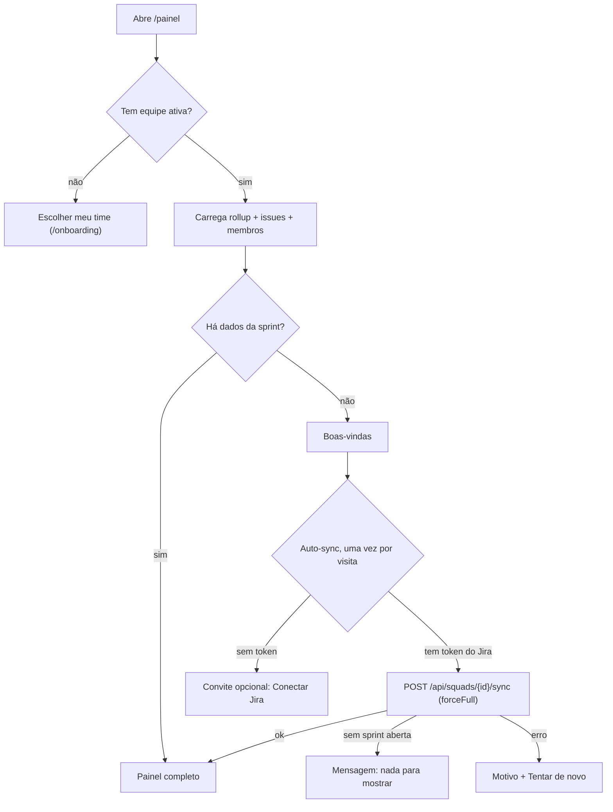

# Painel (`/painel`) e Home (`/`)

Descreve o que o código faz **hoje** (`develop`, 2026-10-09). Sem teste ao vivo (conta de teste e Jira reais): leitura de código + testes unitários.

## Objetivo e quem usa

O painel é a tela do dia a dia da equipe: mostra a sprint atual (vinda do Jira), o board resumido, quem está no time e a próxima cerimônia. Quem usa: qualquer pessoa com equipe ativa. A **Home** é só uma grade de atalhos para os módulos.

## Telas e entradas

| Tela | Caminho | Fonte dos dados |
|---|---|---|
| Painel | `/painel` | `useSquadDashboardData`: rollup, issues e membros da squad (`/api/squads/{id}/rollup|issues|members`); sem membros, cai no cadastro do projeto |
| Boas-vindas do painel | `/painel` (sem dados ainda) | Cadastro do projeto, salas de Poker, estado do sync |
| Próxima cerimônia | card do painel | `SquadConfig.ceremonyMode`: Google Calendar pessoal (OAuth no navegador) **ou** cadastro manual da squad |
| Importar equipes do Jira | diálogo do painel e `/onboarding` | `JiraProfieldsImport` (ver `integracao-jira.md`) |
| Home | `/` | Atalhos estáticos; **nenhum número real** |

## Fluxo principal

- **Painel completo, coluna principal:** nome da sprint (do rollup), "N itens na sprint", % = concluídas ÷ total do rollup, em andamento/a fazer, parados e atrasados (do rollup), "sincronizado há X" (maior `syncedAt`). Board em 3 colunas por categoria de status (3 itens mais recentes por coluna); "seu" marca as issues da pessoa por conta do Jira, nome ou prefixo do e-mail.
- **Coluna lateral:** próxima cerimônia, seu time (até 4 avatares + total + "você é X"), últimos movimentos (5 issues), atalhos "Explorar".
- **Próxima cerimônia:** `google_calendar` lê a agenda pessoal (hoje + amanhã, filtro por palavras como daily/planning/retro) e atualiza a cada 5 min; `manual` calcula a próxima ocorrência a partir de `ceremonies` (dia, hora, duração, link) nos próximos 7 dias. A configuração vale para a **squad toda** e é salva em `POST /api/squads/{id}` por qualquer membro.
- **Aviso de capacidade:** aparece se ninguém tem horas/dia configuradas; dispensável por squad (`localStorage`).
- **Atualizar** só relê o banco do Portal; **não** sincroniza o Jira (isso é o sync automático/"Tentar de novo").

## Estados e transições

`sem equipe` → `carregando` → `boas-vindas` (sem dados) ou `painel completo`. O sync tem `syncing` (três etapas fingidas, trocam a cada 6 s só para dar noção de progresso), `done`, `no-jira`, `error`. Contador da cerimônia: `agora` / `em N min` / `em Nh` / `hoje HH:MM` / `amanhã HH:MM` / `ter 14/10 10:00`.

## Permissões: servidor x cliente

- **Servidor:** exige JWT e que a pessoa seja **membro da squad** para ler (`SquadAccessService`). Não há distinção por cargo: Developer e PO leem os mesmos dados.
- **Cliente:** só decide o que mostrar. Quem edita a configuração de cerimônias é **qualquer membro** (o servidor aceita). O auto-sync usa o token Jira da própria pessoa e grava o rollup que **todos** da squad veem.
- Importar equipes: só AM/PL/admin (regra no servidor, `onboarding-e-papeis.md`).

## Dados persistidos

Rollup da sprint e issues sincronizadas (por squad), configuração da squad (modo de cerimônia, cerimônias manuais), preferências no navegador (aviso de capacidade dispensado, token do Jira — `integracao-jira.md`). A home não persiste nada.

## Pontos frágeis e erros de fluxo conhecidos

**Corrigidos agora:**

- Contador "amanhã": qualquer cerimônia a 24 h ou mais aparecia como "amanhã" (uma daqui a 5 dias mostrava "amanhã 10:00"). Agora conta dias de calendário.
- Boas-vindas: falha ao carregar as salas de Poker mostrava **"0 Sessões de Poker"** como dado real; falha ao carregar o cadastro deixava "Pessoas no time" em "…" para sempre. Agora aparece "—" com o motivo.
- Importação do Jira: se a equipe já tinha sido gravada e um passo seguinte falhava (ativar a equipe, guardar o token), a tela dizia "Não foi possível importar" e a pessoa refazia. Agora avisa só do que faltou. Rodapé "Importar 0 pessoas" ganhou texto que explica que a equipe nasce só com você.
- Token do Jira: erro ao salvar na conta era engolido (a tela dizia "guardado na sua conta"); agora avisa que vale só neste navegador.
- Perfil: lista de projetos do usuário lia um campo que o servidor nunca enviou.

**Não corrigidos (e por quê):**

- **`workdaysRemaining` nunca vem do servidor** (`SquadSyncService.buildRollup` não preenche): o título "Faltam N dias úteis" é ramo morto e o painel sempre mostra "N itens na sprint". Falta decisão de produto e mexe em código da frente de Squad.
- **Nome da sprint "Sprint Atual"** quando o rollup não tem nome (rótulo, não número) e **cards do topo (rollup) x board (issues de todas as sprints)** podem divergir: "10 de 20" no topo e 40 em "Concluído".
- **Erros viram "sem dados"**: o hook engole 403/500 de rollup/issues/membros e dispara o auto-sync; o banner de dados defasados quase nunca aparece. Refatoração do hook (compartilhado com os dashboards de Squad).
- **`Atualizar`/sync trocam a página inteira por spinner** (remonta cartões e perde estado); **corrida** se dois fetches terminam fora de ordem enquanto o perfil carrega.
- **Filtros perdem estado**: sprint selecionada nos dashboards volta para "atual" ao navegar; o diálogo de importação perde fila e escolhas se fechado com Esc.
- **Auto-sync automático** gasta o token Jira de quem apenas abre o painel (uma vez por visita sem dados).
- **Mensagens cruas do servidor** (`Squad API error 403: ...`) aparecem em erro de sync; qualquer erro contendo "token" é tratado como "sem Jira".
- **Home com cartões decorativos** (Showcase "Squad Elite Alpha", notas de retro e cartas de poker de exemplo no `BentoGrid`) que parecem dados reais; "Resumo Diário" é só uma dica aleatória. Não é número de painel, mas pode confundir.
- **Acessibilidade/mobile:** botão do menu de usuário sem `aria-label`; dias da semana na configuração de cerimônia sem `aria-pressed`; `Card` clicável sem teclado/`href`; atalhos "Explorar" com 3 colunas fixas em telas de ~320 px; textos de 7–9 px.
- **Segurança do `meetLink`**: digitado por qualquer membro e usado em `<a href>` sem validar o esquema (`javascript:`). Avisado à frente de Squad.
- **Papel mostrado** ("você é X") cai no papel de sistema (`user`/`admin`) quando a pessoa não casa com o roster.

## Onde olhar no código

- `src/app/painel/page.tsx`, `src/components/painel/` (`PainelWelcome`, `NextCeremonyCard`, `CeremonySettingsDialog`), `src/hooks/useSquadDashboardData`, `useNextCeremony`, `src/lib/ceremony-countdown`.
- Home: `src/app/page.tsx`, `src/components/home/` (`BentoGrid`, `ModuleGrid`, `LinkedTeamWelcome`, `NewSquadWelcome`).
- Importação: `src/components/jira/`.
- Backend: `SquadController`/`SquadService`/`SquadSyncService`/`SquadAccessService` (frente de Squad).
- Testes: `src/lib/__tests__/ceremony-countdown.test.ts`.
