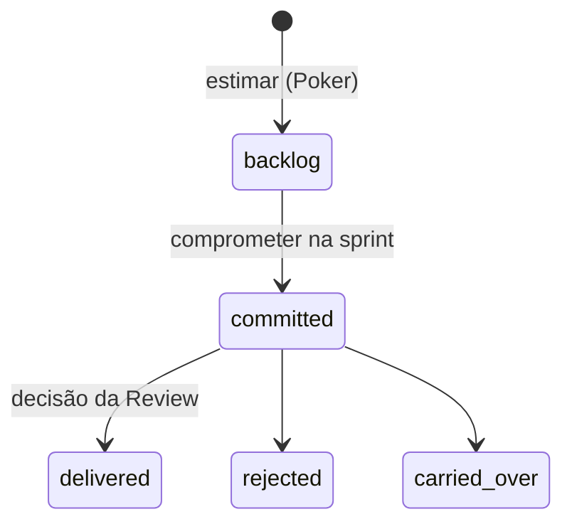

# Planejamento de sprint e work items

Estado do `develop` em 2026-10-09. Sem teste ao vivo.

## Objetivo e quem usa

Dois mecanismos distintos:

1. **Planejador de sprint** (`/api/sprint-plannings`): tabela de capacidade e tarefas de uma sprint (dev/QA, foco, ausências, horas por tarefa). **A tela nova ainda não existe:** `/sprint-planner` (e o atalho `/agile-tools/sprint-planner`) mostram "Em breve". O backend existe para o app legado e para um futuro porte; nenhuma tela do frontend novo o chama.
2. **Work items** (`/api/work-items`): estimativa (Poker), compromisso com a sprint e decisão da Review gravados sobre as **mesmas linhas de issue** que o sync preenche (`squad_issue_snapshots`, campos `ceremonyStatus`, `pointsEstimated`, `decisionFeedback`).

## Work items: ciclo

- `PUT /{squad}/{chave}/estimate`: pontos (vazio limpa). Aceita só número finito de 0 a 1000; senão 400. Cria a linha se a issue ainda não existe.
- `PUT …/commit`: `sprint_id` obrigatório; status vira `committed`.
- `PUT …/showcase-decision`: status em `committed | delivered | rejected | carried_over`, com feedback; grava data da decisão.
- Leituras: lista da squad (título = título do Jira, ou a chave se não houver), backlog estimado, itens de uma pessoa, **stats da sprint**.
- **Stats:** previsto = soma dos pontos dos itens da sprint; entregue = pontos dos `delivered`; carry-overs = contagem. Sprint ativa sem itens → zero (antes somava os itens de todas as sprints). Só squad **sem sprint ativa gravada** usa os itens em jogo.
- Chave da issue precisa ter o formato `ABC-123`. A unidade (pontos/horas/camisetas) é a configurada na squad (`estimationUnit`); o servidor guarda o número, não a unidade.

## Planejador (backend)

Planejamento (título, autor, configurações: início, dias úteis [10], fator de foco [70 %], devs/QAs e ausências, horas/dia padrão [8], modo detalhado, "pronto para o Poker", salas de Poker importadas), tarefas (nome, link, status, responsável, papel dev|qa, horas, datas, subtarefas) e pessoas (papel, foco, folgas, horas/dia). Cada gravação **substitui** tarefas e pessoas inteiras.

- Ler: quem tem o link (o id é o "convite"). Alterar/apagar: só o autor (do token) ou admin; planejamento antigo sem dono é assumido por quem salvar primeiro.
- Limites: 2000 tarefas, 200 pessoas. Id de tarefa/subtarefa/pessoa que já pertence a **outro** planejamento ganha id novo (antes sobrescrevia o alheio).
- Listagem "prontos para o Poker": só os do próprio autor (admin vê todos), no máximo 100.

## Permissões: servidor x cliente

Work items: **membro da squad** (mesma regra de `SquadAccessService`; antes cada controller tinha cópia própria e usuário sem squad era vinculado a qualquer uma). O gate de quem decide na Review (PO/SME) segue **só no cliente** para este endpoint (ver `review.md`). Planejador: autor/admin no servidor.

## Dados persistidos

Linha de issue (estimativa, status da cerimônia, sprint, decisão, feedback, data); `sprint_plannings`, `_tasks`, `_subtasks`, `_members`, `_imported_poker_rooms` (índices desde V19).

## Pontos frágeis e erros conhecidos

- **Corrigidos:** escrita de work item por quem não é da squad / auto-vínculo; estimativa negativa/NaN; compromisso sem sprint; título sempre igual à chave; stats misturando sprints; sobrescrita de tarefa de outro planejamento; limite da listagem sem teto.
- **Não corrigido:** decisão da Review sem papel no servidor (qualquer membro grava o status); `showcase-decision` e `estimate` criam linha "fantasma" para chave inexistente no Jira (ex.: `MANUAL-001`); planejamento **não tem squad** (por isso a listagem é por autor e a leitura por link); sem versão/trava otimista (a última gravação vence e substitui tudo); grava tarefas uma a uma; "pontos" e "horas" convivem na mesma coluna sem unidade; a tela do planejador não existe no frontend novo (**decisão do usuário:** portar do legado ou redesenhar).

## Onde olhar no código

Frontend: `src/app/work-items-api.ts`, `src/app/sprint-planner/page.tsx` (placeholder). Backend: `WorkItemController`, `WorkItemService`, `SprintPlanningController`, `SprintPlanningService`, entidades `SprintPlanning*`, `SquadIssueSnapshot`.
