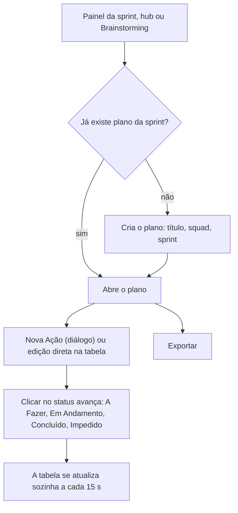

# Plano de Ação (5W2H)

## Objetivo e quem usa

Tabela de execução no formato 5W2H: para cada ação, **O quê, Por quê, Onde, Quando, Quem, Como e Quanto** (custo ou esforço), mais um status (A Fazer, Em Andamento, Concluído, Impedido). Serve para qualquer demanda e recebe ações vindas do **Brainstorming** (fase Plano) e é aberto a partir do painel de cerimônias da sprint.

- **Não há facilitador.** Quem tem o link edita. O plano guarda um criador (`creatorId`, definido pelo servidor a partir do login), mas ele não tem poderes extras hoje.
- **Decisão de produto aplicada:** o link dá acesso (como a Review). Planos são **públicos** por padrão e a tela nunca cria plano privado; o servidor sabe tratar plano privado (só criador, participante já adicionado ou ADMIN) para o caso de alguém criá-lo por API.
- Entrar exige login (não é um item público).
- Não confundir com o plano de ação da **Retro** (colunas de ação do quadro, ver `retro.md`): são recursos diferentes. Só o Brainstorming exporta para este módulo.

## Telas

| Tela | Caminho | O que é |
|---|---|---|
| Hub | `/action-plan` | Cria o plano (título obrigatório, squad). Aceita `?sprintId=` e `?squad=` vindos do painel de cerimônias para ligar o plano à sprint |
| Plano | `/action-plan/[id]` | Tabela 5W2H com edição direta nas células, diálogo "Editar Detalhes", guia e exportação (Markdown/CSV/etc.) |
| Entrada pelo painel | `CeremoniesDashboard` e atalhos da sprint | Abre o plano **da sprint** se já existir (`openOrCreateActionPlan`), senão leva ao hub com a sprint preenchida |

## Fluxo principal

1. **Criar.** Hub grava título (até 255 caracteres, obrigatório), squad e sprint. O criador é o do login, o plano começa público e o id é sempre gerado pelo servidor.
2. **Adicionar ação.** "Nova Ação" abre o diálogo com os sete campos; **"O quê" e "Quem" são obrigatórios** na tela (o servidor exige só "O quê"). A ordem vai para o fim da lista. O autor é quem está logado.
3. **Editar na tabela.** Clicar numa célula (O quê, Por quê, Como, Onde, Quando, Quem) edita no lugar; Enter ou sair do campo salva; Esc cancela. Só o campo editado é enviado e o servidor **mantém todos os outros**. Se a gravação falhar, aparece um aviso e a célula continua em edição com o texto digitado.
4. **Status.** Clicar no selo avança o status em ciclo (A Fazer → Em Andamento → Concluído → Impedido → A Fazer). No diálogo escolhe-se direto.
5. **Excluir.** Só pelo diálogo ("Editar Detalhes" → Excluir), com confirmação.
6. **Atualização.** A página não tem WebSocket: ela busca as ações de novo a cada 15 s com a aba visível e ao voltar para a aba. A edição de outra pessoa aparece em até ~15 s.
7. **Exportar.** Markdown/CSV da tabela atual (campos vazios saem em branco).

## Estados e transições

Status por ação: `todo`, `doing`, `done`, `blocked` (qualquer um para qualquer um). O servidor aceita maiúsculas e minúsculas e grava em minúsculas; qualquer outro valor é recusado (`400`). Não há estado do plano (aberto/fechado).

## Tempo real

Não há. Atualização por consulta a cada 15 s (ver acima). Gravações de outra pessoa na **mesma célula** ao mesmo tempo: vale a última.

## Permissões (servidor x cliente)

| Ação | Servidor | Cliente |
|---|---|---|
| Criar plano | Autenticado; criador = quem chama; título obrigatório | — |
| Ler plano e ações | Plano público: qualquer autenticado. Privado: criador, participante ou ADMIN | — |
| Listar planos de uma sprint (`GET /api/action-plans?sprintId=`) | Qualquer autenticado, **só planos públicos** | Usado pelo painel de cerimônias |
| Criar / editar / excluir ação | Mesma regra de leitura (quem tem acesso ao plano). A ação é sempre do plano da URL: id, plano, datas e autor do corpo são ignorados | Todos |
| Entrar como participante (`POST …/participants`) | Só a si mesmo (criador e ADMIN podem informar outra pessoa) | Não é usado pela tela |
| Apagar ou renomear o plano | **Não existe** endpoint | — |

Qualquer pessoa com acesso apaga ou altera qualquer ação (não há dono por ação).

## Endpoints principais

`POST /api/action-plans`, `GET /api/action-plans/{id}`, `GET /api/action-plans?sprintId=`, `POST …/{id}/participants`, `GET/POST …/{id}/tasks`, `PUT /api/action-plans/tasks/{taskId}` (parcial), `DELETE /api/action-plans/tasks/{taskId}`.

Erros relevantes (mensagem em português): `404` (plano ou ação inexistente), `403` (plano privado sem acesso), `400` (título/“O quê” vazio, texto acima de 5000 caracteres, "Quem"/"Quanto" acima de 255, status inválido).

## Dados guardados (negócio)

Plano (título, squad em texto, sprint, criador, público/privado, participantes, data) e ações (os sete campos 5W2H, status, autor, ordem, datas de criação e atualização). "Quando" e "Quem" são **texto livre**, não data nem pessoa do sistema. Índice de ações por plano (migration V40).

## Pontos frágeis e erros de fluxo conhecidos

Corrigidos em 2026-10-09: **editar um campo na tabela ou mudar o status apagava todos os outros campos da ação** (o servidor gravava os campos ausentes como vazios; com o status nulo a tabela chegava a quebrar); um id no corpo de "criar ação" podia **mover uma ação de outro plano** para este; o autor da ação vinha do corpo; qualquer pessoa se adicionava a plano privado informando qualquer participante; qualquer erro ao abrir o plano virava "Plano não encontrado" e redirecionava (agora só 404/403 redirecionam; queda de rede mostra "tentar de novo"); falha ao salvar uma célula não avisava e perdia o texto; célula aberta depois de uma atualização mostrava o valor antigo e podia sobrescrever a edição de outra pessoa com ele.

Ainda abertos:

- **Sem tempo real:** até 15 s de atraso e, na mesma célula, vale a última gravação sem aviso de conflito.
- **Sem dono por ação, sem histórico:** qualquer pessoa com o link apaga ou altera qualquer ação e não há registro de quem mudou o quê (o autor da criação é gravado, mas não aparece na tela).
- **Sem apagar nem renomear o plano**, e sem reordenar as ações (a ordem é a de criação).
- **"Quando" e "Quem" em texto livre:** não dá para filtrar por prazo, ordenar por data, lembrar prazos vencidos nem ligar à pessoa. A tela do diálogo exige "Quem", mas o servidor e o Brainstorming criam ações sem responsável.
- **Plano privado só por API:** a tela nunca cria; o campo `settings.isPublic` que a tela enviava era ignorado pelo servidor (removido do envio).
- **Painel de cerimônias pode abrir plano de outra squad:** `openOrCreateActionPlan` procura o plano da sprint pela squad e, se não achar, usa o primeiro plano público da sprint.
- **Listagem de planos por sprint** lê os participantes de cada plano em consultas separadas (carregamento eager), custo cresce com a quantidade de planos da sprint.
- **Exportar do Brainstorming** cria sempre um plano novo; clicar duas vezes cria dois planos.
- **Não testado ao vivo** (exige uma conta logada, e não havia conta de teste nem banco local). Validado por testes unitários: backend (criação, edição parcial com todos os campos preservados, validações, autorização por plano público/privado, participante só a si mesmo) e frontend (cliente de API, mensagens de erro e códigos). A migration V40 só cria índices e nunca rodou contra um Postgres real antes do deploy.

## Onde olhar no código

- Frontend: `src/app/action-plan/page.tsx` (hub), `src/app/action-plan/[id]/page.tsx` (carga, atualização a cada 15 s), `src/app/action-plan/api.ts`, `src/components/action-plan/*` (`ActionPlanBoard` com a tabela e a edição direta, `ActionTaskDialog`, `ExportActionPlanDialog`, `ActionPlanGuide`), `src/lib/sprintCycleNav.ts` (abrir/criar o plano da sprint), `src/components/brainstorming/ActionsPhase.tsx` (exportação do Brainstorming).
- Backend: `ActionPlanController` (acesso por plano), `ActionPlanService` (regras e edição parcial), entidades `ActionPlan/ActionPlanTask`, migration V40.
