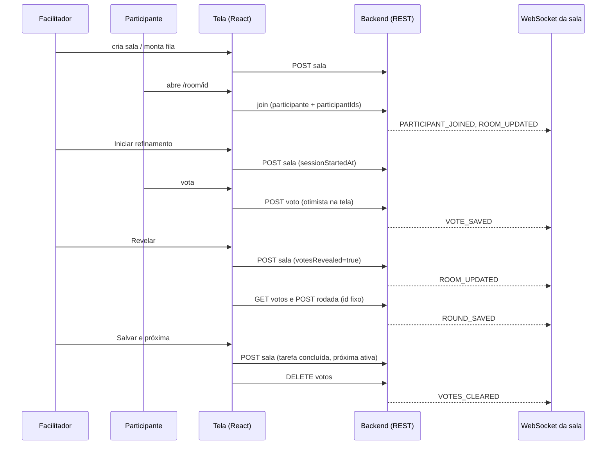
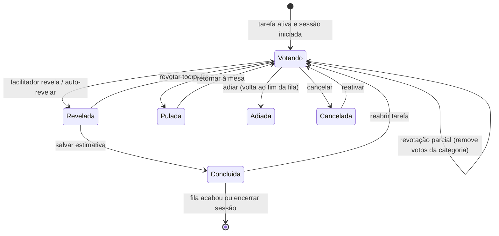

# Fluxo do Scrum Poker

Documento do que o código faz hoje (frontend `v4.20.0` + backend com a migration V38). O que for suposição está marcado com **[suposição]**. Nada aqui foi exercitado ao vivo: a sala exige login do Portal (e-mail e senha), então tudo vem de leitura de código e testes unitários.

## 1. Objetivo e quem usa

Estimar tarefas do backlog em grupo (Planning Poker), com votos escondidos até a revelação, histórico de rodadas e devolução da estimativa ao item de trabalho (Jira/backlog).

Papéis de sala (campo `role` do participante): `dev`, `qa`, `organizador`, `spectator`. O papel inicial vem do cargo global do perfil (Desenvolvedor/Designer/UX = dev; QA = qa; Scrum Master, Agile Master, Product Owner, Tech Lead, People Lead, SME = organizador; Stakeholder/Observador = spectator).

Quem é **facilitador** (mostra os controles de facilitação):
- No cliente: o criador da sala (`creatorId`), ou qualquer participante com papel `organizador`.
- Fallback do cliente: se não houver criador nem organizador online, o primeiro participante online que não seja espectador passa a se achar facilitador (cada tela decide sozinha; **[suposição]** pode haver telas discordando por diferença de relógio ou de lista de participantes).
- No servidor: criador, ADMIN/LEAD do sistema, participante com flag de facilitador ou com papel `organizador`. O facilitador de fallback do cliente **não** é facilitador no servidor.

Quem **vota**: dev, qa e (se o facilitador liberar "Gestão pode votar") organizadores. Espectador nunca vota. A categoria de quem vota (Developer, QA, UX, Designer ou Gestão) vem do cargo global do perfil; o papel da sala só vale como reserva quando não há cargo.

## 2. Telas e entradas

- `/room`: lista as salas da squad, abre o assistente de criação (título, squad, modo síncrono/assíncrono, baralho, regras opt-in, template, equivalência de camisetas) e permite entrar numa sala existente.
- `/room/<id>`: a sala. Mesma tela para facilitador e participante; os controles de facilitador só aparecem para quem se acha facilitador.
- Entrada por link (`/room/<id>`, copiado pelo botão Link), por id (colado na lista) ou clicando numa sala da lista. Não existe convite separado: quem tem o link e está autenticado entra.
- Login do Portal (e-mail e senha) obrigatório; sem perfil carregado a tela pede identidade antes de entrar. Ao abrir a sala o cliente registra o usuário como participante sozinho.

## 3. Fluxo principal (modo síncrono)

1. Facilitador cria a sala: baralho (Fibonacci, Horas, Camisetas), modo, regras. Sala nasce com os padrões `DEFAULT_ROOM_SETTINGS` (só opções que acrescentam informação; automações e mudanças de regra ficam desligadas).
2. Facilitador monta a fila: adiciona tarefa manual, cola lista/CSV ou importa do Jira (XML ou API). Se não há tarefa ativa, a primeira vira ativa.
3. Participantes entram; o backend registra o participante e o inclui na lista de participantes da sala.
4. "Iniciar refinamento" (ou início automático quando há 1 dev e 1 QA online) grava `sessionStartedAt`. Antes disso o baralho fica bloqueado.
5. Cada participante vota na tarefa ativa. O voto é otimista na tela e confirmado pelo servidor. Clicar de novo na mesma carta remove o voto.
6. Facilitador revela (ou "Revelar automaticamente" quando todos os votantes online votaram). A sala vira "revelada", o cliente do facilitador relê os votos, calcula consenso/piso/teto/média e grava a rodada no histórico.
7. Se divergiu: "Revotar todos" (limpa os votos e desrevela) ou revotação parcial por categoria (remove só os votos dessa categoria).
8. "Salvar e próxima": grava a estimativa final na tarefa (concluída), envia o número ao item de trabalho quando a tarefa tem chave Jira e a estimativa é numérica, limpa os votos e ativa a próxima pendente.
9. Alternativas por tarefa: pular, adiar (volta ao fim da fila), cancelar, reabrir/revotar tarefa já feita, fixar como referência.
10. Fim da fila ou "Encerrar sessão": grava `sessionEndedAt` e o resumo; a tela mostra o relatório.

Cálculo da média: consenso = todos os votos elegíveis iguais (mais de um). A média usa só votos numéricos elegíveis (gestão e espectador ficam de fora, salvo gestão liberada). "?" e café não entram na média. O arredondamento segue a opção "Arredondamento da média": **para cima (padrão)**, mais próximo, para baixo ou carta mais próxima. Nos baralhos de Fibonacci e de Horas a estimativa **salva** é a soma das médias por papel (Developer + QA etc.), não a média geral exibida (o card avisa a diferença). Em camisetas com equivalência a média é em horas; sem equivalência vale o tamanho mais votado.

## 4. Síncrono x assíncrono

- **Síncrono**: uma tarefa ativa por vez; um voto por participante na sala (id `sala_participante`); a revelação é um flag da sala (`votesRevealed`); tem timer, fila com ativa, rodadas e todas as regras opt-in.
- **Assíncrono**: cada pessoa vota quando puder, em qualquer tarefa; um voto por participante **por tarefa** (id `sala_participante_tarefa`, unicidade pela migration V38); a revelação é por tarefa (lista `revealedIssues`); "consolidar" salva a estimativa da tarefa e limpa os votos dela. Não há timer, auto-revelar nem rodadas por revelação. **[suposição]** parte das regras opt-in do síncrono fica escondida no painel assíncrono.

## 5. Estados e fases

- Sala: `votesRevealed` (verdadeiro/falso), `activeIssueId`, `sessionStartedAt`, `sessionEndedAt`, `selectiveRevotingRole` (categoria em revotação parcial), `mode` (`sync`/`async`), `timer` (`stopped`, `running`, `paused`).
- Tarefa: status `pending`, `active`, `completed`; marcas `skipped`, `cancelled`, `parked` (+ `parkCount`).
- Voto: valor da carta, confiança opcional (`low`, `medium`, `high`), `issueId`, nome/papel congelados no voto.
- Rodada (histórico): uma por revelação; também uma por tarefa pulada ou cancelada; guarda votos, estatísticas, pontos por papel.

Transições e quem dispara (cliente = quem se acha facilitador; servidor = quem passa na checagem):
- Votar/remover o próprio voto: participante votante; servidor exige ser participante, carta do baralho e rodada não revelada.
- Revelar, revotar, selecionar/concluir/pular/adiar/cancelar tarefa, mudar baralho, timer, configurações: botões só para o facilitador no cliente; no servidor basta ser participante da sala (ver seção 7).
- Remover voto ou participante de outra pessoa: facilitador do servidor, ADMIN ou o próprio.

## 6. Tempo real

Conexão: `WebSocket /ws/poker/<id>` com o token na URL. Eventos (todos com `type` e `payload`):
- `ROOM_UPDATED`: sala inteira atualizada; o cliente só aplica se a `version` não for menor que a já aplicada.
- `PARTICIPANT_JOINED` / `PARTICIPANT_LEFT`: insere/atualiza/remove participante.
- `VOTE_SAVED` / `VOTE_REMOVED`: atualiza o voto (casa por id; remoção pode vir com a tarefa no modo assíncrono).
- `VOTES_CLEARED`: zera os votos.
- `ROUND_SAVED` / `ROUNDS_CLEARED`: histórico.
- `CHAT_MESSAGE_SAVED` / `CHAT_MESSAGE_DELETED`: chat (DMs só chegam aos dois envolvidos).
- Reação: mensagem `REACTION` (sem persistência), montada no servidor com o remetente do login.
- `REFRESH_ROOM` e tipos desconhecidos: o cliente recarrega tudo por REST.

Os eventos saem **depois do commit**. O envio por sessão é serializado.

Reconexão: ao cair, o cliente recarrega por REST, espera 1 s, 2 s, 4 s… (até 30 s), reabre com o token atual e, ao reconectar, recarrega sala, votos, participantes, rodadas e o chat. A presença é mantida por heartbeat a cada 25 s (servidor grava só `last_seen`) e o cliente busca participantes a cada 20 s (online = visto há até 60 s).

Lock otimista: a sala tem `version`. Toda gravação da sala devolve 409 se partiu de versão velha; o cliente dispara um aviso único "A sala mudou", recarrega e pede para repetir a ação. Gravações sem versão (clientes antigos, MCP) sobrescrevem. O reveal usa a versão da sala gravada como parte do id da rodada, então repetir não duplica.

## 7. Permissões

Servidor (o que de fato é imposto):
- Qualquer usuário autenticado lê sala, participantes, votos e rodadas e pode abrir o WebSocket de uma sala pelo id (**ainda não fechado**, ver seção 9).
- Entrar na sala: só como si mesmo; só facilitador edita outro participante. A flag de facilitador só é concedida por criador/ADMIN/LEAD/facilitador.
- Gravar a sala, limpar votos/rodadas, notas de refinamento, rodadas e reações: precisa ser participante (ou criador, ADMIN/LEAD).
- Trocar o criador da sala: facilitador do servidor, ou o próprio usuário se o organizador atual não tem heartbeat recente (cerca de 90 s).
- Votar: só o próprio voto; sala existente; participante; carta do baralho; antes da revelação (modo síncrono) ou antes da revelação da tarefa (assíncrono); tarefa ativa no síncrono.
- Remover voto/participante de outro: facilitador do servidor ou ADMIN.

Cliente:
- Controles de facilitador (revelar, revotar, fila, baralho, timer, configurações, importação) só para quem se acha facilitador. Isso é uma conveniência: o servidor não repete a regra para a maioria das ações.
- Gestão sem liberação e espectadores veem aviso em vez do baralho. Espectador não assume a sala.

**Opções opt-in do facilitador** (nunca mudam o padrão da sala): gestão pode votar, revelar automaticamente, revelação anônima, explicar votos extremos, histograma, sugerir revotação, agrupar votos por papel, timer automático, aviso "sua vez", nota de decisão, notas de refinamento, tempo por tópico, histórico do time, voto de confiança, envio ao grooming, auto-consenso, reações, referência, aviso de rodadas, adiar/cancelar tarefa, limites de divergência (horas), **Arredondamento da média** (padrão: para cima), **Votos às cegas** (padrão: desligado).

**Votos às cegas**: ligado, o servidor troca o valor dos votos dos outros por `*` no REST e no WebSocket até a revelação. O próprio voto e quem é facilitador no servidor veem os valores. Ao revelar, todos os clientes buscam os votos de novo. Desligado, o valor dos votos de terceiros trafega para todos antes da revelação (a tela só os esconde).

## 8. Dados e integrações

Persistido (em termos de negócio): sala (configurações, fila de tarefas, lista de participantes, resumo, timer, versão); participante da sala (apelido, papel, flag de facilitador, última vez visto); voto (um por participante, ou por tarefa no assíncrono); rodada do histórico (votos, estatísticas, pontos por papel); mensagens de chat. Templates de sala ficam no navegador (localStorage), assim como a credencial do Jira do usuário.

Jira: importação por XML ou API via proxy do frontend para o backend. Vêm título, chave, descrição, status, tipo, prioridade, responsável, atualização, labels, critérios de aceite e pontos existentes (referência, não é a estimativa da sala). Pontos pela API: três campos fixos de story points; pelo XML: campo cujo nome indica pontos. A estimativa volta pelo endpoint de estimativa do item de trabalho da squad quando a tarefa tem chave, a estimativa é numérica e a squad é resolvida; falha é avisada na tela. A busca por API mostra aviso quando o resultado passa do limite, mas não pagina.

## 9. Pontos frágeis e pendências

Não corrigido (decisão ou contrato em aberto):
- Leitura aberta e WebSocket sem checar participação: a página lê sala/rodadas e abre o socket antes de entrar. Fechar exige entrar primeiro ou autorizar por squad.
- O servidor não exige facilitador para revelar, limpar ou editar a fila; qualquer participante com a chamada na mão consegue. Motivo: o facilitador de fallback é decidido no cliente.
- Facilitadores múltiplos no cliente (todo `organizador`): as automações (início automático, revelação automática, timer, auto-consenso) podem disparar em vários navegadores; o lock gera 409 e aviso em quem perde.
- Pontos do Jira pela API: a busca "por nome de campo" nunca casa; só três ids fixos de story points funcionam. Em outras instâncias os pontos vêm vazios.
- Trocar o papel de alguém na sala não muda a categoria dele quando o cargo global existe (o cargo vence). A ação de trocar papel nem aparece na lista de participantes.
- A busca de rodadas por chave de API (rota pública e MCP) varre todas as squads.
- A estimativa final salva a soma das médias por papel (Fibonacci/Horas), que difere da média exibida; é o comportamento histórico, agora sinalizado.
- Fechar a aba não remove o participante: ele só fica offline em até 1 minuto.

Não testado ao vivo: tudo. Em particular reconexão do WebSocket, voto otimista com rollback, modo assíncrono ponta a ponta, votos às cegas, assumir o controle, a migration V38 em banco real e os fluxos de pular/cancelar com a nova ordem de gravação (sala primeiro, rodada depois).

## 10. Onde olhar no código

Frontend:
- `src/app/room/page.tsx`: lista e criação de salas.
- `src/app/room/[id]/page.tsx`: estado da sala, WebSocket, regras de facilitador, todas as ações (votar, revelar, fila, timer).
- `src/app/room/api.ts`: chamadas REST e tratamento de 409.
- `src/components/poker/`: PokerRoom (tela síncrona), AsyncPokerRoom, Controls (baralho), VotingArea/ParticipantCard, Results (média e consenso), TopicQueue (fila e importação), FacilitatorPanel (opções), History, ExportDialog, team-chat.
- `src/lib/poker-utils.ts`: categorias, votantes elegíveis, média, arredondamento, presença. `src/lib/types.ts`: tipos e baralhos.
- `src/components/shared/JiraImportDialog.tsx` e `src/services/jiraService.ts`: importação do Jira.

Backend:
- `controller/PokerController`, `service/PokerService`: regras, permissões, eventos.
- `websocket/PokerWebSocketHandler`: salas e envio.
- `domain/PokerRoom`, `PokerParticipant`, `PokerVote`, `PokerRound`; `repository/Poker*`.
- `db/migration`: V30 (versão da sala), V38 (voto por tarefa e índice de rodadas).
