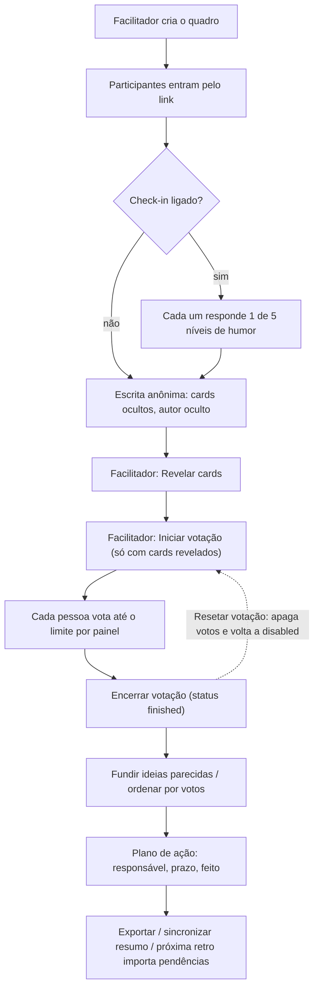

# Retrospectiva

## Objetivo e quem usa

Quadro colaborativo de retrospectiva em tempo real. A equipe escreve cards em colunas, o facilitador revela, a equipe vota e funde ideias, e saem ações (plano de ação) acompanhadas entre sprints.

- **Facilitador:** quem criou o quadro (`creatorId`) ou quem **assumiu o controle**. Controla fase, revelação, votação, timer e configurações. Há **um único** facilitador por vez.
- **Participante:** qualquer pessoa que entrou no quadro. Escreve cards, vota, reage, move o **próprio** card, marca ação como feita, usa o chat.
- **Admin:** pode o mesmo que o facilitador.
- Entrar exige login, mas **não exige pertencer à squad**: o link dá acesso. Quem abre o link vira participante automaticamente (e passa pela pergunta de check-in, se estiver ligada).

## Telas

| Tela | Caminho | O que é |
|---|---|---|
| Hub | `/retro` | Cria retrospectivas (guarda um atalho da sala criada no navegador, `localStorage`); não lista as retros da squad |
| Quadro | `/retro/[id]` | A sessão em si (colunas, controles, chat, participantes) |
| Modo apresentação | dentro do quadro | Tela cheia por coluna, com timer e controles do facilitador |
| Exportar | menu "⋯" do quadro | Markdown, texto TDN, CSV, PDF |
| Importar ações pendentes | coluna de ação | Traz ações não concluídas de retros anteriores da mesma squad |
| Histórico | dentro da visão de desempenho da squad (`SquadPerformanceView`) | Humor médio por retro, ações feitas/total, ações recorrentes |
| Números da sprint | menu do quadro | Previsto x entregue, vindos do Jira |

## Criar uma retro (hub)

Campos: título, squad (preenchida com a do usuário), **modelo de colunas**, sprint (vem da navegação, ex.: painel de cerimônias), e cinco chaves opcionais do facilitador (todas **desligadas por padrão**):

| Chave | Efeito |
|---|---|
| Autores abertos | Mostra quem escreveu cada card |
| Sincronizar coluna ativa | Todos acompanham a coluna que o facilitador foca |
| Check-in inicial | Pergunta de humor antes de abrir o quadro (pergunta editável) |
| Auto-revelar ao fim do timer | Revela os cards quando o tempo zera |
| Ordenar por votos ao encerrar | Ordena as colunas de feedback quando a votação termina |

Modelos: Clássico, Start/Stop/Continue, Mad/Sad/Glad, Starfish, 4Ls, DAKI, Veleiro, Três Porquinhos, Carro de corrida e **Personalizado** (2 a 6 colunas, nomes diferentes; cada coluna pode ser marcada como **plano de ação**). Os modelos prontos têm coluna de ação conforme a lista em `lib/types.ts` (alguns não têm; nesse caso não há plano de ação).

## Fluxo de uma sessão

Detalhes por etapa:

1. **Escrita anônima.** Enquanto `isCardsRevealed = false`, a pessoa só vê o texto dos **próprios** cards. Autor só aparece se `isAuthorsRevealed` for verdadeiro. A coluna de ação sempre mostra texto e autor.
2. **Revelar.** O facilitador alterna "Revelar cards". Com "auto-revelar ao fim do timer", o facilitador do navegador dispara isso quando o timer chega a zero.
3. **Votação.** `votingStatus`: `disabled` → `active` → `finished`. Só se inicia com cards revelados.
   - O voto é **uma alternância por pessoa e card**, feita no servidor. O **limite de votos vale por coluna** (cada painel é uma votação). Limite 0 = sem limite.
   - Voto em coluna de ação não existe. Voto fora da fase `active` é recusado.
   - **Resetar votação** (com confirmação) apaga **todos** os votos e volta a `disabled`.
4. **Fundir cards.** Só com cards revelados e **só dentro da mesma coluna**. O texto do card de origem entra como histórico (linha do tempo) no destino, os votos são unidos **sem repetir** quem votou nos dois, os filhos migram, e a origem é apagada. É uma operação única no servidor.
5. **Mover cards.** Arrastar muda coluna/ordem. Na fase anônima só o autor ou o facilitador move o card. Ao mudar de coluna, os votos vão junto; se isso estourar o limite da coluna de destino, o arrasto é bloqueado com aviso. Colunas "ordenadas por votos" ignoram reordenação manual.
6. **Plano de ação.** Cards da coluna de ação têm responsável, prazo e "feito". O prazo aparece no card. O facilitador pode editar/apagar qualquer card; o autor edita o próprio; os demais podem marcar "feito" e reagir.
7. **Exportar.** Fica desabilitado para participantes até os cards serem revelados (o facilitador exporta sempre). PDF (relatório), Markdown, texto TDN e CSV incluem votos, ações, autores (se revelados) e as ideias agrupadas.
8. **Importar ações pendentes.** Lista retros anteriores **da mesma squad** (pelo `squadId`) com ações não concluídas e traz as escolhidas para a coluna de ação deste quadro, guardando de qual retro vieram e quantas vezes foram repetidas (`carryCount`).

## Timer

- Estados: `stopped`, `running`, `paused`. O servidor **guarda** o fim (`endTime`, em ms) e a duração; **não conta tempo**. Cada navegador calcula o que falta pelo relógio local.
- Ao chegar a zero: toca o alarme (se o som estiver ligado), o facilitador revela os cards (se configurado) e o facilitador grava o timer como `stopped`. Quem entra depois do fim não ouve o alarme.
- Pausar guarda quanto faltava; retomar recalcula o fim.

## Chat

Canais: **geral**, um por categoria de papel e **mensagens diretas** entre participantes. Cada pessoa só enxerga os canais dela. Mensagens chegam por WebSocket.

## Tempo real (WebSocket `/ws/retro/{id}?token=`)

O servidor só aceita conexão de quem pode ler o quadro. Depois de cada gravação confirmada ele envia:

| Evento | Quando | O cliente faz |
|---|---|---|
| `BOARD_UPDATED` | Qualquer mudança do quadro | Substitui os dados do quadro |
| `PARTICIPANT_JOINED` / `PARTICIPANT_LEFT` | Entrada/saída | Atualiza a lista |
| `CARD_SAVED` | Card criado/alterado (inclui voto, fusão, reset) | Insere/substitui o card |
| `CARD_DELETED` | Card apagado | Remove |
| `CARDS_IMPORTED` | Importação de ações | Insere em lote |
| `CHAT_MESSAGE_SAVED` / `CHAT_MESSAGE_DELETED` | Chat | Atualiza o canal |
| `REFRESH_BOARD` e desconhecidos | — | Recarrega tudo |

Os eventos saem **depois do commit**. Ao reconectar o cliente **recarrega** quadro, cards e participantes; respostas antigas de recarga são descartadas (só vale a mais recente). A resposta de cada gravação também é aplicada na hora, então o fluxo não depende do eco do WebSocket.

## Permissões (servidor)

| Ação | Quem |
|---|---|
| Ler quadro, cards, participantes, abrir WebSocket, entrar como participante | **Qualquer pessoa logada que receba o link** (mesma regra da Review e do Poker), mesmo de outra squad. Listagens por sprint continuam filtradas por participação/squad |
| Criar card | Participante (autor é sempre quem chama) |
| Editar texto/responsável do card | Autor, facilitador, admin |
| Mover, marcar feito, reagir | Qualquer participante (cada um altera só a própria reação) |
| Apagar card | Autor, facilitador, admin |
| Votar / remover voto | Participante, fase `active` |
| Resetar votação, alterar fase/revelação/timer/colunas/configurações | Facilitador, admin (`PATCH /api/retros/{id}`) |
| `participantIds` no PATCH | Qualquer participante (entrada); a lista real vem de `/participants` |
| Assumir controle | Qualquer participante (a flag de facilitador passa a ser só dele) |
| Remover participante | O próprio, o facilitador ou admin |
| Apagar quadro | Facilitador, admin |

Gravar o card inteiro **não** altera votos nem autor de um card que já existe: o servidor mantém os persistidos. Votos só mudam por voto, fusão e reset.

## Endpoints principais

`POST /api/retros` (criar), `GET/PATCH/DELETE /api/retros/{id}`, `POST …/votes/reset`, `POST …/transfer-control`, `GET/POST …/participants`, `DELETE …/participants/{userId}`, `GET/POST …/cards`, `DELETE …/cards/{cardId}`, `POST …/cards/{cardId}/vote`, `POST …/cards/{targetId}/merge/{sourceId}`, `POST …/cards/import`, `GET/POST …/chat`, `DELETE …/chat/{messageId}`.

Erros relevantes: `409` (votação fechada, limite do painel, fusão na fase anônima ou entre colunas, edição concorrente), `403` (sem acesso/permissão), `404` (quadro/card inexistente), `400` (valor inválido).

## Dados guardados (negócio)

Quadro (título, squad, sprint, criador, colunas, estado de revelação/votação, timer, configurações, resumo sincronizado, ordenação por coluna), cards (texto, coluna, ordem, autor, votos, reações, responsável, prazo, feito, histórico de fusão, origem e contagem de repetição), participantes (apelido, papel, criador, resposta do check-in) e mensagens de chat. Votos têm unicidade por (card, pessoa). Quadro e card têm versão (trava otimista).

## Pontos frágeis e erros de fluxo conhecidos

- **Anonimato é só visual.** O servidor ainda envia conteúdo e autor de cards **não revelados** a todos os participantes (REST e WebSocket); só a tela os esconde. Alguém com o navegador aberto pode ler. Corrigir exige o servidor mascarar até a revelação.
- **Quem foi removido volta ao recarregar.** Não há lista de banidos.
- **Relógio do timer é o de cada navegador.** Diferença de relógio entre máquinas mostra segundos diferentes. Falta um relógio do servidor.
- **`participantIds` não persiste** (não há coluna); vale a lista de `/participants`.
- **Edição de card inteiro:** reação, "feito" e arrasto ainda enviam o card completo; o servidor protege votos e autor, mas duas edições simultâneas do **mesmo campo** ainda disputam (vale a última; `409` quando a versão não bate).
- **Gravação em movimentos em lote** (renumerar coluna) manda várias requisições em paralelo; uma falha reverte só aquele card.
- **Fase do card:** o servidor só valida que a coluna existe; não impede editar fora da "fase" porque a sincronização de coluna é uma conveniência de tela.
- **Conteúdo do export:** cards sem texto são ignorados; datas usam a da retro; PDF não imprime emoji.
- **Não testado ao vivo:** nenhuma correção de 2026-10-09 foi exercitada no app (exige uma conta logada, e não havia conta de teste nem banco local). Validado por testes unitários. A migration V35 (que apaga votos duplicados) e a validação do Hibernate nunca rodaram contra um Postgres real antes do deploy.
- **Retro legada** (Firestore) segue regra própria: reagir a participantes é permitido nas regras do Firestore.

## Onde olhar no código

- Frontend: `src/app/retro/[id]/page.tsx` (estado, WebSocket, handlers), `src/app/retro/api.ts`, `src/components/retro/*` (Board, Column, Card, Controls, Export, Settings, Create, History, ActionImport), `src/components/shared/EliteCard.tsx`, tipos e modelos em `src/lib/types.ts`.
- Backend: `RetroController`, `RetroService` (regras), `RetroWebSocketHandler` e `RetroBoardHandshakeInterceptor`, entidades `RetroBoard/RetroCard/RetroParticipant/RetroChatMessage`, migrations V35 e V39.
