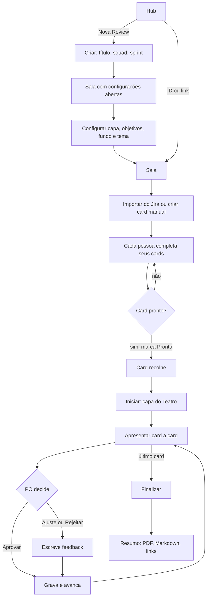
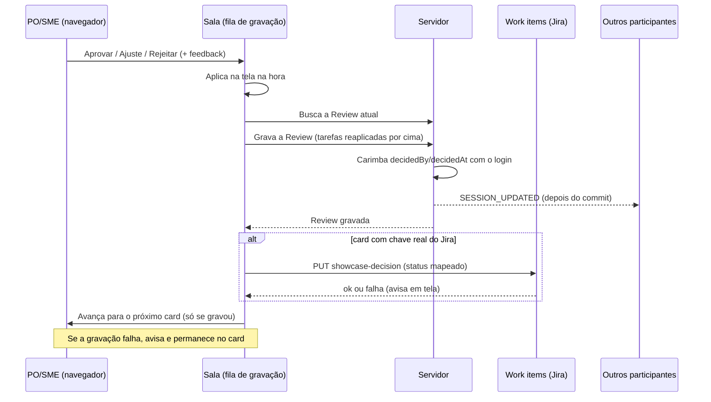

# Fluxo da Review (Sprint Review / "showcase")

Descreve o que o código faz **hoje** (frontend v4.19.0, backend com a migration V37). Onde algo é suposição, está marcado com **(suposição)**. Nada aqui foi testado ao vivo: o fluxo exige login Firebase/Google, então tudo vem de leitura de código e de testes automatizados.

## 1. Objetivo, quem usa e regra de acesso

A Review substitui os slides da cerimônia de Sprint Review. A squad importa as entregas da sprint (do Jira ou à mão), cada pessoa prepara a evidência dos seus cards, e na cerimônia o **Modo Teatro** mostra uma entrega por vez, com o PO registrando aceite, ajuste ou rejeição.

| Papel | O que faz na prática |
|---|---|
| Facilitador / AM | Cria a Review, configura capa e apresentação, importa cards, conduz o Modo Teatro e finaliza. Não é um papel gravado na Review: é quem a cria e apresenta. |
| PO e SME | Registram a decisão (aprovar, pedir ajuste, rejeitar) no Modo Teatro. O botão só fica ativo para quem tem o papel global "Product Owner", "Product Owner (PO)" ou "SME" no perfil. |
| Participantes (devs, QA) | Completam problema, solução, evidências e anexos dos próprios cards; marcam o card como "Pronta". |
| Quem só recebe o link | Entra, vê e edita como qualquer participante. Não vê o botão de decisão ativo se não tiver papel de PO/SME. |

**Regra de produto (decidida pelo usuário):** a Review pertence a uma squad, mas **quem recebe o link pode acessar**. Não há bloqueio por pertencimento à squad. Isso é intencional e não deve ser "corrigido" com um gate por squad. Exige apenas estar logado (token válido); o endereço da Review, que contém um identificador longo e aleatório, funciona como a chave de acesso.

A **listagem** do hub é a exceção: só devolve Reviews da squad à qual a pessoa pertence (ou administradores e lideranças).

## 2. Telas e entradas

- **Hub (`/showcase`)**: painel com indicadores das Reviews da squad (aceitação, prontidão), a última Review, o checklist "Review Sem Slides", botão de nova Review e o campo "Entrar com o ID ou link da sala".
- **Criar**: diálogo com título, squad/time e sprint (opcional). Ao criar, a Review nasce em `planning`, com capa e fundo padrão, e a pessoa é levada à sala com `?setup=1`, que abre as configurações sozinho.
- **Entrar por ID ou link**: aceita o ID puro (diferencia maiúsculas de minúsculas) ou o link inteiro colado; vai para `/showcase/{id}`.
- **Sala (`/showcase/{id}`)**: cabeçalho com título editável, indicadores de prontidão e horas, ações (guia, compartilhar, configurações, adicionar card, importar do Jira, retrospectiva, iniciar). Lista de cards com busca e filtros (dev, QA, tipo) e ordenação (chave, tipo, dev, QA).
- **Configurações**: abas Geral (nome, squad, período, ordem, objetivos), Cards e link (importar, criar, copiar link), Capa e Apresentação (fundo, tema claro/escuro, estilo).
- **Modo Teatro**: tela cheia com capa, depois um slide por card, barra de progresso, navegação por teclado (setas, Esc) e botões de decisão.
- **Resumo e exportação**: ao finalizar abre o resumo com PDF (um slide por card), relatório em Markdown, resumo de aprovações copiável e lista de links do Jira. Há também uma visão de impressão (`PrintSlidesView`) com os slides em formato de página.
- **Sala inexistente ou erro de carga**: tela com mensagem ("Review não encontrada" ou "Não foi possível carregar") e botão de voltar/tentar de novo.

## 3. Fluxo principal

Passo a passo:

1. **Criar a Review**: define nome, squad e sprint. O nome da squad é texto livre e é o que filtra a listagem do hub; se divergir do nome exato da squad, a Review some da lista do painel (continua acessível pelo link).
2. **Configurar a apresentação**: capa (imagem por link ou predefinida), fundo (cor, gradiente, imagem), tema (claro/escuro, estilo), objetivos da sprint e ordem dos cards. Tudo persiste na Review. Ao tentar iniciar sem objetivos, o sistema avisa uma vez e abre as configurações.
3. **Importar tarefas e criar cards**: a importação do Jira traz título, tipo, problema, solução, critérios de aceite, dev/QA, horas planejadas, versões e links. Cards já existentes (mesma chave) não são duplicados. O card manual recebe a chave `MANUAL-NNN` (próximo número livre) e pode ser "padrão" ou de "métricas" (campos e valores que geram gráfico).
4. **Checklist de prontidão**: dois níveis. No hub, o checklist "Guia" da Review mais recente (4 itens marcáveis, gravados na própria Review). Na sala, a prontidão real de cada card é calculada pelo conteúdo (problema, solução e alguma evidência, ou métricas preenchidas) e comparada com o status manual "Pronta"; divergências são sinalizadas no cabeçalho.
5. **Anexos PNG, JPEG e PDF**: em cada card (não-métrica), até 5 arquivos de 10 MB. Contam como evidência para a prontidão e aparecem no Teatro junto com os links.
6. **Links de documento técnico e TDN**: campos opcionais do card, inferidos na importação e editáveis. Aparecem como links no painel lateral do Teatro. Só `http`/`https` são aceitos; sem esquema, completa com `https://`; esquemas como `javascript:` são descartados.
7. **Apresentar**: o Teatro mostra a capa e então um card por vez, com evidência (vídeo/embed, imagem, PDF, arquivo anexado ou gráfico), problema, e detalhes recolhíveis (solução, critérios, versões, métricas). A ordem é a ordem escolhida para a lista, com **todos** os cards (os filtros pessoais da lista não afetam a apresentação nem a impressão).
8. **Feedback e decisão**: aprovar grava na hora; ajuste e rejeição abrem um quadro de feedback (o texto pode ficar vazio) antes de confirmar.
9. **Finalizar**: botão visível no último card. Se houver cards sem decisão, pede confirmação. Marca a Review como `finished` e abre o resumo.
10. **Exportar**: PDF paisagem (capa, KPIs, uma página por card, com a imagem do print ou do primeiro anexo de imagem quando carregar), Markdown (aprovados, pendências e sem decisão) e tabela de aprovações.

### Ciclo de decisão

## 4. Estados e transições

**Review (campo `status`)**: `planning` (criada) → `active` → `finished`. Na prática, o código só escreve `planning` (criação) e `finished` (botão Finalizar). **(suposição)** `active` existe no modelo mas nada no fluxo atual o define; qualquer pessoa na sala pode reabrir editando, e não há transição de volta controlada. Quem dispara `finished`: quem clica em Finalizar no Teatro.

**Card, preparação (`preparationStatus`)**: `todo` (Aguardando) → `doing` (Em Preparação) → `review` (Em Revisão) → `done` (Pronta). Qualquer pessoa altera, em qualquer direção. `done` recolhe o card (se alguém estiver digitando nele, não recolhe até sair do foco); sair de `done` reabre.

**Card, decisão (`decision`)**: `open` (Aguardando) → `approved` | `needs_adjustment` | `rejected`. Uma decisão pode ser trocada por outra (clicar em outro botão). Não existe botão para voltar a `open`. Quem dispara: PO/SME pelo Teatro (a restrição é do cliente, ver seção 6). Aprovar zera feedback; ajuste e rejeição guardam o texto.

**Tipo do card**: `story` (padrão) ou `metrics` (sem problema/solução/evidências; tem campos e valores e gráfico).

## 5. Tempo real

- **Canal**: um WebSocket por Review (`/ws/showcase/{id}`), autenticado por token na query. O servidor mantém a lista de conexões por Review.
- **Eventos do servidor**: `SESSION_UPDATED` (traz a Review inteira, enviado depois do commit de cada gravação) e `REFRESH_SESSION` (sem conteúdo; o cliente recarrega. Usado após enviar ou apagar um anexo). Mensagens do cliente para o servidor não têm função.
- **Fila de gravação no cliente**: toda alteração (campo, decisão, adicionar/remover card, configurações) é aplicada na tela imediatamente e entra numa fila. Uma gravação por vez.
- **Reaplicação sobre a versão do servidor**: a cada rodada o cliente busca a Review atual, reaplica por cima dela as alterações pendentes (em vez de enviar a cópia local, possivelmente velha) e grava. Reduz a janela de sobrescrita a poucas centenas de milissegundos. Continua sendo uma gravação da Review inteira: duas pessoas alterando o mesmo campo no mesmo instante, a última vence.
- **Eventos durante gravação**: enquanto há gravação local em andamento, mensagens do servidor são ignoradas; ao terminar, a resposta da gravação passa a ser a versão da tela. Mensagens mais antigas que a versão atual (pelo `updatedAt`) são descartadas.
- **Falha de gravação**: avisa, descarta a alteração local e recarrega o estado do servidor.
- **Reconexão**: se o socket cai, tenta de novo com espera crescente (1 s até 30 s). A cada conexão aberta e ao voltar para a aba, recarrega a Review.
- **Apresentação não é compartilhada**: o card em foco, o início do Teatro e a navegação são locais. Os outros participantes só veem as decisões e edições chegando, não "em que card estamos". O card em foco é acompanhado pelo id: se outro participante adiciona, remove ou reordena cards, o slide segue o mesmo card (ou cai para o vizinho com aviso, se ele foi removido).

## 6. Permissões

**No cliente**
- Botões Aprovar/Ajustar/Rejeitar só ativos para papel global PO, "Product Owner (PO)" ou SME (campo de papel do perfil). Os demais veem "Somente PO/SME". `session.members` não é usado para isso: a lista de integrantes existe nos dados mas não define permissão.
- Facilitação não é um papel: qualquer pessoa com o link vê e usa Configurações, Importar, Adicionar card, Iniciar e Finalizar.

**No servidor**
- Exige apenas token válido. **Não** verifica squad, criador ou papel para ler, gravar, enviar/baixar/apagar anexos nem para ouvir o WebSocket. Isso segue a regra de acesso por link (seção 1).
- **O gate PO/SME não é imposto pelo servidor.** Qualquer usuário autenticado com o link pode gravar uma decisão chamando a API diretamente.
- O que o servidor passou a impor (v4.19.0): `decidedBy`, `decidedByName`, `decidedAt` e `approvedAt` de uma decisão **nova ou trocada** vêm do login de quem gravou (o nome vem do cadastro do usuário), ignorando o que o navegador mandou; uma decisão **mantida** preserva quem decidiu e quando; voltar a `open` limpa tudo. Ou seja, não dá mais para forjar *quem* decidiu, mas continua dando para decidir sem ser PO.
- Ids de cards e integrantes enviados pelo cliente que já pertençam a outra Review são recusados (409).
- Links dos cards e da capa com esquema perigoso (`javascript:`, `data:`, `vbscript:`, `file:`, `blob:`) são descartados antes de gravar.
- Listagem do hub: exige pertencer à squad pedida (ou ser administrador/liderança), com teto de 100 itens.

## 7. Dados, arquivos e integração com work items

**Persistido, em linguagem de negócio**
- **Review**: nome, sprint, status, squad (texto), período, objetivos, ordem padrão, capa, fundo e tema da apresentação, checklist de prontidão (até 20 itens), quem criou e quando, última alteração.
- **Cards**: chave e título do Jira (ou manual), tipo, descrição, critérios de aceite, dev/QA, horas previstas e gastas, problema, solução, links de print/vídeo/doc técnico/TDN, preferência de qual evidência abre primeiro, projeto e versões (suporte, master, release, develop), métricas e gráfico, status de preparação, decisão, feedback, quem decidiu e quando, e a ordem.
- **Integrantes**: nome, papel e avatar (gravados, mas sem efeito em permissões).
- **Regravação**: a cada gravação, os cards e integrantes da Review são apagados e regravados a partir do que o cliente mandou. Um card ausente da lista enviada é removido, junto com seus anexos.

**Arquivos (anexos)**
- Guardados no disco do servidor (pasta de uploads local), com nome interno aleatório; no banco ficam nome original, tipo, tamanho, quem enviou e quando.
- Limites: PNG, JPEG ou PDF; 10 MB por arquivo; 5 por card (controlado por trava no servidor).
- Validação: o tipo é decidido pelos primeiros bytes do conteúdo, não pelo nome nem pelo tipo declarado; o nome é saneado (sem caminho, sem caracteres de controle, extensão coerente); caminho do arquivo nunca vem do usuário.
- Download: devolve o tipo detectado, com `nosniff`, política que bloqueia script e `no-cache` privado. O navegador busca o arquivo com o token e abre como `blob:`.
- Ao apagar o anexo, remove registro e arquivo (depois do commit). Ao remover o card, os anexos saem junto.

**Integração com work items/Jira (`showcaseDecision`)**
- Quando a decisão de um card muda, o cliente chama o servidor para registrar o veredito no acompanhamento da squad (work items): `approved` vira `delivered`, `rejected` vira `rejected`, `needs_adjustment` vira `carried_over`; qualquer outro valor vira `committed`. Grava status, feedback e data.
- Só é chamado para cards com chave de Jira (padrão `ABC-123`); cards `MANUAL-NNN` não vão.
- A squad usada é o nome da squad da Review, ou o prefixo da chave, ou a squad do perfil, nessa ordem.
- Exige permissão de escrita **na squad**: quem tem o link mas não é da squad (ou não tem escrita) recebe 403. A falha agora é mostrada ("Decisão salva na Review, mas não chegou ao acompanhamento da squad"); a decisão da Review permanece gravada. Antes o erro era silencioso.
- O servidor valida o status (aceita só os quatro acima) e, se o item não existir ainda, cria o registro.

## 8. Pontos frágeis e erros de fluxo conhecidos

Ainda **não corrigidos**:
- **N+1 do hub**: a listagem monta cada Review com todos os cards, métricas e anexos (várias consultas por Review e por card) só para exibir contadores. Teto de 100 e índice por squad aliviam, mas falta uma consulta agregada.
- **Arquivos órfãos**: não existe exclusão de Review; se uma for removida direto no banco, os arquivos ficam no disco. Um envio concorrente com a remoção do card também pode deixar arquivo sem card.
- **Sem PATCH por card**: toda gravação é da Review inteira (agora reaplicada sobre a versão atual). Duas pessoas no mesmo campo ao mesmo tempo ainda se sobrescrevem; saves de pessoas diferentes simultâneos são serializados no servidor.
- **Token do WebSocket na query**: o JWT aparece na URL e pode ir parar em log do proxy.
- **Fallback fixo `'DDWMISSI'`**: ao criar uma Review sem squad resolvida, o hub cai nessa squad fixa. É decisão de produto pendente.
- **PO/SME só no cliente** (seção 6) e **sem gate por squad** (decisão de produto, seção 1).
- **`active` sem uso** e sem como reabrir uma Review finalizada de forma explícita **(suposição, vale confirmar com o produto)**.
- **Squad como texto livre**: renomear a squad nas configurações pode tirar a Review da listagem do hub.
- **Apresentação não compartilhada**: cada pessoa navega sozinha; não há "seguir o apresentador".
- Imagens por link de hosts que exigem login (ex.: anexos do Jira) dependem da configuração do Jira do apresentador; outros hosts podem bloquear embed.

**Não testado ao vivo:** nenhuma das correções recentes (fila de gravação, reconexão, Teatro, hub, exportações) foi exercitada num navegador com login real, nem o salvamento concorrente de dois usuários. Estão cobertos por testes unitários (utilitários de link, serviço de gravação, anexos, work items) e checagem de tipos.

## 9. Onde olhar no código

Frontend (`agile-space-frontend/src`):
- `app/showcase/page.tsx`: hub e criação. `app/showcase/[id]/page.tsx`: sala (fila de gravação, WebSocket, filtros, decisão, finalizar). `app/showcase/api.ts`: chamadas HTTP e URL do WebSocket. `app/work-items-api.ts`: veredito para work items.
- `components/showcase/TeatroMode.tsx`, `TeatroHeader.tsx`, `ShowcaseCover.tsx`, `TaskFileEvidence.tsx`: apresentação. `TaskCard*.tsx`, `ControlledFields.tsx`, `MetricsEditor.tsx`, `TaskCardAttachments.tsx`: edição dos cards.
- `SessionSettingsDialog.tsx`, `ShowcaseDashboard.tsx`, `ShowcaseRoomHeader*.tsx`, `ShowcaseTour.tsx`: configuração, hub e guia.
- `SummaryDialog.tsx`, `PrintSlidesView.tsx`: exportação. `utils.ts` (links, embeds, prontidão, ordem), `types.ts` (modelos e constantes), `__tests__/`.
- `app/manual/content/ShowcaseTopic.tsx`: manual do usuário.

Backend (`agile-space-backend/src/main`):
- `controller/ShowcaseSessionController`, `ShowcaseFileController`: entradas HTTP. `service/ShowcaseSessionService` (gravação, autoria da decisão, ids), `ShowcaseTaskFileService` (anexos), `UrlSafety` (links), `WorkItemService` (veredito).
- `domain/Showcase*`, `repository/Showcase*`: modelo. `websocket/ShowcaseWebSocketHandler`, `config/WebSocketConfig`: tempo real. `storage/LocalFileStorage`: arquivos em disco.
- `resources/db/migration/V20` e `V31` a `V34`, `V37`: estrutura de dados da Review.
