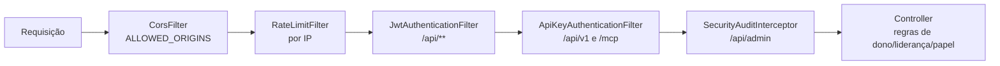

# Segurança transversal

Estado do `develop` em 2026-10-09. Esta é a visão de ponta a ponta de **quem pode chamar o quê**. Detalhes por módulo estão nos outros documentos.

## Modelo de autorização

Não há Spring Security: a barreira é uma cadeia de filtros do servlet (ordem da menor para a maior prioridade numérica):

Camadas, da mais grossa à mais fina:

1. **Sessão (JWT):** `/api/**` exige `Authorization: Bearer` válido, exceto as rotas públicas da tabela abaixo.
2. **Papel de sistema:** `/api/admin/**` exige `ADMIN` (papel relido do banco a cada 30 s, ver `autenticacao-e-sessao.md`).
3. **Regra do recurso (no controller/serviço):** dono do recurso, facilitador, liderança da squad, membro da squad, participante da sala. É aqui que vive a maior parte da segurança de cada módulo.
4. **Chave de API:** `/api/v1/**` e `/mcp/**` não usam JWT; usam `X-Api-Key` com escopos (ver `chaves-de-api-e-mcp.md`).

Papéis (ver também `onboarding-e-papeis.md`):

| Camada | Valores | Para que serve |
|---|---|---|
| `User.role` | `ADMIN`, `LEAD`, `MEMBER` | Autorização do sistema: `/api/admin/**` (ADMIN), convites e chaves de API amplas (ADMIN/LEAD) |
| `User.jobTitle` | texto, só admin grava | Reconhece liderança de squad em algumas telas |
| Roster da equipe | linhas por projeto, com `isLeadership` | Quem cadastra equipes, convida, vê a tribo |

Regras que valem para o sistema todo: **ninguém ganha papel por criar algo**; `role`/`jobTitle`/`active` só o admin muda; o id do Jira só é gravado por pessoa comum se não for de outra pessoa do roster.

## Rotas públicas (sem login)

Tudo o que está fora desta tabela e começa com `/api/` exige JWT. O prefixo só vale como **segmento inteiro**.

| Rota | Método | Por que é pública | Risco / observação |
|---|---|---|---|
| `/api/auth/login` | POST | Entrar | Limite de 10/min por IP **só** em `login`, `register` e `forgot-password` (faixa apertada); mesma resposta para e-mail inexistente e senha errada. `/api/auth/me` e `/api/auth/switch-project` ficam na faixa geral (300/min por IP): antes, poucas navegações seguidas, ou um escritório inteiro atrás do mesmo IP, recebiam 429 e eram mandadas ao login (achado no teste ao vivo de 2026-10-09) |
| `/api/auth/register` | POST | Cadastro | Restrito ao domínio corporativo; **sem verificação de e-mail** (risco alto aceito, ver abaixo). Pode ser fechado com `APP_REGISTRATION_ENABLED=false` |
| `/api/auth/forgot-password` | POST | Pedir reset sem estar logado | Resposta sempre genérica; 1 pedido pendente por e-mail |
| `/api/public/system-config` | GET | Marca/cor/logo/manutenção antes do login | Lê só 5 chaves fixas (`companyName`, `primaryColor`, `logoUrl`, `allowAnonymous`, `maintenanceMode`) |
| `/api/public/announcements` | GET | Aviso global antes do login | Qualquer pessoa na internet lê os anúncios; **não colocar dado interno em anúncio** |
| `/api/public/prompt-hub/**` | GET | Itens **públicos** da Biblioteca de IA (regra de produto) | Outra frente; não alterado aqui |
| `/api/changelog`, `/latest`, `/{id}` | GET | Changelog público por design | Só versões publicadas; rascunho por id = 404 |
| `/api/jolt/transform`, `/api/jolt/engine-info` | POST/GET | Executar transformação JOLT no motor Java sem login | Consome CPU com entrada arbitrária; limite de tamanho tratado por outra frente (`JoltRequestSizeFilter`); só o limite de taxa geral de IP protege o resto |
| `/api/v1/**` | todos | API para máquinas | **Não é pública**: exige `X-Api-Key` válida e escopo |

Fora de `/api/`:

| Rota | Autenticação | Observação |
|---|---|---|
| `/mcp/sse`, `/mcp/message` | `X-Api-Key` | Servidor MCP; sem limite de taxa; **não roteado pelo Caddy atual** (ver `chaves-de-api-e-mcp.md`) |
| `/ws/retro/*`, `/ws/poker/*`, `/ws/health-check/*`, `/ws/brainstorming/*`, `/ws/showcase/*` | JWT em `?token=` no handshake | A Retro ainda confere acesso ao quadro; os demais conferem só o token e fazem a regra da sala dentro do handler |
| `/actuator/health` | nenhuma | Só `health`, sem detalhes |
| `/v3/api-docs`, `/swagger-ui.html` | nenhuma | **Desligados em produção** (`springdoc ... enabled: false` no perfil `prod`); abertos em desenvolvimento |
| Frontend (Next) | `AuthGuard` no cliente | Só `/login` e `/changelog` (rota aberta) dispensam login; as páginas em si não têm segredo, os dados vêm da API autenticada |

Fora da cadeia de filtros de propósito: pré-voo `OPTIONS` (liberado pelo `CorsFilter`).

## CORS

- `WebCorsConfig` aplica **somente** as origens de `ALLOWED_ORIGINS` (produção: obrigatória, sem padrão; desenvolvimento: `http://localhost:9002`), com `allowCredentials=true`. O `WebSocketConfig` usa a mesma lista.
- Os `@CrossOrigin(originPatterns = "*", allowCredentials = "true")` que existiam nos controllers **não valem** na prática: o `CorsFilter` roda antes (`HIGHEST_PRECEDENCE`) e responde 403 a qualquer origem fora da lista antes de o controller ser consultado. Eram código morto e enganoso; foram removidos dos controllers desta frente (restam em controllers de outras frentes, sem efeito).
- Risco real do `"*"` + credenciais seria um site qualquer ler a API com o login da vítima. Como a sessão é um **cabeçalho `Authorization`** (não cookie), um site de terceiros nem consegue anexar a credencial; portanto o risco real hoje é baixo mesmo se o filtro falhasse.

## CSRF

Não se aplica: autenticação por cabeçalho `Authorization` em `localStorage`, sem cookie de sessão; o navegador não anexa essa credencial sozinho em requisições de outro site.

## Limite de taxa

`RateLimitFilter`, em memória, por IP: 10 requisições/min em `/api/auth/**` e 300/min no restante de `/api/**`. Limites: usa o primeiro IP de `X-Forwarded-For`, que o Caddy define; com a porta 8002 exposta (`PUBLISH_ADDR=0.0.0.0`) um cliente poderia forjar o cabeçalho e fugir do limite (o padrão do compose é loopback). Os baldes nunca são removidos do mapa. Sem limite em `/mcp` e `/ws`.

## Segredos e criptografia

| Segredo | Variável | Proteção |
|---|---|---|
| Assinatura do JWT | `APP_JWT_SECRET` | Mínimo 32 bytes; em produção o boot **falha** se faltar ou for um valor de dev conhecido (`ProductionSecretsValidator`) |
| Criptografia de tokens pessoais (Jira, TDN, IA) | `APP_ENCRYPTION_SECRET` | AES-256-GCM (IV aleatório de 12 bytes); chave = SHA-256 do segredo; boot de produção falha se faltar |
| Chave admin da listagem de usuários | `APP_ADMIN_KEY` | Opcional; vazia desliga; só vale **junto com** login; comparação em tempo constante |
| Domínio permitido no cadastro | `ALLOWED_EMAIL_DOMAIN` | Produção: obrigatório e não vazio |

Cuidados:

- **Trocar `APP_ENCRYPTION_SECRET` quebra os tokens já gravados**: a descriptografia falha em silêncio e devolve o texto cifrado como se fosse o token (compatível com dados antigos em texto puro). Não existe rotação; trocar exige regravar os tokens. Mesmo cuidado com `APP_JWT_SECRET` (derruba todas as sessões, o que é aceitável e até desejável em incidente).
- Chaves de API: só o SHA-256 no banco. Senhas: PBKDF2-HMAC-SHA256, 310 000 iterações, sal por senha.
- Nenhum segredo real foi lido, impresso ou alterado nesta auditoria.

## Auditoria

`SecurityAuditInterceptor` grava todo acesso a `/api/admin/**` (método, rota, e-mail do token, IP). Convites, reset de senha e mudanças de papel passam por `audit_logs` (mudança de papel: ver pontos frágeis). Logs da aplicação não imprimem tokens; o token do WebSocket só aparece na URL de handshake.

## Riscos aceitos (e por quê)

| # | Risco | Gravidade | Por que não foi mudado |
|---|---|---|---|
| 1 | Cadastro sem verificação de e-mail permite assumir um e-mail corporativo ainda sem senha (e as equipes/cargos ligados a ele) | **Alta** | Exige SSO ou serviço de e-mail; fechar cadastro muda o comportamento de quem usa. Mitigação opt-in entregue (`APP_REGISTRATION_ENABLED`) |
| 2 | Token de 24 h sem revogação individual (mitigado por desativar a conta: 30 s) | Média | Refresh/lista de revogação é projeto à parte |
| 3 | Token e dados de sessão em `localStorage` | Média | Padrão atual do app; troca para cookie httpOnly muda toda a autenticação |
| 4 | Token do WebSocket na URL | Baixa | Navegador não envia cabeçalho no handshake; alternativa é ticket de curta duração (mudança de contrato com o frontend) |
| 5 | Chaves de API sem expiração, papel congelado, chaves legadas com acesso total | Média | Revogar/recriar quebra integrações em uso; decisão do usuário |
| 6 | `/api/jolt/**` público | Baixa | Funcionalidade pública pedida; protegido por limite de taxa e (outra frente) tamanho |
| 7 | Admin lê tokens de Jira/TDN de qualquer pessoa | Média | O frontend depende da leitura pelo dono; mascarar para o admin exige separar os endpoints |
| 8 | Limite de taxa em memória, por IP, forjável se a porta do backend for exposta | Baixa | Instância única atrás do Caddy |
| 9 | Sem política de senha além de 8 a 128 caracteres; senha temporária sem troca obrigatória | Baixa | Decisão de produto |

## Pontos frágeis e erros de fluxo conhecidos

**Corrigido nesta rodada** (commits `fix(acesso)`, `fix(chaves-api)`, `fix(sessão)`):

- **Crítico:** escalada via id do Jira editável no próprio perfil e no cadastro (herdava equipes e liderança de outra pessoa).
- **Alto:** feedback legível/alterável/apagável por qualquer login; chamado de suporte tomado por id do cliente; feedback sobrescrito por id do cliente.
- **Médio:** papel e conta ativa congelados no token por 24 h; token sem `exp`; prefixos públicos por `startsWith`; caminhos com `/..`; aceite de convite sem trava; chave de API de conta inativa; enumeração por tempo/estado no login; autor forjável na auditoria manual; senha temporária visível para sempre; vínculos de squad lidos por qualquer login; rascunho de changelog público.
- **Baixo:** `@CrossOrigin` morto, comparação da chave admin em tempo não constante, nomes/tamanhos sem validação (500 no banco).

**Não corrigido (ver tabela de riscos):** itens 1 a 9 acima, mais:

1. **Casamento por nome em `SquadAccessService`** (o nome da conta, editável, dá acesso à squad cujo membro tem o mesmo nome de exibição) — frente de squad.
2. **WebSocket só confere o token na abertura**, não a conta ativa nem a expiração durante a conexão.
3. **Handlers de WebSocket de Poker, Health Check, Brainstorming e Showcase** autenticam o token mas a autorização por sala é interna a cada handler; a Retro tem interceptor de acesso ao quadro. Auditados por outras frentes.
4. **`X-Forwarded-For`** é confiado sem lista de proxies (ver limite de taxa).
5. **Sem teste automatizado de integração** da cadeia de filtros com o Tomcat real: os testes montam o filtro direto (`MockHttpServletRequest`). A observação sobre o caminho cru vs. normalizado foi confirmada com um Tomcat embutido de teste (fora do repositório).

**Sem teste ao vivo:** nenhuma das correções foi exercitada num ambiente com banco e navegador; a verificação foi por testes unitários e leitura de código. As consultas novas (leitura de convite com `PESSIMISTIC_WRITE`) só são validadas pelo Hibernate na primeira subida real.

## Onde olhar no código

- `security/` (todo o pacote): `JwtAuthenticationFilter`, `UserSessionGuard`, `JwtTokenUtil`, `JwtHandshakeInterceptor`, `RateLimitFilter`, `ApiKey*`, `JiraAccountIdGuard`, `EncryptionUtil`, `CryptoConverter`, `PasswordUtil`.
- `config/`: `WebCorsConfig`, `WebSocketConfig`, `ProductionSecretsValidator`, `SecurityAuditInterceptor`.
- `application.yml` e `application-prod.yml` (segredos, CORS, springdoc), `Caddyfile` e `docker-compose.yml` (proxy, portas).
- Testes: `JwtAuthenticationFilterSessionTest`, `JwtAuthenticationFilterPublicPathTest`, `RateLimitFilterTest`, `AccessControlsHardeningTest`, `AccessHardeningTest`.
