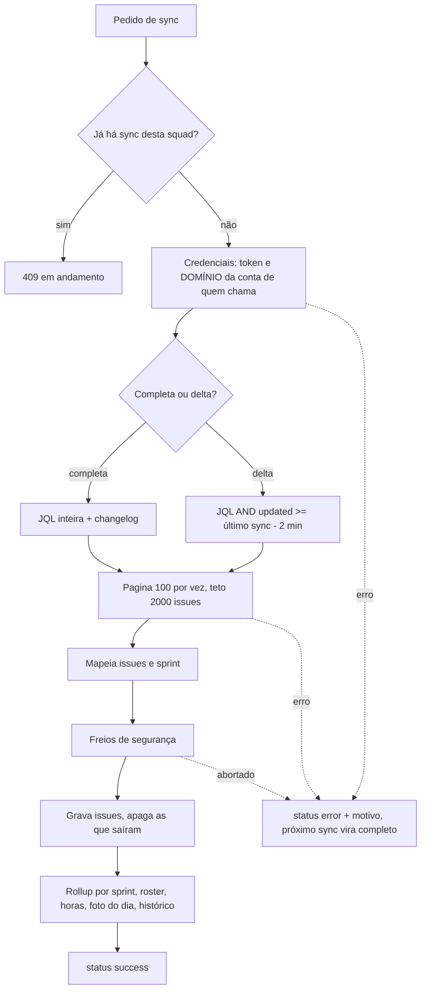

# Sincronização do Jira da squad

Estado do `develop` em 2026-10-09. Sem teste ao vivo (nem contra o Jira real): validado por testes unitários com respostas simuladas.

## Objetivo e quem usa

Trazer a sprint da squad do Jira para o banco (issues, rollup, histórico, roster, horas) para que telas e painéis leiam do servidor sem chamar o Jira. Qualquer membro dispara; um agendador opcional faz o mesmo sem ninguém clicar.

## Entradas

- Botão **Sincronizar** (hub, roster, painel; o painel dispara sozinho uma vez por visita enquanto a squad não tem dado, sempre como sincronização completa).
- `POST /api/squads/{id}/sync[?forceFull=true]`, `POST …/force-resync-sprint?sprintId=` (reescreve só uma sprint, útil para worklog lançado depois do fechamento).
- Agendador `SquadSyncScheduler` (**desligado por padrão**, `app.squad.scheduled-sync.enabled`): para squads com `syncOwnerUserId`, a cada 15 min vê quais estão vencidas (intervalo padrão 6 h) e sincroniza com o token do dono.

## Fluxo

1. **Completa** quando: forçada, sem campo da sprint, nunca sincronizou, sem sprint ativa, última completa há mais de 6 h (`reconcileIntervalHours`), último status `error`, ranking recém-ligado, ou a sprint ativa mudou. Só ela pede changelog e apaga issues que saíram da sprint.
2. **Delta** pega o que mudou e **junta** ao que já existe.
3. **Credenciais:** o token vai **somente para o domínio salvo na conta** de quem sincroniza. O domínio da squad só vale se a conta não tem um. (Antes, quem editava a squad podia apontar o domínio para outro servidor e receber o token dos colegas.)
4. **Sprint:** lida do campo configurado (ou descoberto pelo nome/tipo `gh-sprint`). Vence a `ACTIVE`; senão a última da lista. Sprint **sem datas** (ex.: futura) não é reconhecida e a issue cai em `UNMAPPED`; sem nenhuma sprint, `active_sprint_id = UNMAPPED` e o rollup mostra a sprint real mais frequente (`withSnapshotFallback`). Filho sem sprint herda a do pai.
5. **Freios:** sync completa com 0 issues quando havia issues, ou que apagaria mais de 90 % (com mais de 5), é abortada com 409 e nada é apagado.
6. **Fuso:** hoje, dias vencidos, horário comercial do cycle time e a data da JQL do delta usam `America/Sao_Paulo` (o servidor roda em UTC; antes o delta pedia datas 3 h adiante e podia perder mudanças recentes).

## Rollup e métricas (`squad_metrics_rollup`, um por sprint)

Contagens (total, concluídas pela categoria do Jira, em andamento, bugs, parados > 3 dias, atrasados, a vencer em 3 dias), somas de estimado/restante/registrado em segundos, dias úteis da sprint, e `extraMetrics`: por tipo e por status; datas da sprint; taxa de escape de bugs; **só na sync completa**: cycle time por status (horas produtivas × horas/dia de `SquadCapacityService`), scope churn (planejadas, adicionadas, carry-over, removidas) e estimativa ajustada. **O delta preserva estes três do último completo** (antes os sobrescrevia com valores parciais). `workdaysRemaining` nunca é gravado; o front calcula pelas datas.

Horas por pessoa (`squad_member_metrics`) e cache de worklog só com **ranking ligado** (opt-in): soma o worklog **inteiro** das issues da sprint (não só a janela), ÷ (horas/dia do roster × dias úteis). Foto diária guarda os acumulados da sprint; "o do dia" é a diferença entre dias.

## Estados e transições

`lastSyncStatus`: `success` | `error` (com `lastSyncError`). Sync em andamento é guarda **em memória** (uma instância do backend). O agendador, depois de uma falha, só tenta a mesma squad de novo após 1 h.

## Permissões

Disparar: membro da squad (ou nova squad, primeiro uso). Configurar a JQL/domínio/dono do sync agendado: só liderança; ninguém põe outra pessoa como dono. `sprintId` do ressincronismo só aceita letras, números, `_` e `-` (entra na JQL). Ler: membro.

## Dados persistidos

Squad (estado do sync, sprint ativa, histórico), issues, rollup, horas por pessoa, foto do dia, cache de worklog, roster semeado por responsável (pulando quem a liderança removeu à mão: tabela de exclusões, V46; a mesma checagem vale na importação de quadro, na reimportação Profields e no join). Migrations: V13–V17 e V26–V29 (modelo), **V45** (índices), **V46** (exclusões do roster).

## Pontos frágeis e erros conhecidos

- **Corrigidos:** token enviado ao domínio da squad; delta apagando churn/cycle time; falha de sync invisível (nunca gravava `error`); retentativa a cada tick; data da JQL e "hoje" em UTC; `sprintId` concatenado na JQL.
- **Não corrigido:** teto de 2000 issues (sync "truncada" só vira aviso em `lastSyncError`); paginação por `startAt` da API de busca antiga do Jira (suposição: instância Server/Data Center); sprint futura sem datas vai para `UNMAPPED`; roster não remove quem saiu; guarda em memória não protege com mais de uma instância; horas por pessoa ignoram a janela da sprint; delta não vê issue removida da sprint até a completa; `ensureSquadConfig` troca `MISSI` por `DDWMISSI` fixo; `sync` chama o Jira para cada sprint do mapa (uma chamada por sprint).
- **Decisões do usuário:** ligar o agendador em produção; se o domínio por squad deve existir (hoje só vale quando a conta não tem domínio).

## Onde olhar no código

`SquadSyncService`, `SquadSyncScheduler`, `SquadSyncGuard`, `SquadCapacityService`, `SquadService` (gravações em lote com id protegido), `SquadController` (`/sync`), `JiraService` (chamadas HTTP e lista de domínios permitidos).
