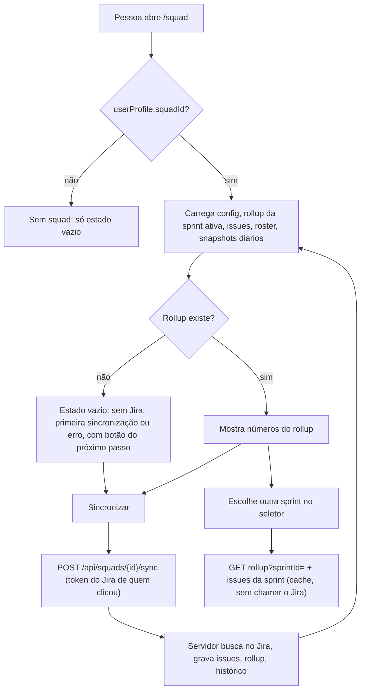

# Squad Hub: roster, capacidade, quadro e métricas

Descreve o que o código faz **hoje** (develop, 2026-10-09). Suposições estão marcadas. Nada abaixo foi testado ao vivo (login Google/Firebase): a validação foi por leitura de código e testes unitários.

## Objetivo e quem usa

`/squad` é o hub da squad: mostra a sprint sincronizada do Jira (visão geral, quadro, cronograma, métricas) e é onde a liderança cuida das pessoas do time e da capacidade.

- **Qualquer membro da squad:** lê visão geral, quadro, cronograma, métricas da sprint, roster (nome, papel, horas/dia), próprio painel; conecta o próprio token do Jira; dispara "Sincronizar"; faz "Sou eu" na própria linha do roster; salva cerimônias, unidade de estimativa e nº do quadro.
- **Liderança da squad** (Agile Master, People Lead, Tech Lead, PO, Tribe Lead/Agile Coach da tribo, admin): além disso configura a squad (projeto, JQL, domínio, capacidade padrão, ranking, fases), edita roster/capacidade, importa/exporta planilha, convida por link e vê horas por pessoa.
- **Squad é a chave do projeto** (ex.: `DDWMISSI`). `MISSI` e `DDWMISSI` são tratados como a mesma squad (alias fixo no código).

## Telas e entradas

| Tela | Caminho | O que é |
|---|---|---|
| Hub | `/squad` | Abas: Visão geral, Quadro, Cronograma, Métricas (Sprint atual / Desempenho do time), Meu painel |
| Configurar | botão no hub | Domínio e token do Jira (pessoais); projeto, capacidade, JQL, nº do quadro, campo da sprint (só liderança) |
| Fases | botão no hub (só liderança) | Mapeia tipo de issue em fase do cronograma (cor/ordem) |
| Pessoas do time | `/squad/roster` | Roster, horas/dia, papel/capacidade por sprint, planilha CSV, convite por link, cadastro manual |
| Painéis por papel | `/squad/dashboards/*` | Ver `dashboards-por-papel.md` |
| Seletor de sprint | topo do hub | Mostra uma sprint do histórico (somente leitura); "Sincronizar" fica desligado fora da sprint atual |

## Fluxo principal

1. O hub usa `userProfile.squadId`. Troca de squad zera o estado anterior; respostas atrasadas de outra squad são descartadas.
2. **Visão geral:** progresso de tempo (a partir das datas reais da sprint) × trabalho concluído, atrasados e parados, atalhos das cerimônias, próximas cerimônias.
3. **Métricas > Sprint atual:** KPIs do rollup (concluído, horas, bugs, parados), quadro por status, produtividade diária (horas e concluídos **do dia**, diferença entre snapshots), roster.
4. **Métricas > Desempenho do time:** horas registradas × capacidade da **sprint** (horas/dia do time × dias úteis da sprint), concluídos, estimado/restante, dias úteis com 4 h+ registradas (últimos 15), composição do escopo por tipo, carga por pessoa (**só liderança**) e histórico de retrospectivas.
5. **Quadro:** o quadro Scrum do Jira (RapidBoard) é buscado **direto no Jira** pelo navegador via proxy do backend, com o token pessoal. Filtros rápidos, raias e limites de WIP editados na tela ficam no `localStorage` do navegador (por squad), não no servidor.
6. **Cronograma:** linha do tempo estilo Jira Plans montada das issues sincronizadas (datas reais ou inferidas de prazo/criação; `datesAreInferred`), com fases do passo "Fases".

## Estados (tela vazia que diz o próximo passo)

`SquadDataState`: sem Jira conectado → conectar; conectado e nunca sincronizado → sincronizar; última sincronização falhou (`lastSyncStatus = error`, com o motivo gravado pelo servidor) → tentar de novo; sprint sem issues; quadro não encontrado. Sem rollup, as telas mostram "—" ou "sem dados desta squad ainda", nunca 0% inventado.

## Roster e capacidade

Há **dois modelos de capacidade** que ainda não conversam:

| Modelo | Onde | Usado em |
|---|---|---|
| Horas/dia da pessoa (`SquadMember.capacityHoursPerDay`, sugerida pelo sistema × "hora real" do gestor, observação, origem: sistema / manual / planilha) | `/squad/roster` tabela | Capacidade das métricas por pessoa (× dias úteis da sprint), painel People Lead, Desempenho |
| Papel DEV/QA + dias de codificação/teste + dias de regressivo + horas produtivas, por sprint com **herança** (sprint atual → anterior → padrão global → 8 h) | `/squad/roster` linha expandida | Só o cycle time por status (horas produtivas) |

- Padrão de horas/dia da squad: **6 h** (servidor semeia o roster com 6 h; a tela agora usa o mesmo padrão). Regra de cálculo: padrão fixo, média de worklog por JQL (**ainda sem cálculo no servidor**, só é salva) ou fator de foco.
- O sync semeia o roster com quem aparece como responsável de issue (nome do Jira, horas padrão). Pessoa removida do Jira **não** sai do roster.
- Planilha CSV: exporta/importa (aceita aspas e vírgula decimal). Valor de horas ilegível mantém o que a pessoa já tem. Importar cria/atualiza linhas, nunca troca o vínculo de conta.
- "Sou eu" (`claim`): liga a conta de quem chama a uma linha **livre**; linha de outra conta dá 409.
- Convite por link (`/invite/<token>`): ver `convites.md`.

## Permissões: servidor x cliente

Regra do servidor (`SquadAccessService`): **ler** = membro real da squad (vínculo na conta, papel no cadastro do projeto, roster ou liderança transversal **da própria tribo**), ADMIN ou LEAD. **Gerenciar** = ADMIN/LEAD, ou membro da squad com cargo de liderança / papel de liderança no cadastro do projeto. Squad **sem nenhuma liderança cadastrada** mantém a regra antiga (qualquer membro gerencia) para não travar a configuração.

| Ação | Servidor |
|---|---|
| Ler squad, rollup, issues, roster, snapshots diários | Membro |
| Sincronizar / ressincronizar sprint | Membro (usa o token do Jira de **quem chama**) |
| "Sou eu" | Membro, só a própria conta, linha livre |
| Salvar cerimônias, unidade de estimativa, nº do quadro | Membro (`meetLink` da cerimônia só http/https, senão 400; o Painel também só renderiza http/https) |
| Configuração do Jira (projeto, JQL, domínio, campo da sprint), capacidade padrão, ranking, fases, dono do sync agendado | Liderança |
| Horas/dia, observação e papel/capacidade por pessoa, roster em lote (planilha) | Liderança |
| **Adicionar, remover e mudar o papel de pessoas do time** (`/api/squads/{id}/team/...`) | Agile Master, Scrum Master ou People Lead **da própria squad**, ou admin. Agile Master/Scrum Master/People Lead só o admin atribui. Quem tem esses papéis só é alterado/removido pelo admin (ou por ele mesmo). Nunca remove nem rebaixa a única liderança (admin pode). Papéis válidos: Developer, QA, Designer, UX, SME, Stakeholder, Product Owner, Tech Lead (Tribe Lead/Agile Coach só vêm do Jira). Cada ação grava auditoria |
| Horas por pessoa (`member-metrics`) e cache de worklog | Liderança |
| Gravar rollup, issues, snapshots diretamente | Liderança (o sync grava por dentro do servidor) |
| Lista de squads, "squads de uma pessoa" (`by-user` e `/api/users/{uid}/squads`) | Só squads legíveis; vínculos só do próprio identificador (admin vê qualquer) |
| Painéis JQL no servidor (`/panels`) | Membro cria; só o dono edita/apaga |

O cliente (`SQUAD_ADMIN_ROLES`, `SQUAD_PEOPLE_ADMIN_ROLES`, `SQUAD_LEADERSHIP_VIEW_ROLES`, papel do perfil) só decide o que mostrar: botões Fases/Pessoas, seção de configuração, lista por pessoa. O servidor recusa mesmo se a tela mostrar. Ninguém indica **outra pessoa** como dono do sync agendado (token do Jira de terceiros).

Primeiro uso em ambiente limpo: usuário sem squad que escreve numa squad **que ainda não existe** é vinculado a ela. Antes, qualquer usuário sem squad se vinculava a qualquer squad existente.

## Pessoas do time (adicionar, remover, mudar o papel)

Na tela `/squad/roster`, os botões "Adicionar Integrante", a lixeira e o seletor de cargo aparecem só para quem o servidor diz que gerencia (`GET …/team/can-manage`); o servidor valida de novo em cada ação.

- **Adicionar:** digitar o e-mail procura contas existentes (3+ letras); escolher uma já entra com acesso (a conta é vinculada à linha). Sem conta, é pré-cadastro por nome (e e-mail opcional) e vale quando a pessoa entrar com esse e-mail. Cria a linha do roster **e** o papel no cadastro do projeto (é o que dá ou não liderança). Pessoa já no time dá 409.
- **Mudar o papel:** atualiza roster e cadastro do projeto juntos; liderança acompanha o papel (PO e Tech Lead são liderança; Developer/QA/Designer/UX/SME/Stakeholder não). O papel não muda mais pelo salvar genérico da linha.
- **Remover (exclusão):** apaga a linha e o papel no projeto, solta a conta da squad (`squadId`/projeto padrão) **sem apagar a conta** e grava uma *exclusão* (`squad_member_exclusions`, V46). O sync do Jira, a importação de quadro (`JiraAdminService`), a reimportação Profields e o "entrar na equipe" por conta própria não recolocam quem tem exclusão (a pessoa removida vê a mensagem para pedir ao AM/PL); adicionar de novo limpa a exclusão.
- Nunca mexe em `User.role` (autorização global).

## Dados persistidos (negócio)

Pessoas removidas à mão (exclusões do sync), auditoria das ações do time; squad (nome, projeto Jira, JQL, domínio, campo da sprint, nº do quadro, sprint ativa, histórico de sprints, estado da última sincronização e motivo do erro, capacidade padrão, ranking ligado/desligado, fases, modo e lista de cerimônias, unidade de estimativa, dono do sync agendado); rollup por sprint; foto das issues; roster; horas por pessoa (só com ranking ligado); foto diária; cache de worklog por autor; papel/capacidade por pessoa e sprint; painéis JQL. Índices de consulta: V45.

## Pontos frágeis e erros de fluxo conhecidos

Corrigidos em 2026-10-09 (para contexto): escrita aberta a qualquer membro; auto-vínculo em squad alheia; liderança transversal alcançando todas as tribos; id de linha de outra squad sobrescrevendo dado alheio; sprint escolhida mostrando o rollup da ativa; "faltam 0 dias úteis"; donut de "onde o tempo foi gasto" com minutos inventados; horas "por dia" que eram acumuladas; capacidade da sprint comparada com a semana; nome da squad trocado pela chave em gravação parcial; datas `YYYY-MM-DD` mostrando o dia anterior; consulta JQL custom com 0 resultados exibindo issues não relacionadas.

**Não corrigido (e por quê):**

- **Casamento por nome dá acesso à squad.** `SquadAccessService` aceita nome de exibição igual ao de uma linha do roster. Homônimo ganha leitura. Remover trava quem ainda depende disso; **decisão do usuário** (ideal: só "Sou eu"/convite).
- **Painéis JQL custom ficam só no navegador.** A opção "Toda a Squad" não compartilha nada, embora o backend (`/panels`) e `useSquadPanelsStore` existam sem uso. A tela agora avisa; ligar ao servidor é feature nova (opt-in).
- **Dois modelos de capacidade** (horas/dia × papel/dias/horas produtivas) sem integração; horas registradas somam o worklog inteiro da issue, não só a janela da sprint.
- **Issue em sprint futura sem datas cai em `UNMAPPED`**; só o sync completo (a cada ~6 h) apaga issues que saíram da sprint.
- **Roster não remove sozinho** quem saiu do Jira (a liderança remove à mão e todo caminho automático respeita: sync, importação de quadro, reimportação Profields e entrar por conta própria; adicionar de novo à mão, por convite ou por planilha limpa a exclusão); "Hora real" volta para 1 quando o campo é apagado; `sprintHours` do roster assume 10 dias úteis.
- **Quadro Scrum usa `localStorage`** para filtros/raias/WIP (não compartilhado entre pessoas).
- **Duas instâncias do hook de dados** na mesma página (painel + seção de JQL) duplicam as requisições.
- **Pessoa vê "o próprio painel" por nome/ID:** quem tem nome diferente do Jira não vê tarefas; a tela avisa para conferir o nome.
- **Não testado ao vivo.** Nenhuma correção foi exercitada com login real; V45 só cria índices (idempotente).

## Onde olhar no código

- Frontend: `src/app/squad/page.tsx`, `src/app/squad/roster/page.tsx`, `src/app/squad/api.ts`, `src/store/useSquadStore.ts`, `src/components/squad/*` (Overview, PerformanceView, ScrumBoard, PlansTimeline, DataState), `src/lib/squad-metrics.ts`.
- Backend: `SquadController`, `SquadService`, `SquadAccessService`, `SquadCapacityService`, `SquadLeadership`, entidades `Squad*`, migration V45.
