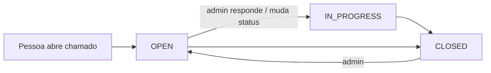

# Suporte, feedback e changelog

Estado do `develop` em 2026-10-09.

## Objetivo e quem usa

- **Suporte (chamados):** qualquer pessoa logada abre um chamado e acompanha as respostas do admin. O **admin** tria (lista todos, responde, muda status, apaga).
- **Feedback (NPS e sugestões):** qualquer pessoa logada envia nota/sugestão por ferramenta (widget flutuante). Só o **admin** lê, tria e apaga.
- **Changelog:** a lista pública de versões. Admin publica/edita; a página `/changelog` mescla o que o backend publicou com o arquivo `versions.json` gerado a cada entrega.

## Telas

| Tela | Caminho | Quem |
|---|---|---|
| Central de suporte | `/support` | Logado: abrir e acompanhar os próprios chamados |
| Triagem de chamados | painel admin (`components/admin/AdminComponents.tsx`) | Admin |
| Widget de feedback | botão flutuante nas telas (`FeedbackWidget`) | Logado |
| Feedbacks & NPS | `/admin` → Feedbacks | Admin |
| Changelog | `/changelog` | Qualquer pessoa, **com ou sem login** (rota aberta no `AuthGuard`; o endpoint de backend é público) |
| Gerência do changelog | `/admin` → Changelog | Admin |

## Chamados de suporte

- `POST /api/support/tickets` cria. **O servidor monta o chamado** só com assunto e mensagem: solicitante (id, e-mail) vem do token, status começa `OPEN`, e id/status/datas do corpo são ignorados (um id vindo do cliente atualizaria o chamado de outra pessoa).
- Limites: assunto até 200 caracteres, mensagem até 8 000, nome até 120. Vazio é recusado (400).
- `GET /mine` lista os próprios. `GET /` (todos), `PATCH /{id}/status`, `DELETE /{id}`: **só admin**. Status válidos: `OPEN`, `IN_PROGRESS`, `CLOSED`.
- Respostas (`/replies`): lê e escreve o **solicitante** ou o admin; outra pessoa recebe 403. A resposta de admin é marcada como tal (`isAdmin`) pelo servidor, não pelo corpo.
- O nome de quem responde vem do corpo (texto livre, truncado em 120). Qualquer pessoa pode então **escrever "Suporte" como nome**; a marca de admin da resposta é a que vale. Aceito (cosmético).

## Feedback

- `POST /api/feedbacks`: o **servidor cria** o registro (id novo, `userId` do token, status `OPEN`); o corpo informa só ferramenta (até 80), nota (-1 = sugestão sem nota, 0 a 10) e comentário (até 4 000).
- `GET`, `PATCH /{id}/status` (`OPEN`, `REVIEWED`, `ARCHIVED`), `DELETE`: **só admin**.
- O widget só reabre sozinho depois de 30 dias por ferramenta (marcador no navegador).

## Changelog

- Público (sem login) no backend: `GET /api/changelog`, `/latest`, `/{id}`. Só versões **publicadas**; pedir um rascunho por id devolve 404.
- Gerência (`/api/admin/changelog`, só admin): criar, editar, apagar, importar legado.
- A página `/changelog` junta: versões do backend + `versions.json` do repositório (na mesma tag vale a do backend; ordem da mais nova para a mais antiga). `versions.json` e `package.json` são atualizados pelo time na entrega, não pelo painel.
- O backend semeia as versões iniciais (`changelog-seed.json`) quando a tabela está vazia.

## Permissões: servidor x cliente

Toda restrição acima é do servidor. O frontend só esconde a aba e o botão. **Conteúdo é texto**: o React escapa; não há `dangerouslySetInnerHTML` nas telas de suporte, feedback, anúncios e changelog (conferido por busca no código), então XSS armazenado nesses campos não se aplica hoje. Se alguém passar a renderizar HTML ali, precisa sanitizar (`lib/sanitize-html.ts`).

## Dados guardados

Chamados e respostas (assunto, mensagem, solicitante, status, datas); feedbacks (ferramenta, nota, comentário, autor, status); versões do changelog (tag, título, mudanças, publicada, autor).

## Pontos frágeis e erros de fluxo conhecidos

**Corrigido nesta rodada (gravidade alta):** qualquer pessoa logada **listava todos os feedbacks, mudava o status e apagava** feedback de terceiros; o POST de feedback aceitava id do cliente (sobrescrevia o feedback de outra pessoa) e autor do cliente; o POST de chamado com id do cliente tomava o chamado de outra pessoa; status e tamanhos sem validação (500 no banco); rascunho de changelog era legível por id sem login.

**Não corrigido:**

1. **Anexos não existem** em chamados/feedback (não há upload nesta frente; nada a proteger).
2. **Sem notificação** de resposta ao solicitante (nem e-mail nem aviso na tela): ele precisa reabrir `/support`.
3. **Sem limite de chamados/feedbacks por pessoa**; vale só o limite geral de taxa por IP.
4. **Apagar chamado/feedback é definitivo** (sem lixeira).
5. **Comentários de feedback podem citar nomes e dados internos** e ficam em texto no banco, sem política de retenção definida.
6. ~~`/changelog` exigia login no frontend~~ **Resolvido:** `/changelog` é rota aberta (`isOpenRoute` no `AuthGuard`); quem está logado continua nela sem redirecionamento, quem não está lê as versões publicadas.
7. **Duas fontes de changelog** (backend e arquivo) podem divergir; a mescla resolve por tag, mas edição no painel de uma tag existente em `versions.json` passa a "vencer" o arquivo.

## Onde olhar no código

- Backend: `controller/SupportTicketController`, `service/SupportTicketService`; `controller/FeedbackController`, `service/FeedbackService`; `controller/ChangelogController`, `AdminReleaseController`, `service/AppReleaseService`.
- Frontend: `app/support/page.tsx` e `api.ts`; `app/feedback/api.ts`, `components/feedback-widget.tsx`, `components/admin/FeedbackManager.tsx`, `ChangelogManager.tsx`; `app/changelog/page.tsx` e `merge.ts`.
- Testes: `FeedbackControllerTest`, `FeedbackServiceTest`, `AccessHardeningTest`, `SupportTicket*Test`, `ChangelogControllerTest`, `AccessControlsHardeningTest`.
