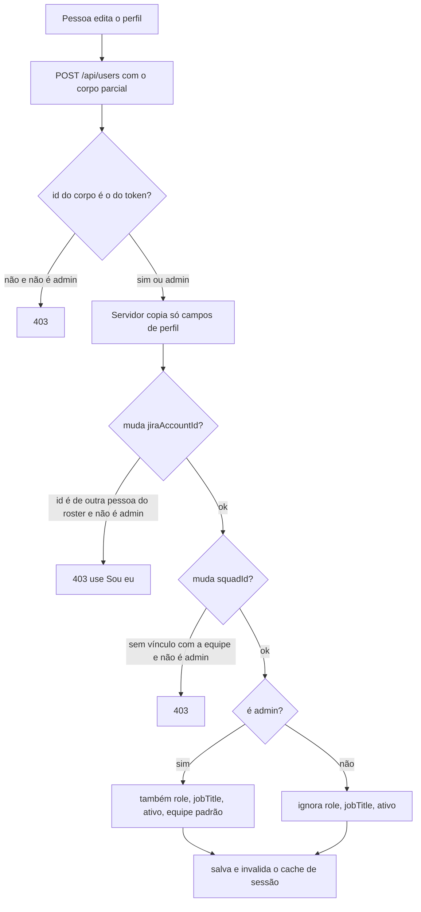

# Usuários, perfil e administração

Estado do `develop` em 2026-10-09.

## Objetivo e quem usa

- **Qualquer pessoa logada:** vê e edita o **próprio** perfil (nome, avatar, carga diária, equipe ativa) e guarda suas integrações pessoais (token do Jira e do TDN).
- **Admin** (`User.role = ADMIN`): painel `/admin` para gerenciar usuários, ler auditoria, aprovar reset de senha, publicar anúncios e changelog, ver métricas, gerir chaves de API e feedbacks.

Três coisas diferentes que **não** se misturam:

| Campo | O que é | Quem grava |
|---|---|---|
| `User.role` (`ADMIN`, `LEAD`, `MEMBER`) | Nível de **autorização do sistema** (libera `/api/admin/**`, convites e chaves de API de qualquer escopo) | Só admin |
| `User.jobTitle` | Cargo de negócio usado em algumas checagens de liderança de squad | Só admin |
| Linhas do roster (`project_member_roles`, `squad_members`) | Cargo na equipe (Agile Master, PO, Dev...) | Jira/Profields, convite, "Sou eu" |

Ninguém ganha papel por criar algo; `role`, `jobTitle` e `active` nunca vêm do corpo de uma requisição comum.

## Telas e entradas

| Tela | Caminho | Quem |
|---|---|---|
| Painel admin | `/admin` | Admin (a tela confere `role === admin` e manda os demais para `/`; o servidor é quem barra de fato) |
| Abas do painel | Sincronização Jira, Usuários & Acesso, Analytics de Cerimônias, Histórico de Sessões, Crescimento & Métricas, Feedbacks & NPS, Anúncios & Avisos, Configuração do sistema, Changelog, Intelligence Hub, API Keys, Auditoria, Reset de senha | Admin |
| Perfil | menu da pessoa → "Editar perfil" (`UserProfileModal`, `workspace/ProfileSettings`) | Qualquer logado |
| Integrações pessoais | configurações do Jira/TDN | Dono ou admin |

## Fluxo principal: editar um perfil

Detalhes:

- **Campos que o dono pode mudar:** nome, avatar, carga diária, id do Jira (com a regra abaixo), segmento, tribo e equipe ativa (só para equipe com a qual já tem vínculo, a mesma regra do `switch-project`). Campo omitido preserva o valor.
- **Campos só do admin:** `role` (valida ADMIN/LEAD/MEMBER, maiúsculas), `jobTitle`, `active`, `defaultProjectId`. `email`, hash de senha e `ssoId` **nunca** são aceitos do corpo.
- **Id do Jira é chave de acesso:** o roster liga a conta a equipes e a cargos de liderança por esse id. Por isso uma pessoa comum **não pode gravar um id que já pertence a outra pessoa** (outra conta vinculada ou outro e-mail na linha do roster); recebe 403 com a orientação de usar "Sou eu" no onboarding. O mesmo vale no cadastro: um id digitado que for de outra pessoa é ignorado e o cadastro segue sem ele.
- **Desativar uma conta** (admin): a pessoa perde a sessão em até 30 s (filtro JWT), a chave de API dela deixa de valer, e o login passa a responder 403 "Usuário inativo" (após a senha certa).
- **Rebaixar um admin:** perde `/api/admin/**` em até 30 s sem esperar o token expirar.

## Painel admin: o que cada parte faz

| Parte | Endpoint (`/api/admin/**`, só ADMIN) | Observações |
|---|---|---|
| Métricas | `GET /stats` | Contagens de tabelas; "sem dados" vira 0 |
| Configuração do sistema | `GET/POST /configs/{key}` | Pares chave/valor livres. Apenas `companyName`, `primaryColor`, `logoUrl`, `allowAnonymous`, `maintenanceMode` aparecem na leitura pública |
| Anúncios | `GET/POST/DELETE /announcements` | Aparecem para todos (inclusive sem login) em `/api/public/announcements` |
| Auditoria | `GET/POST /audit-logs` | O POST manual usa o **autor do token**; o nome informado na requisição é ignorado. Todo acesso a `/api/admin/**` é registrado com o e-mail do token e o IP |
| Sessões de cerimônias | `GET /sessions`, `DELETE /sessions/{id}?type=` | Lista as 100 mais recentes; excluir apaga a sessão (irreversível). Tipos aceitos: poker, retro, health, brainstorm, sprint_planning |
| Reset de senha | `GET /password-resets`, `POST /password-resets/{id}/approve` | Ver abaixo |
| Changelog | `/api/admin/changelog` | Ver `suporte-e-feedback.md` |
| Chaves de API | `/api/admin/api-keys` | Ver `chaves-de-api-e-mcp.md` |
| Sincronização Jira | `/api/admin/jira/**` | Outro módulo |

### Reset de senha

1. Pessoa usa "Esqueci a senha" em `/login` (sem e-mail enviado; resposta sempre genérica).
2. O pedido aparece em Reset de senha com status `PENDING` (um por e-mail enquanto pendente).
3. O admin aprova: o servidor gera uma **senha temporária de 16 caracteres**, troca o hash da conta e mostra a senha ao admin, que a repassa à pessoa **fora do sistema**.
4. A senha temporária fica legível na lista por **1 hora**; depois é apagada do registro (o hash na conta continua valendo). Aprovar duas vezes é recusado.

## Permissões: servidor x cliente

| Ação | Servidor | Cliente |
|---|---|---|
| Ver/editar o próprio perfil | dono ou ADMIN (`/api/users/{id}`) | modal de perfil |
| Listar todos os usuários | ADMIN, ou `X-Admin-Key` válido **mais** login (comparação em tempo constante); sem `APP_ADMIN_KEY` configurada só o ADMIN | aba Usuários & Acesso |
| Ler/gravar config de Jira/TDN | dono ou ADMIN | telas de integração |
| Vínculos de squad de uma conta (`/api/users/{id}/squads`) | dono ou ADMIN | sem chamador no frontend atual |
| Qualquer `/api/admin/**` | papel ADMIN no banco | tela confere `admin` |

## Dados guardados (negócio)

Contas e perfis; configurações pessoais de Jira e TDN (token **cifrado em repouso** com AES-256-GCM, chave derivada de `APP_ENCRYPTION_SECRET`); histórico de mudança de papel (`user_role_history`, tabela existe; o código atual não a preenche no `saveUser`, suposição a conferir); auditoria; anúncios; configurações do sistema.

## Pontos frágeis e erros de fluxo conhecidos

**Corrigido nesta rodada:** qualquer pessoa podia gravar no próprio perfil o id do Jira de um Agile Master/People Lead e herdar equipes e liderança (**crítico**; ver `seguranca-transversal.md`); qualquer login lia os vínculos de squad de qualquer conta; forjar o autor no registro de auditoria; senha temporária ficava legível para sempre na lista de resets; pedidos de reset repetidos lotavam a fila.

**Não corrigido:**

1. **Admin lê os tokens do Jira e do TDN de qualquer pessoa** (`GET /api/users/{id}/jira-config` retorna o token em claro para o dono ou admin). O frontend precisa do token do dono; para o admin é permissão herdada. Decisão: tirar o acesso do admin ou devolver o token mascarado.
2. **O nome da conta também é chave de acesso em `SquadAccessService`** (casa `nome` do usuário com o nome de exibição de membro da squad). Como o nome é editável pela própria pessoa, quem tem o mesmo nome de um membro da squad passa a ter acesso a ela. Esse serviço é do módulo de squad (outra frente); a correção correta é remover o casamento por nome ou exigir vínculo explícito. Registrado aqui para quem for mexer em squad.
3. **`GET /api/users` devolve todos os usuários** (incluindo e-mail e papel) em um array só, sem paginação.
4. **Excluir sessão de cerimônia pelo painel não apaga arquivos/anexos** associados (suposição; depende do módulo).
5. **`user_role_history`** sem uso aparente: mudança de papel não deixa trilha além do registro de acesso a `/api/admin/**` (que guarda a rota, não o valor).
6. **Texto do painel:** parte dos rótulos mistura inglês ("API Keys", "Intelligence Hub"); não alterado por ser nome de produto.

## Onde olhar no código

- Backend: `controller/UserController`, `service/UserService`, `security/JiraAccountIdGuard`, `controller/AdminController`, `service/AdminService`, `service/PasswordResetService`, `config/SecurityAuditInterceptor`.
- Frontend: `app/admin/page.tsx` e `app/admin/api.ts`, `components/admin/*`, `app/users/api.ts`, `components/layout/UserProfileModal.tsx`, `context/UserContext.tsx`.
