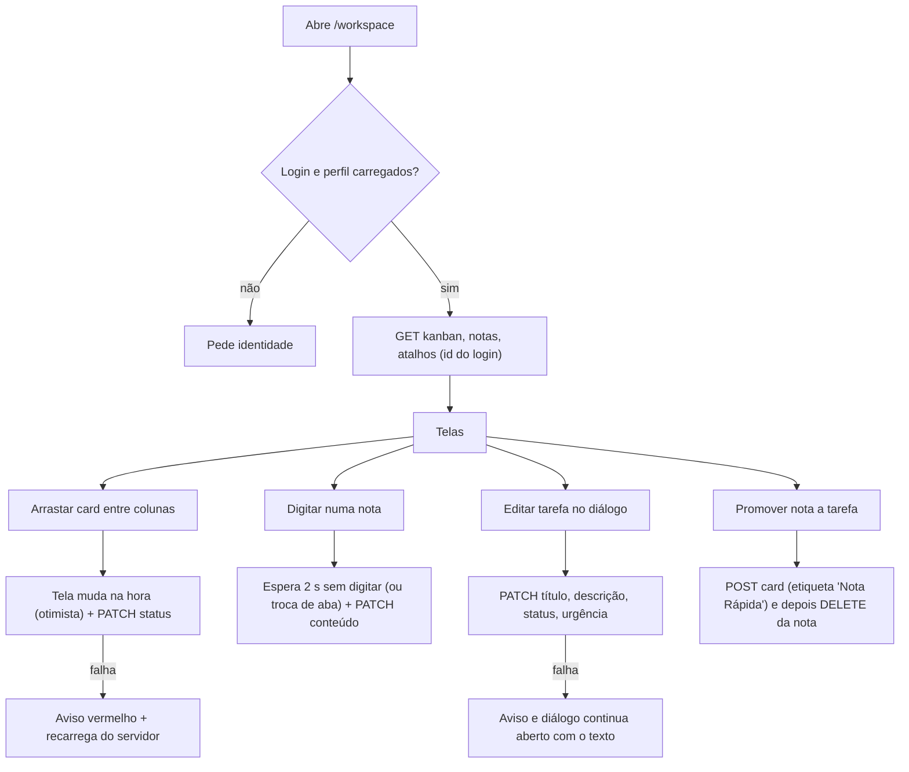

# Meu Espaço (workspace pessoal)

Descreve o que o código faz **hoje** (frontend após o commit "fix(workspace)" de 2026-10-09 e backend com a migration V60). Suposições estão marcadas com **(suposição)**. Nada foi exercitado ao vivo: o módulo exige login Firebase/Google, então tudo vem de leitura de código e de testes unitários.

## 1. Objetivo e quem usa

Espaço **privado** de cada pessoa logada: kanban pessoal, notas adesivas, atalhos, snippets de código, histórico das cerimônias de que participou, perfil, conexões (Jira, TDN, chaves de API pessoais) e a lista dos próprios itens da Biblioteca de IA. Não existe papel especial: cada pessoa vê e altera só o que é seu, inclusive administradores.

## 2. Telas e entradas

| Aba | O que é | Dados |
|---|---|---|
| Início | Painel-resumo (tarefas abertas, notas recentes, últimas cerimônias) | Calculado a partir das outras abas |
| Kanban | Três colunas (A Fazer, Em Andamento, Concluído) com arrastar e soltar | Servidor (`user_kanban_cards`) |
| Notas | Mural de notas coloridas, fixar, promover a tarefa | Servidor (`user_sticky_notes`) |
| Histórico | Poker, retros e radares de saúde da squad em que a pessoa participou ou que criou | Listas gerais da squad, filtradas no navegador |
| Perfil | Dados de exibição | Contexto do usuário |
| Conectividade | Jira, TDN e chaves de API pessoais | Hooks próprios e `MyApiKeysManager` (fora deste documento) |
| Atalhos | Links rápidos com ícone e cor | Servidor (`user_quick_links`) |
| Prompts | Itens da Biblioteca de IA da própria pessoa | Ver `biblioteca-ia.md` |
| Snippets | Caderno de código com editor Monaco | Servidor (`user_snippets`) |

Atalho `Ctrl/⌘ + K` abre a busca de comandos (navegar, nova tarefa, nova nota, novo snippet). Rota: `/workspace`.

## 3. Fluxo principal

Detalhes:

1. **Kanban.** Criar usa `POST` (etiqueta "Manual"); editar e mover usam `PATCH`, que só muda os campos enviados e preserva etiqueta, origem (link para a cerimônia que gerou o card), prazo e data de exportação. Antes desta correção o arrastar mandava um card incompleto (sem título), que o banco recusava: a tela mudava e voltava ao recarregar, sem aviso.
2. **Ordem.** O servidor lista do mais recentemente alterado para o mais antigo. Não existe posição manual: reordenar dentro da coluna parece funcionar durante o arrastar, mas não é guardado.
3. **Notas.** O texto é gravado 2 s depois da última tecla e também ao sair da aba ou da página (a nota excluída ou promovida não regrava). Fixar e trocar de cor são `PATCH`. O campo fixada trafega como `isPinned` (antes o servidor devolvia `pinned`, e a nota fixada voltava desafixada ao recarregar).
4. **Atalhos.** O endereço é normalizado no navegador (completa `https://`; só `http`/`https` passam) e validado de novo no servidor. Ícone e cor agora são gravados (V60); atalhos antigos aparecem com ícone de link genérico e sem cor.
5. **Snippets.** Título e código obrigatórios; o diálogo só fecha se o servidor aceitar.
6. **Histórico.** Busca as listas completas de Poker, Retro e Radar da squad atual e filtra no navegador por `participantIds` ou `creatorId`.
7. **Conversão nota → tarefa.** Duas chamadas em sequência (cria o card, apaga a nota). Se a segunda falhar sobra a nota e a tarefa (duplicado).

## 4. Estados e transições

- Card: `todo` → `doing` → `done`, qualquer direção (arrastar ou editar). Urgência: `baixa`, `media`, `alta`, `critica`. O servidor recusa valores fora dessas listas (400).
- Nota: normal ↔ fixada. Fixadas ficam no topo.
- Estados de tela: carregando (esqueletos), vazio (com botão de criar), erro de carga (aviso; a lista fica vazia, mas nada foi apagado).

## 5. Permissões

| Ação | Servidor | Cliente |
|---|---|---|
| Listar e criar em `/api/workspace/{userId}/...` | `{userId}` precisa ser o do JWT, senão 403 | Usa `session.id` (id do login) primeiro |
| Alterar ou apagar por id (`PATCH`/`POST` com id/`DELETE`) | Dono do item (JWT); outro usuário → 403; id inexistente no PATCH → 404 | — |
| Limites | Até 2.000 itens de cada tipo por pessoa (409); título obrigatório; textos com teto (nota 20 mil caracteres, snippet 200 mil) | — |
| Links | Atalho só `http`/`https` com host; link de origem do card só caminho interno (`/x`) ou `http`/`https` | `safeHref` não renderiza outro esquema |

O identificador do dono **nunca** vem do corpo: o controlador sobrescreve `userId` com o da rota, que já foi igualada ao JWT.

## 6. Dados guardados (negócio)

- **Tarefa:** título, descrição, status, urgência, prazo (hoje sem campo na tela), etiqueta, link de origem, data de exportação, última alteração.
- **Nota:** texto, cor (classes de estilo), fixada, última alteração.
- **Atalho:** nome, endereço, ícone, cor, data de criação.
- **Snippet:** título, código, linguagem, data de criação.

## 7. Pontos frágeis e o que não foi corrigido

- **Sem ordem manual no Kanban.** Exigiria coluna de posição + migration + renumeração; fica como decisão de produto. Hoje o arrastar dentro da coluna "volta".
- **Nota → tarefa não é atômica** (duas chamadas). Um endpoint único resolveria.
- **Edição simultânea (duas abas)** da mesma nota/tarefa: vale a última gravação; sem versão. **(suposição)** uso raro por ser espaço pessoal.
- **Histórico:** retros só aparecem para quem as criou, porque a lista de participantes da retro não é persistida (ver `retro.md`). Poker e Radar usam a lista de participantes.
- **Prazo da tarefa** existe no servidor mas a tela não tem campo para editar.
- **Conectividade:** o token do Jira/TDN volta do servidor para o campo (tipo senha). Não revisado em profundidade; fica no módulo de integrações.
- **Rate limit:** não há limite de chamadas por pessoa no workspace além do teto de itens.
- **Não testado ao vivo.** A migration V60 (colunas novas, `url` 2048, índices) e a validação do Hibernate só rodam na primeira subida real.

## 8. Onde olhar no código

- Frontend: `src/app/workspace/page.tsx` (estado, handlers, diálogo de tarefa), `src/app/workspace/api.ts`, `src/components/workspace/*` (KanbanBoard, StickyNotes, QuickLinks, SnippetLibrary, HistoryTimeline, BentoDashboard, ConnectivitySettings, CommandPalette), `src/lib/safe-url.ts`.
- Backend: `WorkspaceController` (rotas e checagem do JWT), `WorkspaceService` (validação, limites, PATCH), entidades `UserKanbanCard`, `UserStickyNote`, `UserQuickLink`, `UserSnippet`, migration V60.
